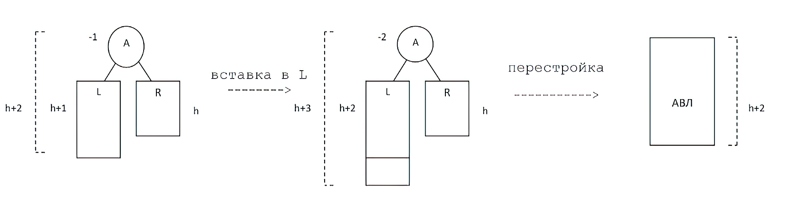
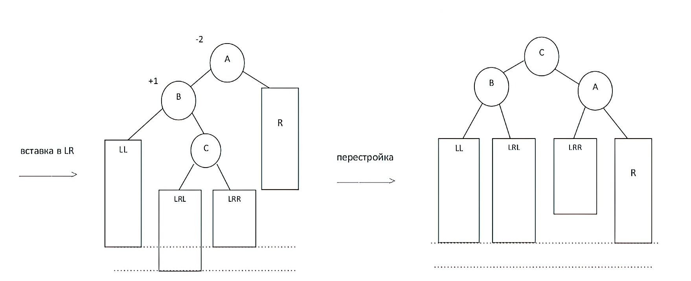

# Теория по алгоритмам и алгоритмическим языкам(Pascal)
## Лектор - Абрамов Владимир Геннадьевич; 1 семестр ФИИТ МГУ

---

_**Содержание оформил**_ [_**@wlix13**_](https://github.com/wlix13) \
_**Использованы записи**_ [_**@Cordasius**_](https://vk.com/cordasius) \
В папках _Contests_ находятся решения задач контестов.

---

## <a name="contents"></a>Оглавление:
1) [Алгоритмы](#lect1)
2) [Нормальные алгоритмы Маркова](#lect2)
3) [Принцип нормализации](#lect3)
4) [Числовые типы данных](#lect4)
5) [Логический тип данных](#lect5_1)
6) [Символьный тип](#lect5_2)
7) [Подготовка к решению задач](#lect6_1)
8) [Процедуры ввода и вывода](#lect6_2)
9) [Структура Pascal программы](#lect6_3)
10) [Операторы](#lect6_4)
11) [Раздел констант, типов](#lect7_1)
12) [Перечислимый тип](#lect7_2)
13) [Ограниченный тип](#lect7_3)
14) [Оператор варианта](#lect7_4)
15) [Оператор перехода](#lect7_5)
16) [Оператор цикла](#lect7_6)
17) [Регулярные типы](#lect8)
18) [Процедуры](#lect9_1)
19) [Принцип локазизации](#lect9_2)
20) [Передача параметров](#lect9_3)
21) [Фунции](#lect10)
22) [Процедуры для повышения эффективности программ](#lect11_1)
23) [Тип string в FPC](#lect11_2)
24) [Рекурсивные функции и процедуры](#lect12_1)
25) [Задача о Ханойских башнях](#lect12_2)
26) [Программирование сверху вниз](#lect13_1)
27) [Отладка и тестирование](#lect13_2)
28) [Комбинированные типы / Запись](#lect14)
29) [Файловые типы](#lect15_1)
30) [Текстовые файлы](#lect15_2)
31) [Внутренние и внешние файлы](#lect15_3)
32) [Ссылочный тип](#lect16)
33) [Проивзольные структуры данных](#lect17)
34) [Таблицы](#lect18_1)
35) [Сортировка](#lect18_2)
36) [Деревья](#lect19)
37) [АВЛ-Деревья](#lect20)
38) [Перемешанные(хэш) таблицы](#lect21)

---

## <a name="lect1"></a>Алгоритмы - [↑](#contents)
**Алгоритм** - это точно и полно сформулированная инструкция исполнителю, указывающая, какие действия, в каком порядке и над какими объектами надо выполнить, чтобы решить задачу, достичь некоторой цели(получить результат)
**Алгоритм** - конечная система правил, которая определяет последовательность действий над исходными данными и приводит исполнителя алгоритма после конечного числа действий к желаемому результату.

Алгоритм Евклида
- Свойство E. Еслм n=m, то НОД(n, m)=n
- Свойство L. Если n>m, то НОД(n, m)=НОД(n-m, m)
- Свойство R. Если n<m, то НОД(n, m)=НОД(n, m-n)

Свойства алгоритмов:
1) Полнота описания: Все действия должны быть явно описаны
2) Выполнимость: Все действия должны быть понятный исполнителю и могли быть реально выполнены 
3) Однозначность(детерминированность): При любом количестве исполнений алгоритма при одних и тех же исходных данных, результат должен быть один и тот же
4) Конечность(результативность): Алгоритм должен давать резултатат за конечное число шагов, за конечное время

Способы задания алгоритмов:
1) Словесное описание \
    :Старт. n, m - натуральные числа \
    :Правило 1. Если n=m, то k=n \
    :Правило 2. Если n>m, то n=n-m \
    :Правило 3. Если n<m, то m=m-n \
    :Правило 4. Перейти к правилу 1

2) Блок-схема 
<!-- Изображение -->


#### Уточнения для алгоритмов:
#### 1) Нормальные алгоритмы Маркова, НАМ
#### 2) Машины Тьюринга 
##### 1) Объект исполнения
##### 2) Действия
---
## <a name="lect2"></a>Нормальные алгоритмы Маркова - [↑](#contents)
[Текст 1] → [Алгоритм] → [Текст 2]

Символ - это любой печатный текст \
Алфавит - это любое печатное множество символов \
Слово - конечная последовательность символов из алфавита \
Длина слова - количество символов из которых составили слово \
Объект алгоритма - слова в некотором алфавите 

#### Формулой подстаковки(ФП) называется запись вида:
$\alpha$ → $\beta$, где $\alpha$, $\beta$ - слова из алфавита \
$\alpha$ - левая часть подстановки; $\beta$ - правая часть

P - некоторое слово. Если в нём есть подстрока $\alpha$, то она заменяется на $\beta$ и получается P' 

Сама подстановка(как действие) задаётся ФП и приеняется к некоторому слову P \
Пример: ФП { ап → олк } \
P = папа \
P + ФП = P' = полка

Свойства: 
1) Если a не входит в P, то подстановка a → b считается неприменимой к P
2) Если a входит в P несколько раз, то по определению, заменяется только первое вхождение в P(слева направо)
3) Если правая часть ФП - пустое слово, то подстановка a → {пусто} сводится к стиранию части a из P
4) Подстановка по форме → b - это приписывание b слева P

Нормальнымм алгоритмом Маркова называется конечный упорядоченный набор формул подстановки. 

- { → } - обычное правило
- { |→ } - заключительное правило

### Правила выполнения НАМ
1) Задаётся вводное слово P
2) Просматривается сверху вниз ФП и выбирается первая из тех, левая часть которой входит в P. К P применяется подстановка, определяемая этой формулой. Получается слово P'
3) Теперь слово P' берётся за исходное словои к нему применяется та же самая процедура, начиная с первой(это важно) и ищется формула, применяемая к P', применяется подстановка и получается слово P''

Алгоритм заканчивается, если:
1) НАМ становится неприменим к P''''...
2) Пока не наступит заключительное правило

Если НАМ никогда не остановится, то говорят, что НАМ не применим к этому входному слову

---
## <a name="lect3"></a>Возомжности НАМ. Принцип нормализации - [↑](#contents)
1. Композиция двух алгоритмов Маркова \
Пусть A и B - два алгоритма \
C = A o B - тоже алгоритм Маркова и для P - входного слова C(P) = B(A(P))
2. Разветвление \
A, B, C - алгоритмы Маркова \
Если A даёт "да", то выполнить B, иначе C
3. Цикл \
Повторять A и B, пока A не даст ответ "нет"


### Принцип нормализации
Любой алгоритм нормализуем, то есть для любого алгоритма можно написать эквиватентный ему НАМ

### Проблема самоприменимости

$$\begin{cases}
\alpha_1 → \beta_1 & \quad \\ 
\alpha_2 → \beta_2 & \quad \\ 
... & \quad \\ 
\alpha_n → \beta_n & \quad
\end{cases}$$

Запись: $\alpha_1 → \beta_1 ; \alpha_2 → \beta_2 ; ... ; \alpha_n → \beta_n$ 

Алгоритмы, которые применимы к своей записи, называются самоприменимыми
### Теорема: Не существует алгоритм, который по записи любого алгоритма определил бы, самоприменим он или нет
### Док-во: От противного, допустим есть A - алгоритм, который по записи любого алгоритма(E) определяет, самоприменим он или нет
$$A(\text{ <запись E> })=\begin{cases}
С, & \text{если самоприменим}\\ 
Н, & \text{если несамоприменим}
\end{cases}
$$

$$B=\begin{cases}
С → С \\ 
Н \text{ |→ } Н
\end{cases}$$

$$K=\text{A o B}$$
1) Предположим, K - самоприменим \
K( <запись K> ) = B( A( <запись K> ) ) = B( С ) - зациклиловсь => предположение неверно
2) Предположим, K - несамоприменим \
K( <запись K> ) = B( A( <запись K> ) ) = B( Н ) - остановился => предположение 2 неверно \
Тогда K не может существовать => изначальное предположение было неверно => такого алгоритма A не существует. Что и требовалось доказать.

### Эквивалентность алгоритмов
Два алгоритма Маркова $H_1$ и $H_2$ эквивалентны относительно алгоритма $A$. Если области применимости $H_1$ и $H_2$ относительно $A$ совпадают и для любого слова P из этой области применимости $H_1(P) = H_2(P)$

### Языки программирования
1) Транслятор - общее название компилятора и интерпретатора
2) Компилятор переводит текст в машинный язык
3) Интерпретатор переводит в машинный язык и сразу выолняется

### Описание языка программирования
1) Алфавит \
Описать алфавит - это указать, какие символы можно использовать при записи программы на ЯП
2) Синтаксис \
Правила, указывающие, какие тексты допустимы в языке, а какие - нет
3) Семантика \
Правила, определяющие смысл каждого синтаксически правильного текста
4) Прагматика \
Назначения конструкций языка, когда и как их использовать

## Бэкуса-Наура Формулы. Язык БНФ
### БНФ - это язык для описания синтаксиса
1) Символы ЯП
2) Метапеременныя( МП ) - любой текст в уголках. Содержательно, МП - это название некоторого множества текстов
3) ::= → по определению есть
4) | → или
### Примеры:
1) <цифра> ::= 0 | 1 | 2 | 3 | 4 | 5 | 6 | 7 | 8 | 9
2) <кортёж> ::= () | ( <элемент>, <элемент> ) \
   <элемент> ::= a | a<цифра>a
(a, 5) - не кортёж
(a, a) - кортёж
(a, a5a) - кортёж
3) <целое> ::= <цифра> | <целое><цифра>
4) <идентификатор> ::= <буква> | <идентификатор><буква> | <идентификатор><цифра>

Запись {a} означает любое из следующих текстов: \
<пусто>, a, aa, aaa и так далее

5) <целое> ::= <цифра> | {<цифра>}
6) <сумма> ::= <буква> {+<буква>}

## Синтаксические диаграммы

---
## <a name="lect4"></a>Числовые типы данных - [↑](#contents)
1. Алфавит Паскаля: \
Буквы: большие и маленькие от A до Z \
Цифры: от 0 до 9 \
Специальные символы: + - * / и т.д \
Разделитель: <проблем> \
Для некоторых символов, отсутствующих в алфавите, используются комбинации из символов алфавита, например: \
<=, >=, <>, :=, и т.д.

### Идентификаторы
```pascal
<идентификатор> ::= <буква> | <идентификатор><буква> | <идентификатор><цифра>
```

$$идентификаторы=\begin{cases}
служебные \; слова \\
имена
\end{cases}$$

Специально выделенные идентификаторы называются служебными (или зарезервированными) словами. \
Все остальные идентификаторы называются именами. \
Имена, смысл которых заранее предопределен, называют стандартными именами.

Типы даннных:
тип данных = множество объектов + множество операций над ними


### Переменные и операции
<раздел переменных> ::= var <секция переменных>; {<секция переменных>;}

<секция переменных>::= <имя> {, <имя>} : <тип>

<простой тип>::= <стандартный тип> │ <перечислимый тип> │ <ограниченный тип>

<стандартный тип>::= integer │ real │ boolean │ char

<целое> ::= <знак> <целое без знака>

<знак> ::= <пусто> │ + │ -

<целое без знака> ::= <цифра> {<цифра>}

#### Операции над целыми числами (а и b - целые)
а+b - сложение \
а–b - вычитание \
а*b - умножение \
a div b - деление нацело a на b (b≠0) \
a mod b - взятие остатка от деления а на b (b>0)

#### Общая формула вычисления остатка в Паскале следующая:
$r = a-(a div b)*b \quad (b > 0)$

$$a\;mod\;b=\begin{cases}
r, \; если \; r \geqslant 0 \\
r+b, \; если \; r < 0
\end{cases}
$$

Из этого определения следует, что остаток всегда будет неотрицательным, а точнее:
$0 ≤ a \; mod \; b < b$

### Стандартные функции для целых чисел
- abs(a) = |a|
- sqr(a) = $a^2$
- succ(a) = a+1
- pred(a) = a–1

### Вещественные числа
#### Операции над вещественными числами (x и y - вещественные)
- x+y - сложение
- x–y - вычитание
- x*y - умножение
- x/y - обычное деление (y≠0)

#### Стандартные функции для вещественных чисел:
- abs(x) = |x|
- sqr(x) = $x^2$
- sqrt(x) = $\sqrt{x}$ (x>0)
- sin(x) - синус от x радиан
- cos(x) - косинус от x радиан
- arctan(x) – арктангенс от числа x
- ln(x) - натуральный логарифм (x>0)
- exp(x) = $e^x$
- trunc(x) - целое, полученное из х отбрасыванием дробной части (truncate - укоротить)
- round(x) = целое, ближайшее к х (round - около):

### Арифметические выражения
#### Запись арифметических выражений
1) Запрещено выписывать подряд несколько знаков операций, например, вместо x*-2 надо писать x*(-2)
2) Вместо ab надо писать a*b
3) Вместо $\dfrac{x}{y}$ надо писать a/b («многоэтажные» формулы в Паскале недопустимы)
4) Отсутствующие операции sqrt(x) и т.д.
5) Из всех видов скобок при записываются с помощью имеющихся функций: вместо |x+1| пишут abs(x+1), допускаются только круглые: вместо $[a(b+c)-d]e$ надо писать $(a*(b+c)-d)*e$ (квадратные и фигурные скобки нужны для других целей).
#### Правила вычисления арифметических выражений
Это обычные правила - с учетом скобок и старшинства операций: 
1) Сначала вычисляются функции и подвыражения в скобках
2) Затем выполняются операции *, /, div и mod
3) В конце выполняются операции + и – (одноместные и двухместные)

## Оператор присваивания
<**оператор присваивания**>::= <**переменная**>:=<**выражение**>

Примеры:
```pascal
d:=7;
i:=i+1;
z:=x/sin(y)+8
```

Переменная и выражение должны быть одно типа !!! \
Исключение!!!: переменная – типа real (вещественная) \
Выражение может быть типа integer \
Пример: 
```pascal
var
x, y:real;
m:integer
m:=67;
x:=5 + m;
y:=m + x + 2022 
```
---
## <a name="lect5_1"></a>Логический тип данных - [↑](#contents)

<логическая константа>::= false ⏐ true \
<отношение> ::= <простое выражение> <знак отношения> <простое выражение> \
<знак отношения> ::= < ⏐ <= ⏐ >= ⏐ > ⏐ = ⏐ <> ⏐ in \
<простое выражение> - любое выражение Паскаля, за исключением отношений 
```pascal
var
m, n: integer;
m:=10;
n:=3;
m<n // false
```
### Операции логического типа
1. Отрицание (not) \
Семантика: операция not меняет логическое значение на противоположное.
2. Конъюнкция - логическое умножение (and) \
Семантика: конъюнкция дает истину только в одном случае - когда оба ее
операнда истинны; если хотя бы один операнд ложен, то и конъюнкция ложная.
3. Дизъюнкция - логическое сложение (or) \
Семантика: дизьюнкция истинна, если истинен хотя бы один ее операнд;
дизьюнкция дает ложь только в одном случае - когда оба операнда ложны.

### Правила
1) При вычислении ЛВ действует следующий порядок вычисления:
- сначала вычисляются простейшие ЛВ и подвыражения в скобках
- затем выполняется not
- потом выполняется and
- далее выполняется or
- и в конце выполняются операции отношения

Операции одного старшинства выполняются слева направо. \
Например, в указанном ЛВ порядок вычисления следующий:
```pascal
not(x>y) or odd(k) and true or b
 3   1   5   2      4       6
```

2) Если ЛВ - это просто отношение, то оно пишется без круглых скобок
b:=x>y, хотя можно использовать и скобки b:=(x>y). Но если отношение входит в
состав какого-то другого выражения, то оно обязательно заключается в круглые
скобки. Например, нельзя писать | x=1 and z<0 |

- Операция and имеет более высокий приоритет, чем операции сравнения,
поэтому она выполняется в первую очередь: x=(1 and z)<0, т.е. получается, что
здесь конъюнкция применяется к числам, что запрещено. Правильная запись
этого выражения такова: (x=1) and (z<0)

3) В Паскале запрещено писать двойные неравенства типа ```0<x<2.``` Дело в
том, что эта запись означает ```(0<x)<2```, т.е. здесь логическая величина будет сравниваться с числом 2, что запрещено. Такие неравенства надо писать в виде конъюнкции двух отношений: ```(0<x) and (x<2)```

4) Допускается выписывание нескольких not подряд: not not not a. Однако
два соседних not уничтожают друг друга, поэтому редко пишут более
одного not.

5) Возможно непосредственное соседство or и and с not, например: a and not b. Однако для наглядности лучше ставить скобки: a and (not b).

6) Нельзя рядом указывать and и/или or: a or and b – ошибка.

---
## <a name="lect5_2"></a>Символьный тип - [↑](#contents)

c, h : char - обозначение 

Обязательные свойства множества значений: \
'0' < '1' < '2' < '3' < '4' < '6' < '7' < '8' < '9'

#### Операции над вещественными числами (x и y - вещественные)
- ord(c) - возвращает код символа c
- char(i) - возвращает символ, код которого равен i
- Свойство: **chr(ord(C)) = C**
- < | <= | = | <> | > | >=

#### Стандартные функции для символьного типа:
- pred: char → char pred(C) = chr(ord(C)+1)
- succ: char → char succ(C) = chr(ord(C)–1)

---
## <a name="lect6_1"></a>Подготовка к решению задач - [↑](#contents)

### Подготовка и решение задач на компьютере делится на следующие этапы:
1. Постановка задачи и разработка технического задания
2. Разработка
- a) информационной модели решения задачи
- b) математической модели решения задачи;
- c) алгоритма для решения задачи;
- d) программы для решения задачи на компьютере;
3. Докуменитрование разработки и выпуск документации
4. Выполнение разработанной программы и анализ результатов или передача программы заказчику
5. Сопровождение программы


**Постановка задачи** включает определение сути задачи, ее исходных данных, совокупности критериев оценки качества процесса обработки данных и состава результатов.

**Математическая модель** – это описание метода решения задачи. Этот этап включает в себя разработку или выбор численных методов или методов нечисловой обработки данных

**Информационная модель** отображает состав, структуру и взаимосвязь обрабатываемых данных, файлов и массивов.

**Разработка алгоритма решения задачи (алгоритмизация)** включает в себя формализацию процесса обработки данных и представление его в форме, позволяющей упростить дальнейшее кодирование алгоритма, т.е. запись его на одном из алгоритмических языков. Алгоритмизация  ключает в себя выделение предполагаемых этапов процесса обработки данных и запись их в определенной форме и последовательности, например в виде схем алгоритмов.

**Разработка программы включает в себя:**
1. Подготовка тестовых исходных данных
2. Написание текста программы на алгоритмическом языке
3. Перенос программы и данных на машинные носители информации
4. Отладка и тестирование программы 

## <a name="lect6_2"></a>Процедуры ввода и вывода - [↑](#contents)
### Ввод
#### Процедура read
read(v), где 

$$v=\begin{cases}
integer \\
real \\
char
\end{cases}$$

В результате этого оператора, v получит значение v:=...\
readln - очищает буфер

### Вывод
#### Процедура write
write(z), где

$$z=\begin{cases}
integer \\
real \\
char \\
boolean \\
<произвольный>
\end{cases}$$

writeln - переводит на новую строку

## <a name="lect6_3"></a>Структура Pascal программы - [↑](#contents)
```pascal
program <имя> ( <имя файла> {,<имя файла>} ); {заголовок программы}
{Блок - начало}
    {Раздел описания - начало}
    <раздел меток>
    <раздел констант>
    <раздел типов>
    <раздел переменных>
    <раздел процедур и функций>
    {Раздел описания - конец}
begin
    {Раздел операторов(тело программы) - начало}
    <оператор>;
    <оператор>;
    ...
    <оператор>;
    {Раздел операторов(тело программы) - конец}
end.
{Блок - конец}
```

### Программа на Pascal
```pascal
program Test;
begin
end.
```
### Раздел переменных
```pascal
var
    x,y: real;
    m,n: integer;
    c, h: char;
    b, q: boolean;
```
### Общие требования к программе:
1. Все используемые в программе объекты (переменные, метки, типы и т.д.) обязательно должны быть описаны в разделе описаний. Использовать неописанный объект нельзя. Это не относится лишь к стандартным объектам (maxint, true, false, sin, exp и т.д.), которые считаются описанными заранее.
2. Одно и то же имя нельзя давать разным объектам программы.
3. Любой объект может быть использован только после того, как он описан, т.е. «сначала опиши, а уж затем используй».
4. В начале выполнения программы ни одна из ее переменных не имеет значения.

### Правила с пробелами:
1. Нельзя ставить пробелы внутри идентификаторов и чисел, а также внутри следующих комбинаций символов: <>,<=,>=,:=
2. Обязательно надо ставить пробел, если рядом по тексту расположены идентификаторы и/или числа, иначе они сольются в одну конструкцию.
3. В остальных местах пробелы можно ставить, а можно и не ставить, причем там, где может стоять пробел, можно указывать два и больше пробелов.

### Переводы строк:
Формально, программа на Паскале - это _одна длинная строка символов_.
Переходить на другую строку можно только в тех местах, где можно поставить пробел. В частности, запрещен перевод строки внутри чисел и идентификаторов, но допустим между операндом и знаком операции. При этом никаких знаков переноса не ставится, никакой символ повторять не надо.

### Комментарии:
Для облегчения понимания программы в нее можно вставлять комментарии. Синтаксически, _комментарий_ – это любая последовательность символов (кроме «}»), заключенная в фигурные скобки. Формально, весь комментарий эквивалентен пробелу, поэтому в тексте его можно размещать только там, где может стоять пробел.

## <a name="lect6_4"></a>Операторы - [↑](#contents)

$$Операторы-\begin{cases}
Простые \\
Составные
\end{cases}$$

$$Простые:\begin{cases}
1.Присваивание \\
2.Пустой \\
3.Перехода \\
4.Процедуры
\end{cases}$$

$$Сложные:\begin{cases}
1.Составной \\
2.Условный \\
3.Варианта \\
4.Цикла \\
5.Присоединения
\end{cases}$$

1. <пустой оператор> ::= 
2. <составной оператор> ::= begin <оператор> {; <оператор>} end
3. <условный оператор> ::= if <логическое выражение> then <оператор> else <оператор> | if <логическое выражение> then <оператор>

### Неопределенность в условном операторе:
В определении условного оператора есть одно неясное место - как понимать
запись:
```pascal
if B1 then if B2 then S1 else S2 {?}
```
К какому из двух then относится единственный else? Возможны две
трактовки:

1) полный оператор вложен в сокращенный оператор:
```pascal
if B1 then if B2 then S1 else S2
└────────────────────┘
```
2) в полный оператор вложен сокращенный оператор:
```pascal
if B1 then if B2 then S1 else S2
└────────────┘
```
В Паскале на этот счет принято следующее соглашение: else всегда относится
к ближайшему слева then. Следовательно, верен первый вариант, который для
большей ясности можно записать так:
```pascal
if B1 then begin if B2 then S1 else S2 end
                └─────────────────────────┘
```
Что же касается второго варианта, то его можно записать только с
использованием операторных скобок:
```pascal
if B1 then begin if B2 then S1 end else S2
          └───────────────────────┘
```
---

## <a name="lect7_1"></a>Раздел констант - [↑](#contents)
**Константа** в языке Паскаль - конкретное значение некоторого типа, которое фиксируется и не может изменяться в ходе программы

_Требование_:
1. Численно определять постоянные величины.
2. Использовать символические имена постоянных.

```pascal
<раздел констант> ::= const <описание константы>; {<описание константы>;}
<описание константы> ::= <имя константы> = <константа>
<константа> ::= <integer> │ <real> │ <char> │ <string> │<знак> <имя константы>
<знак> ::= <пусто> │ + │ -
<имя константы> ::= <имя>

{Пример:}
const
    pi = 3.14;
    mpi = -3.14;
```
## Раздел типов
```pascal
<раздел типов> ::= type <описание типа>; {<описание типа>;}
<описание типа> ::= <имя типа> = <тип>
<имя типа> ::= <имя>
<тип> ::= <имя типа> │ <конструктор типа>
<конструктор типа> ::= <простой тип> │ <составной тип> │ <ссылочный тип>

{Пример:}
type
    int = integer;
    T1 = int;
```
_Правило:_ Каждое новое описание вводит новый тип, отличающийся от других типов.

## <a name="lect7_2"></a>Перечислимый тип - [↑](#contents)

```pascal
<задание перечислимого типа> ::= (<имя> {,<имя>})
type
    месяц = (январь, февраль, март, апрель, май, июнь, июль, август....);
               1       2       3       4     5    6      7     8
    масть = (пики, трефы, бубны, черви);
               1      2      3      4
    week = (понедельник, вторник, среда, четверг, пятница, суббота, воскресенье);
var
    m: месяц;
    s: масть;
```
### Операции над перечислимыми типами
- ord: week → { 0, 1, 2, 3, 4, 5, 6 }; ord(вторник) = 1
- succ: week → week; succ(пятница) = суббота
- pred: week → week; pred(среда) = вторник
- Присваивание: m := март
- <, <=, <>, >, >=, =

## <a name="lect7_3"></a>Ограниченный тип - [↑](#contents)
```pascal
<задание ограниченного типа> ::= <константа1>..<константа2>
type
    mondayth = 1..12;
    digit = 1..9;
    week = пон..вск;
var
    m: mondayth;
    d: '0'..'9';
    w: week;
```


## <a name="lect7_4"></a>Оператор варианта - [↑](#contents)
Оператор case создан для удобства, хотя ту же программу можно написать через оператор if.
```pascal
{–}

if (D = monday) or (D = wednseday) then writeln(’Лекции’)
else if (D = tuesday) or (D = thursday) then writeln(’Cеминары’)
else if D = friday then writeln(’Заседания’)
else if (D = saturday) or (D = sunday) then writeln(’Выходные’);
```
```pascal
{Предпочтительно:}
case D of
    monday, wednseday: writeln(’Лекции’);
    tuesday, thursday: writeln(’Cеминары’);
    friday: writeln(’Заседания’);
    saturday, sunday: writeln(’Выходные’);
end;
```
```pascal
<оператор варианта> ::= case <селектор оператора> of
    <элемент списка варианта>
    { ;<элемент списка варианта>} end

<селектор оператора> ::= <выражение>
<элемент списка варианта> ::= <список меток варианта> : <оператор>
<список меток варианта> ::= <метка варианта> {, <метка варианта>}
<метка варианта> ::= <константа>
```
**Семантика:**
1. Вычислить <селектор оператора>
2. Найти <элемент списка варианта>
3. Вычислить <оператор>

Замечания:
1. Выражение между case и of называется селектором и может быть любого простого типа, кроме real (Дело в том, что для real нельзя перечислить все возможные значения.)
2. Варианты отделяются друг от друга точкой с запятой.
3. Оператор варианта обязательно завершается словом end
4. Константы, перечисленные в вариантах, должны быть того же типа, что и селектор, и должны различаться. Это очевидные требования, т.к. иных значений селектор не может принимать, а если какое-то значение выписать дважды, то будет двусмысленность - будет неясно, какой вариант выбирать при этом значении.
5. В варианте указывается только один оператор. Если их надо несколько, следует объединить их в составной оператор.
6. Порядок вариантов и констант в них в операторе варианта произволен.

## <a name="lect7_5"></a>Оператор перехода - [↑](#contents)
```pascal
<оператор перехода> ::= goto <метка>
<раздел описания меток> ::= label <метка> {,<метка>} ;
<метка> ::= <идентификатор>
{Пример:}
label 1,2,3;
...
goto 1;
```
## <a name="lect7_6"></a>Оператор цикла - [↑](#contents)
```pascal
<оператор цикла> ::= <оператор цикла с предусловием> │ <оператор цикла с постусловием> │ <оператор цикла с параметром>
```

1. Оператор цикла с предусловием\
**Семантика:** В _while_-цикле сначала вычисляется условие _B_. Если оно истинно, то выполняется оператор S, после чего все повторяется заново. И так до тех пор, пока условие _B_ не станет ложным. Как только _B_ даст ложь, так сразу выполнение оператора цикла прекращается. В частности, если _B_ было сразу ложным, то оператор S не выполняется ни разу.
```pascal
<оператор цикла с предусловием>::= while <логическое выражение> do <оператор>
{Пример. Вычислим z=НОД(x,y) по алгоритму Евклида:}

while x≠y do
    if x>y then x:=x-y
    else y:=y-x;
z:=x;
```

2. Оператор цикла с постусловием \
**Семантика:** сначала последовательно выполняются все операторы $S_i$ из тела цикла, а затем проверяется условие _B_. Если оно истинно, то цикл прекращается, а если _B_ ложно, то все повторяется заново.

```pascal
<оператор цикла с постусловием> ::= repeat <оператор> {;<оператор>} until <логическое выражение>
{Пример. Вычислим z=НОД(x,y) по алгоритму Евклида:}

repeat
    if x>y then x:=x-y
    else y:=y-x;
until x=y;
```
Существенные различия между while-циклом и repeat-циклом:

В while-цикле _B_ - это условие продолжения цикла, т.е. пока _B_ истинно, цикл надо продолжить. В repeat-цикле же _B_ - это условие выхода из цикла, т.е. когда В станет истинным, то цикл прекращается. Это различие надо четко понимать и помнить.

В while-цикле условие _B_ проверяется вначале - перед тем, как будет выполнено тело цикла, а в repeat-цикле условие _B_ проверяется в конце - после того, как тело цикла уже выполнено. Поэтому в while-цикле тело цикла может ни разу не выполниться (если _B_ сразу ложно), тогда как в repeat-цикле тело хотя бы один раз да выполнится. 

1. Оператор цикла с параметром

**Синтаксис:** Имеется две разновидности этого оператора:
```pascal
for v:=H to K do S
for v:=K downto H do S
```
**Семантика:** варианта со словом to эквивалентен следующей последовательности:
```pascal
v:=H; если v<=K то выполнить S иначе завершить ;

v:=succ(v);если v<=K то выполнить S иначе завершить ;

v:=succ(v);если v<=K то выполнить S иначе завершить ;
...
v:=succ(v);если v<=K то выполнить S иначе завершить ;
```

**Семантика:** варианта со словом downto эквивалентен следующей последовательности:
```pascal
v:=K; если v>=H то выполнить S иначе завершить ;

v:=pred(v);если v>=H то выполнить S иначе завершить ;

v:=pred(v);если v>=H то выполнить S иначе завершить ;
...
v:=pred(v);если v>=H то выполнить S иначе завершить ;
```

### Ограничения на for-цикл
1. Значения выражений H и K вычисляется только один раз – в самом начале выполнения оператора цикла.
2. Если в начале цикла Н>К, т.е. начальное значение больше конечного значения, то тело цикла не выполняется ни разу. При Н=К тело выполняется только один раз.
3. В теле цикла запрещено менять значение параметра цикла.
---

## <a name="lect8"></a>Регулярные типы - [↑](#contents)
```pascal
<сложный тип> ::= <регулярный тип> │ <комбинированный тип> │ <множественный тип> │ <файловый тип>
type
    M = array [ТИ] of ТЭ;
{Здесь:
array (массив) и of (из) - служебные слова Паскаля;
    ТИ – тип индексов; это любой простой тип, кроме real;
    ТЭ – тип элементов массива; это любой тип Паскаля.}

{Примеры:}
type
    vector = array[1..10] of real;
    log = array['A'..'Z'] of boolean;
    Y = array[(yesterday,today,tomorrow)] of integer;
    code = array[char] of 0..9;
```
### Операции над массивами
```pascal
v1:=v2 { где v1 и v2 - переменные-массивы обязательно одного и того же типа }
```
## Многомерные массивы

$$A=\begin{pmatrix}
1 & 2 & 3 \\
4 & 5 & 6
\end{pmatrix}$$

Паскаль рассматривает такую матрицу A как массив из 2 элементов (из 2 строк), каждый из которых – это массив из 3 чисел
```pascal
type
    {Матрица A описывается так:}
    matrix = array[1..2] of array[1..3] of integer;
    {Допускается сокращение этой записи до такой:}
    matrix = array[1..2, 1..3] of integer;
var
    B: matrix;

{Обращение же к элементам этой таблицы выглядит так: }
B[1][2]
{или сокращенно}
B[1,2]
```
---

## <a name="lect9_1"></a>Процедуры - [↑](#contents)
$$\dfrac{r}{s}=(\dfrac{1}{10}+\dfrac{1}{11}+...+\dfrac{1}{80})*(\dfrac{1}{m}+\dfrac{1}{m+1}+...+\dfrac{1}{2m})*(1+\dfrac{1}{2}+...+\dfrac{1}{m})$$
$$\dfrac{r}{s}=\dfrac{a}{b}*\dfrac{c}{d}*\dfrac{f}{e}$$

**SUM(H, K, p, q):** $\dfrac{p}{q}=\dfrac{1}{H}+\dfrac{1}{H+1}+...+\dfrac{1}{K}$

_**Описание процедуры:**_
```pascal
procedure SUM(H,K: integer; var p,q: integer);
var
    i: integer;

begin
    p:=0;
    q:=1;
    for i:=H to K do
    begin
        p:=p*i+q;
        q:=q*i
    end
end;
```
**Назначение процедур** – сократить текст программ за счет отказа от повторного выписывания одинаковых действий. Поэтому процедуру имеет смысл использовать, если в программе хотя бы дважды приходится решать одну и ту же подзадачу, либо, если подобную подзадачу необходимо решать в других задач, куда можно переместить описание процедуры.

```
<описание процедуры> ::= <заголовок процедуры>; <блок>
<заголовок процедуры> ::= procedure <имя процедуры> | procedure <имя процедуры>(<список формальных параметров>)
<имя процедуры> ::= <идентификатор>

<список формальных параметров> ::= <секция форм.параметров> { ; <секция форм.параметров> }
```

### Процедуры с параметрами
1. Имя параметра. Каждому формальному параметру надо дать имя, чтобы на него можно было ссылаться в теле процедуры. Какое это имя? Любое, лишь бы имена разных параметров отличались друг от друга.
2. Тип параметра. При описании формального параметра надо указать его тип - за его именем после двоеточия. Тип формального параметра обязательно указывается только своим именем.
3. Параметры-значения и параметры-переменные.

Если в списке формальных параметров перед параметром стоит служебное слово var \
_**var x:T**_ \
\- _параметр-переменная_, \
если оно отсутствует \
_**x:T**_ \
\- _параметр-значение_

## <a name="lect9_2"></a>Принцип локазизации - [↑](#contents)

**_Область видимости имени_ (или объекта с этим именем)** – это тот участок программы, где это имя существует, где им можно пользоваться. Вне этой области имя недоступно, оно не существует

### Формулировка правила локализации
1. Имя, описанное в блоке, существует только в этом блоке и не существует вне этого блока.
2. В каждом блоке каждое имя может быть описано только раз.
3. В каждой точке программы всегда действует описание имени из ближайшего объемлющего блока.

Областью видимости имени является весь блок, в котором это имя описано, за исключением тех вложенных блоков, где описано такое же имя.

### Глобальные и локальные имена процедуры:
Локальные: имена формальных параметров и вспомогательных объектов \
Глобальные: стандартные имена и имена из программы

## <a name="lect9_3"></a>Передача параметров - [↑](#contents)

### Действия при выполнении оператора процедуры:
1. Выполнение процедуры начинается с того, что для каждого ее параметра-значения заводится (т.е. начинает существовать) вспомогательная переменная с именем и типом этого формального параметра и этой переменной присваивается значение соответствующего фактического параметра.
2. После этого заводятся (т.е. начинают существовать) все вспомогательные объекты, описанные в процедуре.
3. Далее выполняется тело процедуры, в котором все ссылки на формальные параметры-переменные заменены ссылками на соответствующие фактические параметры.
4. После завершения выполнения тела процедуры уничтожаются (т.е. перестают существовать) все вспомогательные объекты, описанные в процедуре, а затем будут уничтожены и переменные, соответствующие параметрам-значениям.
5. На этом выполнение оператора процедуры полностью завершается.

### Следствия из семантики оператора процедуры:
1. Результат – только параметр-переменная.
2. Сложные типы – как параметры-переменные.
3. Параметры-значения – нужны.
4. Соответствие типов.
---

## <a name="lect10"></a>Функции - [↑](#contents)
Определим функцию гиперболический косинус:
$$\cosh x=\frac{e^x+e^{-x}}{2}$$

Описание функции выглядит следующим образом:
```pascal
function ch(x: real): real;
var
    p: real;

begin
    p:=exp(x);
    ch:=(p+1/p)/2
end;
```

```
<имя функции>:=<выражение>
```
### Ошибки:
1. Иногда в левой части такого оператора присваивания указывают не только имя функции, но и аргументы: ch(x):=(p+1/p)/2. Это ошибка, т.к. здесь указывать надо только имя функции. Аргументы же функции уже указаны в заголовке функции, повторять их не надо.
2. Имя функции не является переменной, поэтому его, в частности, нельзя использовать в правой части оператора присваивания. Иногда, экономя на переменной р, пишут:
```pascal
ch:=exp(x);
ch:=(ch+1/ch)/2;

{но это ошибка: имени функции можно что-то присваивать, но употреблять его в
качестве переменной нельзя.}
```
### Синтаксис описания функции и указателя функции
```
<описание функции> ::= <заголовок функции> ; <блок>
<заголовок функции> ::= function <имя> : <имя типа> |
                        function <имя> (<список формальных параметров>) : <имя типа>
```

1. Что может быть значением функции? Во-первых, значением функции может быть только одна величина. Во-вторых, при любых аргументах значениями функции должны быть величины одного и того же типа. В-третьих, значения функции могут быть только простого типа или ссылочного типа (мы его будем рассматривать позже), но не сложного типа. В частности, в Паскале значением функции не может быть массив, поэтому в Паскале нет векторных и матричных функций
2. Что же может быть аргументом функции? Аргументами (параметрами) могут быть данные любых типов, в том числе и массивы. Например, описание функции, вычисляющей максимальный элемент массива, может выглядеть так:
```pascal
const
    n=20;
type
    вект=array[1..n] of real;

function max(var x: вект): real;
var
    m: real;
    i: integer;
begin
    m:=x[1];
    for i:=2 to N do
        if x[i]>m then
            m:=x[i];
    max:=m
end;
```
3. Функции без параметров.
```pascal
function nextchar: char;
const
    blank=' ';
var
    c : char;

begin
repeat
    read(c)
until c=blank;
nextchar:=c

end;
```
### Побочные эффекты функций:
Побочный эффект - это произведенное функцией изменение в текущем
состоянии программы, и такие изменения могут быть двух типов: \
\- ввод или вывод, осуществленный функцией (здесь меняется входной или
выходной файл программы);

Изменение функцией значения глобальной переменной, т.е. переменной, описанной вне функции, причем такое изменение функция может сделать двояко: либо меняя значение своего параметра-переменной, либо напрямую меняя переменную из программы.

## <a name="lect11_1"></a>Процедуры для повышения эффективности программ - [↑](#contents)
1. ```break``` - процедура прекращает выполнение ближайшего(!!!) охватывающего цикла (for, while, repeat)
2. ```continue``` - процедура, вызывающая прекращение текущей итерации ближайшего охватывающего цикла
3. ```exit``` - процедура выхода из ближайшего охватывающего блока (обычно из тела процедуры или функции), если это программа, то это завершает программу
4. ```halt``` - процедура принудительного окончания программы

## <a name="lect11_2"></a>Тип string в FPC - [↑](#contents)

Тип _**string**_ считается стандартным в FreePascal, т.е. его не надо описывать. Переменные этого типа задаются в программе, как обычно, в разделе описания переменных:

```pascal
var
    name: string [15];
    fam: string;
```

Значения типа string задаются последовательностью литер,
заключенных в апострофы

```pascal
name:= ‘FREE_PASCAL';
```

При объявлении переменной (в нашем случае name) в нее ничего не записывается. Длину значения переменной типа _**string**_ можно не указывать при описании, тогда по умолчанию она считается равной 255.

Что происходит, когда переменной типа string присваиваются значения различной длины?

1. длина значения = длине в описании происходит присваивание значения

2. длина значения < длины в описании происходит присваивание значения

3. длина значения > длины в описании значение обрезается до длины, указанной в описании и происходит присваивание
   
### Операции над строками
#### Отношение:
```
'a' < 'b' _т.к_ ord('a') < ord('b')

'Bob' < 'bob' _т.к_ ord('B') < ord('b')

'an' < 'ana' _т.к_ 'ana' длиннее чем 'an'
```
#### Присваивание:
```pascal
<имя переменной> := <выражение типа string>

str2 := 'Строка';
str := 'Это пример';
str1 := ‘FREE PASCAL';
```
#### Конкатенация:
Операция _**конкатенации**_ означает сцепление одного значения типа string с другим значением. Обозначается знаком +
```pascal
str := str + ' на языке ' + str1;
```
#### Функция concat:
```pascal
{Результат функции полностью аналогичен} 

concat(p1, p2, p3,…,pn) → p1+p2+p3+…pn
```

#### Процедура delete:
```pascal
delete (<string>, <начальная позиция>, <количество удаляемых литер>)
```

#### Процедура insert:
```pascal
insert (<вставляемый string>, <принимающий string>, <начальная позиция>)
```

#### Функция copy:
```pascal
sustring := copy (<string>, <начальная позиция>, <количество литер>);
```

#### Функция pos:
```pascal
k := pos (<string, который нужно найти>, <string, в котором нужно искать>)
```

#### Функция length:
```pascal
size := length (<string>)

{Эквивалента прямому доступу к текущей длине стринга, находящейся в элементе str[0]}
size := str[0];
```
---

## <a name="lect12_1"></a>Рекурсивные функции и процедуры - [↑](#contents)
_**Рекурсия**_ – это определение через себя.

Классический пример рекурсивной функции - факториал n!

$$n!=\begin{cases}
1, & n = 0 \\
n \cdot (n-1)!, & n > 0
\end{cases}$$

Здесь $n!$ Определяется через $(n-1)!$, т.е. через себя, поэтому эта функция является рекурсивной. \
Важно!! Должна быть хотя одна ветка, где определяется не через себя.

```pascal
type
    pos=0..maxint;

function F(n: pos): pos;
begin
    if n=0 then
        F:=1
    else
        F:=n*F(n-1)
end;
```
### Описание рекурсивной функции должно состоять из двух частей:
1. Нерекурсивные ветви, где рассматриваются простейшие случаи, для которых ответ дается явно. Хотя бы одна нерекурсивная ветвь должна быть, иначе при вычислении функции мы зациклимся, не выйдем из рекурсии.
2. Рекурсивные ветви, где рассматривается общий случай.
Любую рекурсивную функцию можно определить и нерекурсивно, через циклы (это строго доказано). Например, факториал можно определить так:
```pascal
type
    pos=0..maxint;

function F(n: pos): pos;
var
    p, i: pos;

begin
    p:=1;
    for i:=1 to n do
        p:=i*p;
    F:=p
end;
```
### Рекомендации по построению рекурсивных функций:
1. Свести задачу к аналогичным подзадачам.
2. Рекурсивно применить функцию к подзадачам.
3. Из ответов подзадач построить ответ для задачи.
4. Задача не сводится к подзадачам → явный ответ.
5. Считать, что функция правильно решает подзадачи.
---
## <a name="lect12_2"></a>Задача о Ханойских башнях - [↑](#contents)

### Постановка задачи:

На столе имеются три колышка с номерами 1, 2 и 3. На _1-й_ колышек надето `n` дисков разного размера, причем диски меньшего размера лежат на дисках бόльшего размера. Требуется перенести все диски с _1-го_ колышка на _3-й_ колышек, соблюдая при этом следующие условия:
1. На каждом шаге можно переносить только один диск
2. С каждого колышка можно снимать только верхний диск
3. Бόльший диск нельзя ставить на меньший

Таким образом, наша исходная задача сводится к следующим трем подзадачам:
1. Перенести `n-1` диск с _1-го_ колышка на _2-й_ колышок
2. Перенести `бόльший диск` с _1-го_ колышка на _3-й_
3. Перенести `n-1` диск со _2-го_ колышка на _3-й_
Опишем нашу процедуру на Паскале:
```pascal
procedure Hanoi(n: integer; from, to, temp: integer);
begin
    if n=1 then
        writeln('Перенести диск с ', from, ' на ', to)
    else
    begin
        Hanoi(n-1, from, temp, to);
        writeln('Перенести диск с ', from, ' на ', to);
        Hanoi(n-1, temp, to, from)
    end
end;
```
---
## <a name="lect13_1"></a>Программирование сверху вниз - [↑](#contents)
Основной из схем разработки программ является метод программирования сверху вниз (ПСВ), согласно которому следует постепенно детализировать общий замысел работы программы, доводя его до детального описания программы.

- Пусть требуется написать программу для решения некоторой задачи A. Если задача простая и мы сразу видим во всех деталях, как ее решать, то надо сразу и писать программу ее решения. Но обычно задача сложная и все детали ее решения не видны. Поэтому следует свести эту задачу к более простым подзадачам (ПЗ), скажем, к подзадачам B, C и D.

- Если решения этих ПЗ очевидны, тогда пишем программы их решения и затем объединяем эти решения в единую программу решения всей исходной задачи. Однако некоторые ПЗ, например C, могут оказаться сложными, тогда и их надо свести к подзадачам, скажем, к подподзадачам C1 и C2. Тем самым мы еще более детализировали исходную задачу. Если новые ПЗ снова сложны, то и их детализируем, и т.д.


_**ПСВ**_ - это постепенная детализация общего замысла работы программы вплоть до детального описания ее работы. Отсюда и другие названия _**ПСВ**_ - пошаговая детализация, нисходящее проектирование.

### Достоинства:
1. Прежде всего, в систематичности такого подхода к решению сложных задач. Здесь мы четко знаем, что нам надо делать на каждом этапе - надо разбить задачу на более простые ПЗ. Это знание делает нашу деятельность более целенаправленной, упорядочивает ее, сокращает время.
2. Кроме того, пошаговая детализация очень хорошо учитывает особенности человеческой памяти, которая устроена так, что не может охватить сразу массу деталей, частностей. При ПСВ же мы на каждом шаге вводим только небольшое число новых деталей, т.к. каждая очередная задача разбивается обычно на десяток новых ПЗ, а это количество наше внимание способно охватить целиком.
3. К тому же, когда мы детализируем некоторую ПЗ, то при этом нам не надо следить за другими ПЗ - каждая ПЗ детализируется независимо от других ПЗ. Поэтому в каждый момент наше внимание сосредоточено не на всех задачах и подзадачах в целом, а только на каком-то отдельном пункте. Так что метод пошаговой детализации действительно неплохо учитывает особенности человеческой памяти.
---

## <a name="lect13_2"></a>Отладка и тестирование - [↑](#contents)

_**Ошибка**_ - это изъян в программе, который приводит к отклонению от требований задачи

_**Дефект**_ - различие между фактическим и ожидаемым поведением программы

_**Отладка**_ - это процесс последовательного выявления ошибок или дефектов и внесение исправлений в текст программы(или технологию разработки)

_**Тест**_ - набор исходных данных, предназначенных для получения заданных ожидаемых результатов.

### Тестирование

Способы проверки программы:
1. Проверка за столом
2. Верификация
3. Тестирование

_**Провека за столом**_ означает следующее: вы садитесь за стол, кладете перед собой текст программы и «прокручиваете» программу в уме, т.е. мысленно выполняете оператор за оператором и сопоставляете то, что должна делать программа, с тем, что она делает согласно написанному тексту.

_**Верификация**_ - это проверка правильности программ с помощью формальных рассуждений, это нечто вроде доказательства теорем: с помощью логических методов доказывается, что программа действительно делает то, что она и должна делать, что она не содержит ошибок.

_**Тестирование**_ - это проверка правильности программы с помощью тестов, т.е. с помощью наборов входных данных, которые должны приводить к заданным ожидаемым результатам.

### Стратегии тестирования
1. Стратегия чёрного ящика 
   1) Метод эквивалентных классов
   2) Метод анализа граничных значений
2. Стратегия белого ящика 
   1) Метод покрытия операторов
   2) Метод покрытия переходов(условий)
   3) Метод покрытия маршрутов

_**Стратегия чёрного ящика**_ - это стратегия тестирования, которая основывается на анализе входных данных и ожидаемых результатов, а не на анализе кода программы.

_**Стратегия белого ящика**_ - это стратегия тестирования, которая основывается на анализе кода программы.

_**Метод покрытия**_ - это метод тестирования, который основывается на том, что входные данные должны быть выбраны так, чтобы каждый путь программы выполнялся хотя бы один раз.

### Отладка состоит из трёх этапов:
1. Определение места ошибки
2. Определение причины ошибки
3. Исправление ошибки

### Полнота наборов тестов:


### Виды тестирования:
_**По объекту тестирования:**_
1. Функциональное // functional
2. Производительности // performance
3. Нагрузочное // load
4. Стресс // stress
5. Стабильности // stability/endurance/soak
6. Юзабилити // usability
7. Интерфейс пользователя // user interface
8. Безопасности // security
9. Локализации // localization
10. Совместимости // compatibility

_**По времени проведения тестирования:**_
1. Альфа // alpha
2. Дымовое // smoke
3. Нового функционала // new feature
4. Регрессионное // regression
5. Приемочное // acceptance
6. Бета // beta

_**По степени подготовленности к тестированию:**_
1. По документации // formal
2. Интуитивное // ad-hoc

_**По знанию исходного кода:**_
1. Чёрного ящика // black box
2. Белого ящика // white box
3. Серого ящика // gray box

_**По субъекту тестирования:**_
1. Альфа // alpha-тестировщик
2. Бета // beta-тестировщик

_**По признаку позитивности сценария:**_
1. Позитивное // positive
2. Негативное // negative
---
## <a name="lect14"></a>Комбинированные типы / Запись - [↑](#contents)
```
Запись - это набор фиксированного количества именнованных компонентов.
                                            └────────────────────────┘
                                                    полей
```
### Определение записи:
```pascal
<задание комбинированного типа> ::= <тип> <имя> = <запись>
<запись> ::= <поле> {; <поле>}
<поле> ::= <имя> : <тип>

type
    vect = array[1..100] of char;
    CT = record
        A : integer;
        B : real;
        C : char;
        D : boolean;
        F : vect;
    end;
var
    Z : CT;

Z.A := 3;
Z.C := 'h';
Z.B := 3.14;
Z.D := true;
Z.F[1] := 'A';
...
Z.F[100] := 'Z';
```

### Оператор присоединения:

$$\text{with R do S, где}\begin{cases}
\text{with и do - служебные слова} \\
\text{R - переменная-запись} \\
\text{S - любой оператор}
\end{cases}$$
```pascal
{В общем виде обращение к оператору присоединения выглядит так:}

with R1, R2, ..., Rn do S

{что полностью эквивалентно:}

with R1 do
    with R2 do
        ...
            with Rn do S
```
---
## <a name="lect15_1"></a>Файловые типы - [↑](#contents)
_**Файл**_ - это последовательность из произвольного числа элементов одного и того же типа. Тип этих элементов называется базовым типом файла. 
```
   ┌──────────
f  │ a b c d     - файл
   └──────────
         ↑       - маркер

       ┌───┐
    f↑ │ c │     - буфер
       └───┘
```
```pascal
type
    <имя файла> = <файловый тип>

<файловый тип> ::= file of <тип>
```
### Операции с файлами:
1. Проверка на конец файла eof(f) (EndOfFile) \
`eof(f)` - это логическая функция принимает значение true, если маркер файла в данный момент указывает на конец файла f, т.е. на позицию вслед за последним элементом файла, и принимает значение false, если маркер указывает на какой-то элемент файла.
2. Считывание из файла reset(f) \
Предположим, что переменная f уже имеет значение, т.е. в файле f уже есть какие-то элементы, и мы хотим организовать считывание из этого файла. Тогда прежде всего надо установить маркер файла на его начало, для чего используется процедура \
`reset(f)` \
Она устанавливает маркер файла f на его первый элемент, после чего копию этого
элемента заносит в буферную переменную _f↑_:
3. Переход к следующему элементу файла get(f) \
`get(f)` - это процедура, которая устанавливает маркер файла f на следующий элемент, после чего копирует этот элемент в буферную переменную f↑.
4. Считывание элемента из файла read(f, x) \
`read(f, x)` - это процедура, которая эквивалентна: x := f↑; get(f);
5. Запись в файл write(f) \
Сразу отметим, что записывать в файл можно только от его начала, но не от середины. Поэтому прежде чем начать запись в файл, надо "перемотать" его на начало, для чего используется процедура: \
`rewrite(f)` \
Она уничтожает все элементы файла f (если такие были), т.е. делает файл пустым, а затем устанавливает маркер файла на первую позицию(пустую) файла f. В этот момент eof(f)=true, а значение _f↑ не определено_.
6. Запись элемента в файл put(f, x) \
Запись в файл осуществляется процедурой: \
`put(f)` \
которая добавляет в конец файла новый элемент, значение которого берется из буферной переменной f↑. После этого маркер сдвигается на позицию вслед за только что записанным элементом, а буферная переменная _f↑ очищается_, т.е. ее значение считается неопределенным:
7. Запись элемента в файл write(f, x) \
`write(f, x)` - это процедура, которая эквивалентна: f↑ := x; put(f);

## <a name="lect15_2"></a>Текстовые файлы - [↑](#contents)
1. Стандартные тип text. Стандартные файлы input и output
```pascal
var
    t, книга: text;
```
2. Деление на строки
```pascal
       ┌──────────────────────
    t  │ a b c # d # e f # ...      
       └──────────────────────
         1-я    2-я  3-я      - строки
```
### Операции с текстовыми файлами:
1. Функция eoln(t) (EndOfLine) \
`eoln(t) = true`, если маркер стоит на конце строки, при этом в буферной переменной t↑ будет _ {пробел}.
2. `readln(t)` - это процедура, которая эквивалентна:
```pascal
while not eoln(t) do
    get(t);
get(t);
{Другими словами, readln(t) считывает из файла t одну строку}
```
3. `writeln` - это стандартная процедура записывает в конец текстового файла символ «конец строки»(т.е переводит маркер на следующую строку). \
Важно!!! Если в конце файла нет символа «конец строки», то при записи в конец файла символа «конец строки» он добавляется автоматически.
---
## <a name="lect15_3"></a>Внутренние и внешние файлы - [↑](#contents)
```
          диск
       ├────────┤
       │  АБИТ  │  ---→  ┌───────────┐
       │________│        │           │
       │        │        │ программа │  ←----→ дисплей
       │________│        │           │
       │  СТУД  │  ←---  └───────────┘
       ├────────┤
```
```pascal
program Test(input, output, АБИТ, СТУД);

assign(АБИТ, 'C:\ABIT.txt');
assign(СТУД, 'C:\STUD.txt');
```
---
## <a name="lect16"></a>Ссылочный тип - [↑](#contents)
### Описание
```pascal
<ссылочный тип> :== ↑<имя типа>
type
    PInt = ^Integer;
    C = ^char;
var
    p,q: PInt;
    c: C;
```
```pascal
type
    D = ^0..9;  {Нельзя!!}
    
    цифра = 0..9;
    D = ^цифра; {Можно}
```

### Операции
1. Образование динамических переменных \
`new(p)` - создаёт область \
`p^:=5` - присваивает к этой области значение
2. Уничтожение(освобождение) динамического объекта  \
`dispose(p)` - уничтожает область \
Важно!!! После `dispose(p)` значние ссылки становится неопределённым. 

## <a name="lect17"></a>Проивзольные структуры данных - [↑](#contents)
### Списочная структура
```
┌───┐
│   │
└───┘
    ╰╮
     ┌───┬───┐ ┌───┬───┐ ┌───┬───┐ ┌───┬───┐
     │   │   │→│   │   │→│   │   │→│   │nil│
     └───┴───┘ └───┴───┘ └───┴───┘ └───┴───┘

                           элемент списка
┌───┬───┐                ╱
│элм│ссл│ → звено списка  
└───┴───┘                ╲
                           ccылка на следующий элемент
```
```pascal
type
    PList = ^List;
    List = record
        data: integer;
        next: PList;
    end;
```
### Стек (Stack)
_**Стек**_ - это структура данных, которая работает по принципу «последним пришёл - первым вышел»(LIFO - Last In First Out).
#### Операции
1. Начальная инициализация стека
2. Проверка стека на пустоту
3. Добавление элемента в конец стека
4. Удаление элемента из конца стека

### Очередь (Queue)
_**Очередь**_ - это структура данных, которая работает по принципу «первым пришёл - первым вышел»(FIFO - First In First Out).

#### Операции
1. Начальная инициализация очереди
2. Проверка на пустую очередь
3. Добавление элемента в конец очереди
4. Удаление элемента из начала очереди
---

## <a name="lect18_1"></a>Таблицы - [↑](#contents)
_**Таблица**_ - это совокупность записей, каждая из которых состоит из двух полей: ключа и значения. Ключи должны быть уникальными.

### Операции над таблицами
1. Поиск элемента по ключу: дан ключ - найти запись с этим ключом
2. Вставка новой записи в таблицу
3. Удаление записи, имеющей данный ключ

### Основная проблема при работе с таблицей
Соглашения:
1. Операция удаления записей из таблиц применяется на практике достаточно редко, поэтому мы не будем рассматривать ее в дальнейшем.
2. Мы будем пользоваться следующим описанием записей таблиц: \
Тип запись - это тип элементов таблицы, которые мы представляем записями из двух полей. Ключи могут быть любого типа, лишь бы их можно было сравнивать на равно-неравно и на больше-меньше; как правило, это числа или строки. Тела же записей могут быть любого типа (массивами, строками и т.п.) - все зависит от
конкретной задачи.
```pascal
type запись = record
    ключ: ТипКлюча;
    тело: ТипТела
end;
```
3. Текущее количество записей в таблице будем обозначать как N:
4. Каждый способ организации таблиц мы будем оценивать по _числу сравнений ключей_, т.е. по тому количеству записей таблицы, ключи из которых нужно сравнить с заданным ключом, чтобы найти запись с этим ключом или найти место, куда надо вставить новую запись.
---

## <a name="lect18_2"></a>Сортировка - [↑](#contents)
### Пример сортировки методом простого обмена (пузырька)


$C=\dfrac{n^2-n}{2}$ - Число сравнений для пузырька

### Пример сортировки методом простого выбора
Выбираем минимальный элемент и ставим его на первое место, затем ищем минимальный элемент в оставшейся части массива и ставим его на второе место и т.д. \


$C=\dfrac{n^2-n}{2}$ - Число сравнений для простого выбора

### Быстрая сортировка Хоара (Quicksort)
1. Выбираем опорный элемент (обычно - первый элемент массива)
2. Устанавливаем правый и левый указатели
3. Двигаемся слева направо, пока не найдем элемент больше или равный опорному. Двигаемся справа налево, пока не найдем элемент меньше или равный опорному. Меняем их местами. Сдвигаем указатели на 1.
---

## <a name="lect19"></a>Деревья - [↑](#contents)
- Из каждой вершины любое количество ветвей
- В каждую вершину только одна ветвь, кроме корня(не входит ни одна ветвь;)
- Из корня должны быть доступны все остальные вершины

### Бинарное дерево
```pascal
type
    TElem =string[20]; {тип элементов дерева (любой)}
    link = ↑node;
    node = record
        data: TElem;
        left, right: link
    end;
    Tree = link;
var
    T: Tree;
```

### Бинарное дерево поиска
_**Дерево поиска**_ – это либо пустое дерево, либо непустое двоичное дерево, в котором все элементы различны и в котором для каждой вершины справедливо следующее утверждение: во всех вершинах ее (вершины) левого поддерева находятся элементы, строго меньшие элемента из данной вершины, а во всех вершинах ее правого поддерева находятся элементы, строго бóльшие элемента из данной вершины.

### Построение дерева поиска


### Поиск элемента
1. Начинаем с корня.
2. Для каждой очередной вершины выполняются следующие действия:
- если ключ совпадает с заданным ключом, то искомая вершина найдена;
- если искомый ключ меньше ключа вершины дерева, то переходим к левому поддереву, если больше, то к правому поддереву;
3. Если поддерево пусто, то поиск неудачен, вершины с заданным ключом в дереве нет.
Если в дереве N вершин, тогда оценка поиска в среднем $C ≈ 1.4⋅log_2N$ сравнений
### Вставка элемента
Применяется такая же последовательность действий как и при поиске, только в случае нахождения вершины с заданным ключом у нее изменяется тело, а если такой вершины не найдено, то к последней вершине слева (если заданный ключ меньше) или справа (если заданый ключ больше) подвешивается новая вершина с заданным ключом.

_**Идеально сбалансированное дерево**_ – дерево поиска, все уровни которого (возможно, за исключением 
последнего уровня) полностью заполнены.

## <a name="lect20"></a>АВЛ-Деревья - [↑](#contents)
### Основные понятия:
_**Уровень вершины**_ - Считаем, что корень находится на 1-м уровне дерева; вершины, к которым ведут ветви из корня, – на 2-м уровне и т.д

_**Высота (глубина) дерева (будем обозначать её как h)**_ - Считаем, что пустое дерево имеет высоту 0, а для непустого дерева высота определяется как максимальный уровень его вершин.\
Можно сказать и так: высота дерева – это число вершин на самом длинном пути от корня дерева к листьям

_**АВЛ-дерево**_ – это либо пустое дерево, либо непустое **двоичное дерево поиска**, в _каждой_ вершине которого высоты её левого и правого поддеревьев отличаются не более чем на 1.

Характеристика вершины - это разность между высотой её правого поддерева и высотой её левого поддерева:
$$\text{характеристика вершины} = h_\text{прав} – h_\text{лев}$$


### Поиск в АВЛ-Дереве
**Сложность поиска ≤ высота АВЛ-дерева**

### Вставка в АВЛ-Дерево
1. Вставляем новый элемент как в обычное дерево поиска.
2. Пересчитываем характеристики вершин получившегося дерева.
3. Перестраиваем (при необходимости) дерево, чтобы оно снова оказалось АВЛ-деревом.

### Перестройки
При вставке новый элемент может «перекосить» дерево и влево, как в примере на предыдущем слайде (это так называемый **L-случай**), и вправо (**R-случай**) – от слов left и right. Оба этих случая зеркально симметричны, поэтому достаточно рассмотреть только один из них.


### _**LL-случай**_:


### _**LR-случай**_:
 

Здесь возможны три случая вставки новой вершины: добавленной вершиной является вершина С (тогда LRL и LRR – пустые поддеревья); новая вершина попала в дерево LRL либо в дерево LRR. Так вот, оказывается, что в любом из этих случаев алгоритм перестройки один и тот же: корнем нового дерева делаем вершину С, слева к которой подвешиваем вершину В, а справа – вершину А; слева от вершины В остается дерево LL, а справа подвешиваем дерево LRL; слева же к вершине А подвешиваем дерево LRR, а справа остается дерево R

### Пример:
Пусть дано следующее АВЛ-дерево и требуется вставить в него новый элемент 5 согласно рассмотренному алгоритму вставки.


_**Действовать надо так:**_
1. Прежде всего надо вставить новый элемент в наше дерево как в обычное дерево поиска. У нас
вершина с 5 будет присоединена справа к вершине 4 (см. середину).
2. Теперь, идя от новой вершины вверх, подсчитываем характеристики вершин. У нас вершина с 4 имеет характеристику +1, с 7 – характеристику –1, с 9 – характеристику –2. Далее идти не надо, на вершине 9 останавливаемся. Эта та вершина, которая в наших схемах обозначена как А. Значит, перестраивать надо только поддерево с корнем А.
3. Теперь надо определить, какой из случаев вставки имеет место. У нас новый элемент вставлен в левое поддерево левого поддерева вершины А, т.е. у нас LL-случай.
4. Выбираем соответствующую схему перестройки и определяем, где у нас вершина В и поддеревья R, LL и LR.
5. И, наконец, во всём исходном дереве заменяем наше поддерево с корнем А на новое поддерево согласно схеме перестройки в LL-случае (см. справа). Остальную часть нашего дерева (ветку 3 – 2 – 1) менять не надо.

## <a name="lect21"></a>Перемешанные(хэш) таблицы - [↑](#contents)
Если функция вычисляет адрес, используя только ключ, и не учитывает текущее содержимое таблицы, то её называют **функцией расстановки (ФР)** или **хеш-функцией**. Если её обозначить как h, тогда её действие можно описать так: **адрес=h(ключ)**
```
    1     2         i         l-1
┌──────┬──────┬─────────────┬──────┬──────┬
│      │      │             │  K   │      │
└──────┴──────┴─────────────┴──────┴──────┴
i=H(K), например h(K)=K
```

### Проблема памяти
Ситуация, когда несколько записей претендуют на одно и то
же место в таблице, называется коллизией (конфликтом). \
$h(К1)=h(К2),\;при\;К1≠К2$

### Решение коллизий
1. Закрытое хеширование(метод линейных проб)
2. Открытой хеширование(метод цепочек)

### Закрытое хеширование(метод линейных проб)

$\alpha=\dfrac{N}{L}$ - Плотность заполнения таблицы

**Основная идея устранения коллизий здесь следующая:** \
Пусть при вставке записи с ключом К мы вычислили i=h(K) и i-я позиция таблицы оказалась занятой. Возможный выход – воспользоваться какой-то другой ФР, которая даст нам другой индекс, и вставить нашу запись в позицию с этим индексом.

При таком подходе к разрешению коллизий исходную ФР называют **первичной ФР**: \
_первичная ФР:_ i=h(K)

Что же касается дополнительных ФР, то обычно в их качестве используются не разные функции, а одна и та же функция (обозначим её h2), которая называется **вторичной ФР** и которая чаще всего имеет следующий вид:

_вторичная ФР_: $i^′=h_2(i)=(i+C)\;mod\;L$
(НОД(С,L)=1)

Здесь _$L$ – размер массива Т, где хранится таблица_, _$С$ – некоторая целая константа_ (0<C<L), а _$i$ – индекс, полученный на предыдущем шаге_.

Смысл этой функции $i^′=h_2(i)=(i+C)\;mod\;L$ следующий: \
если позиция таблицы с исходным индексом занята, тогда надо последовательно двигаться в таблице с шагом С вправо «по кольцу», т.е. считая, что за последней позицией таблицы идет начальная позиция, и каждый раз смотреть, свободна или нет очередная позиция.


### Открытой хеширование(метод цепочек)
