# Теория по алгоритмам и алгоритмическим языкам(Pascal)
## Лектор - Евгения Анатольевна Кузьменкова ; 2 семестр ФИИТ МГУ

---

_**Содержание оформил**_ [_**@wlix13**_](https://github.com/wlix13)

---

# <a name="contents"></a>Оглавление:
  1. [Знакомство](#lect1_1)
  2. [Цикл выполнения команд](#lect1_2)
  3. [Понятие семейства ЭВМ](#lect2_1)
  4. [Особенности хранения чисел в памяти и на регистрах](#lect2_2)
  5. [Ассемблер NASM(Netwide Assembly)](#lect3_1)
  6. [Директивы определения данных](#lect3_2)
  7. [Команды пересылки данных](#lect3_3)
  8. [Расширение размера данных при пересылке](#lect3_4)
  9. [Арифметические операции и регистр флагов](#lect4_1)
  10. [Команды и флаги](#lect4_2)
  11. [Макросы ввода/вывода (файл io.inc)](#lect4_3)
  12. [Команды переходов](#lect5_1)
  13. [Реализация ветвлений](#lect5_2)
  14. [Операторы для циклов](#lect6_1)
  15. [Реализация циклов](#lect6_2)
  16. [Побитовые (поразрядные) операции](#lect7)
  17. [Обработка массивов](#lect8)
  18. [Аппаратный стек](#lect9_1)
  19. [Организация вызова функций](#lect9_2)
  20. [Функции](#lect10_1)
  21. [Соглашение о вызовах cdecl](#lect10_2)
  22. [Рекурсивные функции](#lect11_1)
  23. [Оптимизация вызова функций](#lect11_2)
  24. [Другие соглашения о вызовах: stdcall, fastcall](#lect11_3)
  25. [Использование библиотечных функций](#lect12)
  26. [Обработка вещественных чисел](#lect13)
  27. [Сопроцессор x87](#lect14)
  28. [Макросредства языка ассемблера](#lect15)
  29. [Система программирования языка Си. Многомодульные программы](#lect16)
  30. [Сборка многомодульной программы](#lect17)
  31. [Статические библиотеки](#lect18_1)
  32. [Загрузчик](#lect18_2)
  33. [Мультипрограммный (многозадачный) режим работы ЭВМ](#lect19)
  34. [Повышение производительности работы с ОП](#lect20)
  35. [Кэш память](#lect21)
  36. [Общие принципы конвейерной обработки](#lect22)
---

# <a name="lect1_1"></a>Знакомство - [↑](#contents)
_Цели и задачи курса_:
- Формирование связного представления об организации современных вычислительных систем
  - Изучение базовых принципов устройства современных компьютеров
  - Изучение особенностей процессорной архитектуры IA-32
  - Изучение языка ассемблера (NASM) архитектуры IA-32 
- Изучение особенностей реализации конструкций языка высокого уровня на языке низкого уровня и причин, влияющие на выбор механизма реализации (на примере архитектуры IA-32, языка Си и ассемблера NASM)
- Назначение языка ассемблера
  - средство изучения архитектуры реального компьютера
  - повышение производительности программы 
  - полный доступ к аппаратному обеспечению компьютера
- Знакомство с основными элементами системы программирования, ее связь с архитектурой ЭВМ
- Знакомство с основными архитектурными решениями в современных ЭВМ

_Применение компьютеров_:
- Применение первых компьютеров
  - задачи математической физики
  - шифрование/дешифрование сообщений
  - управление (военной) техникой
- Современное применение компьютеров
  - хранение информации и предоставление удобного доступа к ее обработке
  - игры
  - передача информации
  - управление технологическими процессами
  - работа со всем, что нас окружает...

### **Архитектура машины фон Неймана:**
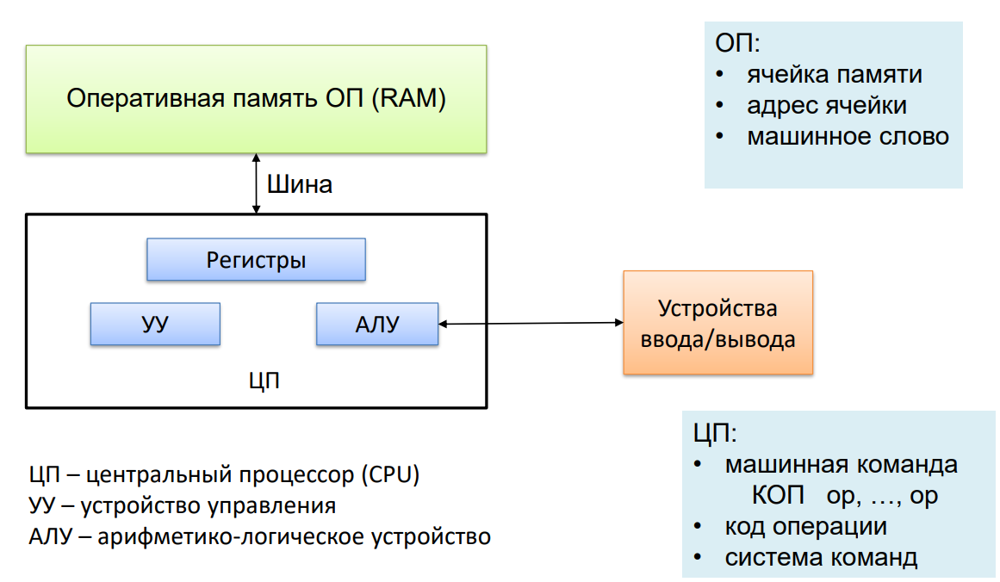

### **Регистры ЦП:**
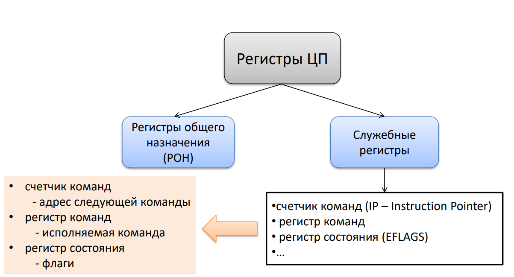

### **Архитектурные принципы фон Неймана**:
- Линейность и однородность памяти
- Произвольный доступ к памяти (адресуемость памяти)
- Программное управление
- Последовательное выполнение команд
- Принцип хранимой программы
- Неразличимость команд и данных
- Двоичное кодирование информации

# <a name="lect1_2"></a>Цикл выполнения команд (такт работы ЦП) - [↑](#contents)
**Выборка → Декодирование → Исполнение**

1. **Извлечение команды из памяти** \
Используя текущее значение счетчика команд, ЦП извлекает из памяти код очередной команды и помещает его в регистр команд

1. **Декодирование команды** \
ЦП по содержимому регистра команд определяет код операции и ее операнды. Значение счетчика команд увеличивается на длину извлеченного кода

1. **Загрузка операндов команды** \
Извлекаются значения операндов. Если операнд размещается в ОП, вычисляется исполнительный адрес

1. **Выполнение операции над данными**

2. **Запись результата** \
Результат может быть записан в том числе и в счетчик команд для изменения естественного порядка выполнения команд (команды перехода)

### **Выполнение команды:**
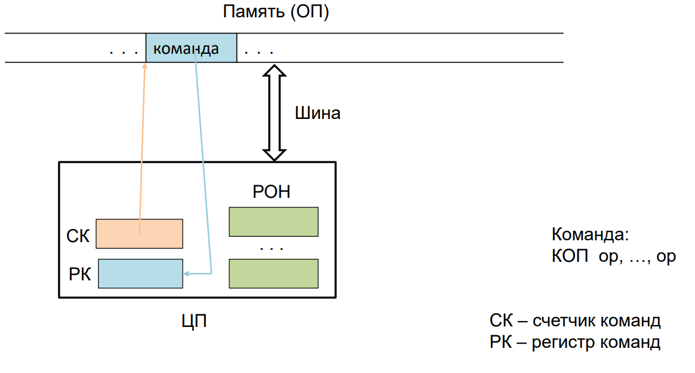

### **Компиляция и выполнение прикладной программы:**
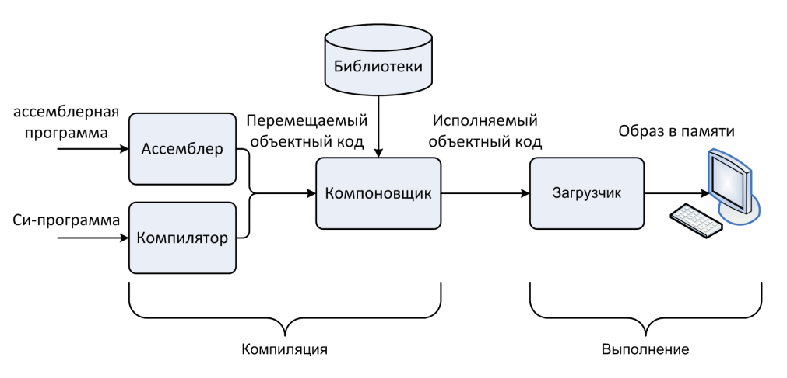

### **Ключевые термины и понятия**:
- Регистр, имя регистра, значение регистра, машинное слово
  - Счетчик команд, регистр команд
- Память, ячейка памяти, адрес ячейки памяти, время 
доступа к памяти
- Цикл выполнения команд (такт работы), тактовая частота
- Машинная команда, код операции, операнд, адресность 
команды
  - исполнительный адрес (effective/ executive address)
- Команда перехода (передачи управления

# <a name="lect2_1"></a>Понятие семейства ЭВМ - [↑](#contents)

- Одновременный выпуск и использование нескольких моделей семейства (с различной производительностью и ценой)
- Программная совместимость всех моделей семейства  * обратная совместимость
- Унификация устройств компьютера (аппаратная совместимость между моделями)
- Принцип модульности в архитектуре моделей семейства
- Стандартизированное системное программное обеспечение

### **Семейство процессоров Intel (x86)**
| Микросхема   | Дата выпуска | Частота(МГц) | Кол-во транзисторов | Объём памяти | Примечание                    |
| ------------ | ------------ | ------------ | ------------------- | ------------ | ----------------------------- |
| 8086         | 1978         | 5-10         | 29 000              | 1 Мб         | Первый 16-разрядный процессор |
| 80286        | 1982         | 8-12         | 134 000             | 16 Мб        | Появилась защита памяти       |
| 80386        | 1985         | 16-33        | 275 000             | 4 Гб         | Первый 32-разрядный процессор |
| 80486        | 1989         | 25-100       | 1 200 000           | 4 Гб         | Кэш-память на 8 Кб            |
| Pentium      | 1993         | 60-223       | 3 100 000           | 4 Гб         |                               |
| Pentium  Pro | 1995         | 150-200      | 5 500 000           | 4 Гб         |                               |
| Pentium II   | 1997         | 233-400      | 7 500 000           | 4 Гб         |                               |
| Pentium III  | 1999         | 650-1400     | 9 500 000           | 4 Гб         |                               |
| Pentium 4    | 2000         | 1300-3800    | 42 000 000          | 4 Гб         |                               |
| Core Due     | 2006         | 1600-3200    | 152 000 000         | 2 Гб         |                               |
| Core         | 2006         | 1200-3200    | 410 000 000         | 64 Гб        | 64-разрядная архитектура      |
| Core i7      | 2011         | 1100-3300    | 1 160 000 000       | 24 Гб        |                               |

### **Виртуальная память**
- _Виртуальная память_  * абстракция ОП
  - каждый процесс единолично использует ОП
  - каждый процесс имеет одно и то же представление о памяти  * _однородное виртуальное адресное пространство_
- Виртуальное адресное пространство:
  - Адреса ячеек памяти [0, 2n - 1]
  - IA-32 : [0, 232 - 1], [00000000, ffffffff]
- Виртуальный адрес
- Физический адреc


Виртуальная память:
- Эффективно использует оперативную память
- Упрощает управление памятью, обеспечивая каждый процесс однородным адресным пространством
- Защищает адресное пространство каждого процесса от вмешательства других процессов
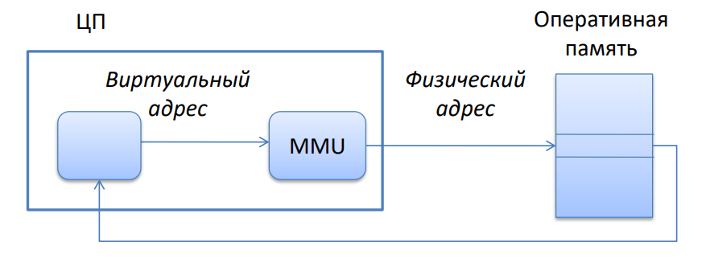


### **Архитектура виртуальной машины IA-32 (Intel Architecture):**
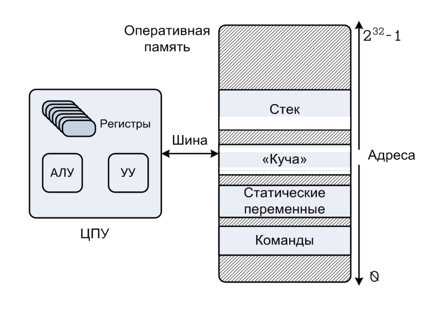


### **Основные регистры IA-32:**
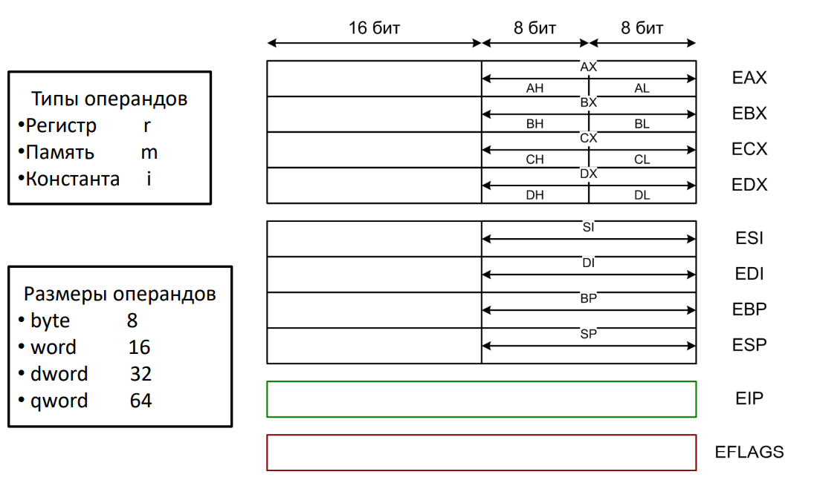

# <a name="lect2_2"></a>Особенности хранения чисел в памяти и на регистрах - [↑](#contents)

### Порядок размещения байтов в памяти

**Два наиболее распространенных подхода:**
1. прямой порядок следования байтов (big-endian) как правило используется в процессорах для обработки сетевых данных
2. обратный порядок следования байтов (little-endian) используется в IA-32

В регистрах используется прямой порядок следования байтов

Пусть $X = 12345678_\text{16}$

```
            Память                    Регистр
     ┌───┬───┬───┬───┬───┬───┐  ┌───┬───┬───┬───┐
     │...│78 │56 │34 │12 │...│  │12 │34 │56 │78 │
     └───┴───┴───┴───┴───┴───┘  └───┴───┴───┴───┘
        └────────────────┘
                X
```

### **Представление целых чисел**
- Числа без знака (беззнаковые)
  - _прямой код_ неотрицательного числа
  - диапазон [0, $2^k - 1$], k  * количество разрядов в ячейке
    - byte (k = 8) ➔ [0, $2^8  * 1$] = [0, 255]
    - word (k = 16) ➔ [0, $2^\text{16}   * 1$] = [0, 65535]
    - dword(k = 32) ➔ [0, $2^\text{32}  * 1$] = [0, 4 294 967 295]
  - примеры (k = 8)
    - 90 = $5A_\text{16}$ = $01011010_2$
    - 128 = $80_\text{16}$ = $10000000_2$

- Числа со знаком (знаковые)
  - _дополнительный код_: доп(x) = $x \ mod \ 2^k$
    - Если x >= 0, доп(x) = $x$
    - Если x < 0, доп(x) = $2^k - |x|$, k   * количество разрядов в ячейке

  - диапазон [$-2^\text{k-1}, 2^\text{k -1} - 1$], k  * количество разрядов в ячейке
    - byte (k = 8) ➔ [$-2^7, 2^7   * 1$] = [-128, 127]
    - word (k = 16) ➔ [$-2^\text{15}, 2^\text{15}  * 1$] = [-32768, 32767]
    - dword(k = 32) ➔ [$-2^\text{31}, 2^\text{31}   * 1$] = [-2 147 483 648, 2 147 483 647]

  - Примеры (k = 8)
    - доп(+90) = $5A_\text{16}$ = $01011010_2$
    - доп(-1) = $FF_\text{16}$ = $11111111_2$

### **Построение дополнительного кода**
Способы построения дополнительного кода (x < 0):

1. По формуле определения \
Пример (k = 8, x = -13) \
доп (-13) = $2^8$   * 13 = 256  * 13 = 243 = $F3_\text{16}$ = $11110011_2$

2. Через _обратный код_:
      - Построить прямой код |x|
      - Построить _обратный код_ (1 → 0, 0 → 1)
      - Прибавить 1 \

**_Пример_** (k = 8, x = -13) \
$|x| = 13$

Прямой код: $00001101_2$ \
Обратный код: $11110010_2$ \
+1 \
Дополнительный код $11110011_2$

### **Преимущества использования дополнительного кода**
- Единый алгоритм сложения и вычитания для чисел со знаком и без знака
- В процессоре достаточно иметь одну электронную схему для сложения и одну - для вычитания (для множения и деления это не так)
- Единое представление +0 и -0

### **Ключевые термины и понятия**:
- Семейство ЭВМ
- Программная совместимость
- Виртуальная память
  - Физический адрес
  - Виртуальный адрес, виртуальное адресное пространство
- Флаг, регистр флагов
- Представление целых чисел
  - Прямой код
  - Обратный код
  - Дополнительный код


# <a name="lect3_1"></a>Ассемблер NASM(Netwide Assembly) - [↑](#contents)

### **Организация ассемблерной программы**

- Программма на языке ассемблера
  - текстовый файл с расширением .asm
- Ассемблерный файл
  - набор секций, в размещается код программы и её данные
  - _директивы ассемблера_ - управляют процессом ассемблирования
- Основные секции ассемблерного файла
  - Секция кода **_.text_**
  - Секция инициализации данных **_.data_** - начальное значение определено
  - Секция неинициализации данных **_.bss_** - начальное значение не определено, все значения обнуляются перед запуском

### Примеры ассемблерных комманд
```asm
%include 'io.inc' ; директива для подключения
                  ; команд ввода/вывода
section .text     ; директива объявляет секцию кода
global CMAIN      ; директива объявляет точку входа 
                  ; в программу
CMAIN:            ; метка, на которую будет передано
                  ; управление при запуске программы
  PRINT_STRING ˮHello, world!” ; вывод строки
  NEWLINE                      ; перевод строки
  xor eax, eax                 ; eax := 0
  ret             ; завершает выполнение программы
```

```c
#include <stdio.h>
int main (void) { 
printf (Hello, world!\n”);
return 0;
}
```

```asm
%include 'io.inc'
section .bss           ; секция неинициализированных данных
  a resd 1
  b resd 1
section .data          ; секция инициализированных данных
  c dd 10
section .text          ; секция кода
global CMAIN

CMAIN:
  GET_DEC 4, [ a ]     ; ввод a
  GET_DEC 4, [ b ]     ; ввод b
  mov eax, dword[ a ] ; eax := a 
  add eax, dword[ b ] ; eax := a + b
  add eax, dword[ c ] ; eax := a + b + c
  PRINT_DEC 4, eax ; вывод eax
  NEWLINE
  xor eax, eax
  ret
```

- Регистры: eax, ebx, ecx, edx, edi, esi, ebp, esp

- CMAIN == int main(void)

- Возвращаемое значение функции * в регистре eax

- Средства ввода: GET_DEC, ...

- Средства вывода: PRINT_DEC, NEWLINE, …

- Размеры обращений к памяти: byte, word, dword

- Резервирование памяти: resb, resw, resd

- Объявление переменных с инициализацией: db, dw, dd

### **_Виды предложений языка ассемблера_**
- Ассемблерная команда
- Директива
- Комментарий
- Макрокоманда
```
Стурктура ассемблерной команды

метка: код_операции операнды  ; комментариий
```
- Метка:
  - Имя - помечает данное место (команду) в программе - Ему соответствует адрес этой команды в памяти

# <a name="lect3_2"></a>Директивы определения данных - [↑](#contents)
- Общий вид директивы
имя_переменной [ : ] директива ; комментарий
- Определение данных с начальной инициализацией
- Секция _.data_
  - db (byte) 1 байт 
  - dw (word) 2 байта
  - dd (dword) 4 байта
  - dq (qword) 8 байтов
- Определение данных без инициализации (резервирование памяти)
- Секция _.bss_
- все значения обнуляются ОС перед запуском программы
  - resb (byte) 1 байт 
  - resw (word) 2 байта 
  - resd (dword) 4 байта 
  - resq (qword) 8 байтов

### Директивы определения данных с начальной инициализацией
```asm
x dd -1       ; определение переменной x в формате двойного слова
              ; со значением -1 (0xFFFFFFFF)

db 5          ; определение байтовой переменной со значением 5

z dw 1, 2, 3  ; определение трех переменных в формате слова 
              ; со значениями 1, 2, 3

y db 127      ; определение байтовой переменной y со значением 127 (0x7F)
```

### Директивы определения данных без инициализации (резервирование памяти)
#### Следует располагать в секции .bss, тогда все данные получают начальное значение 0
```asm
a resd 1      ; резервирование памяти для 1 переменной (двойное слово)
b resb 20     ; резервирование памяти для 20 байтов 
c resw 100    ; резервирование памяти для 100 слов 
```
Имена a, b, и c - адреса, начиная с которых размещены обнуленные данные

### Запись констант
- Десятичное число 200, -5, 0
- Шестнадцатеричное число
  - Префикс _0x_: 0xC8 0x12345678
  - Суффикс _h_: 0C8h 12345678h
- Двоичное число
  - Суффикс _b_: 11001000b
- Символ: 'a', '*', '5'


# <a name="lect3_3"></a>Команды пересылки данных - [↑](#contents)
Типы операндов:
- Регистр - r
- Память - m
- Константа - i

```asm
mov op1, op2 ; op1 := op2, op1 и op2 одинакового размера
```
Допустимые форматы операндов
- _регистр – непосредственный операнд (константа)_ (r, i)
- _регистр – регистр_ (r, r)
- _регистр – память_ (r, m)
- _память – регистр_ (m, r)
- _память - непосредственный операнд (константа)_ (m, i)
  - r/m 8/16/32 r/m/i 8/16/32
- !!! Формат _память – память_ недопустим !!!

```asm
xchg op1, op2 ; op1 <-> op2 
```
- _регистр – регистр_ (r, r)
- _регистр – память_ (r, m)
- _память – регистр_ (m, r)
  - r/m 8/16/32 r/m 8/16/32

### Примеры команд пересылки данных
```asm
mov eax, 0      ; eax := 0
mov ecx, edx    ; ecx := edx
xchg eax, ebx   ; eax <-> ebx
```

Обращение к памяти:
- операнд типа «память»
  - _спецификатор размера_ [ имя переменной ]
  - Спецификатор размера:
    - byte
    - word
    - dword

```asm
mov eax, dword[a]  ; в eax помещается значение переменной a
                    ; (little-endian → big-endian)
mov eax, a          ; в eax помещается адрес переменной a
                    ; обращения к памяти нет
```

# <a name="lect3_4"></a>Расширение размера данных при пересылке - [↑](#contents)
- Используется для приведения типов
- *movzx* - беззнаковое расширение данных
  - число дополняется слева нулями до нужного размера
  - операнды: r 16/32 r/m 8/16
- *movsx* - знаковое расширение данных
  - число дополняется слева значением знака исходного числа
  - операнды: r 16/32 r/m 8/16

# <a name="lect4_1"></a>Арифметические операции и регистр флагов - [↑](#contents)

### Команды сложения и вычитания, регистр флагов
```asm
add op1, op2                 ; op1 := op1 + op2
  r/m 8/16/32 r/m/i 8/16/32 
sub op1, op2                 ; op1 := op1 - op2
  r/m 8/16/32 r/m/i 8/16/32
inc op                       ; op := op + 1
  r/m 8/16/32 
dec op                       ; op := op – 1
  r/m 8/16/32
neg op                       ; op := 0 - op
  r/m 8/16/32
```
- Флаги:
  - CF - флаг переноса
  - OF - флаг переполнения
  - SF – флаг знака
  - ZF - флаг нуля

### Особенности сложения и вычитания целых чисел. Формирование флагов
- CF = 1 – произошло беззнаковое переполнение
$$Сумма(x, y) = (x + y) \; mod \; 2^k=\begin{cases}
  x+y, \; x+y < 2^k, \; CF=0  \\
  x+y-2^k, \; x+y \geq  2^k, \; CF=1
\end{cases}
$$

- OF = 1 – произошло знаковое переполнение
  - Результат вышел за диапазон представления знакового числа
- SF = 1 – результат операции отрицателен
  - SF = старший бит результата
- ZF = 1 – результат операции равен 0
**_Примеры_**:
```asm
mov al, 255; -1 = FF
add al, 3

  FF 
+  3

102_16 = 00000010_2

CF = 1, SF = 0, ZF = 0 
-1 + 3 = 2 in [-128, 127] => OF = 0

al = 2
```
```asm
mov al, 127; 7F
add al, 2

  7F 
+  2

81_16 = 10000001_2 =129

CF = 0, SF = 1, ZF = 0
127 + 2 =129 not in [-128, 127] => OF = 1

al_бз = 129
al_зн = -127
```
### Команды умножения
```asm
mul op  ; умножение чисел без знака
  r/m 8/16/32

imul op ; умножение знаковых чисел
  op:
    byte => ax := al * op
    word => (dx, ax) := ax * op
    dword=> (edx, eax) := eax * op

!!! op не может быть константой!!!
```
```asm
imul op1, op2                 ; op1 := op1 * op2
  r 16/32, r/m 16/32
imul op1, op2, op3            ; op1 := op2 *op3
  r 16/32, r/m 16/32, i 16/32
```
| Размер операндов | множетель 1 | множетель 2 | результат  |
| ---------------- | ----------- | ----------- | ---------- |
| byte             | Al          | r/m 8       | AX         |
| word             | AX          | r/m 16      | (DX, AX)   |
| dword            | EAX         | r/m 32      | (EDX, EAX) |

### Команды деления
```asm
div op    ; деление чисел без знака
  r/m 8/16/32

idiv op   ; деление знаковых чисел 
  op:
    byte => al := ax div op, ah := ax mod op
    word =>  ax := (dx, ax) div op,
             dx := (dx, ax) mod op
    dword=> eax := (edx, eax) div op,
             edx := (edx, eax) mod op

!!! op не может быть константой!!!
```

| Размер операндов | делимое    | делитель | частное | остаток |
| ---------------- | ---------- | -------- | ------- | ------- |
| word/byte        | AX         | r/m 8    | AL      | AH      |
| dword/word       | (DX, AX)   | r/m 16   | AX      |         |
| qword/dword      | (EDX ,EAX) | r/m 32   | EAX     | EAX     |

### Команды расширения размера данных (конвертирование)
```asm
movzx, movsx - пересылка с расширением
```
Расширение знаковых чисел:

<p style="text-align:center"><b>cbw (al → ax )</b></p>

$$ah:=\begin{cases}
0, \; al \geq 0 \\
FF, \; al < 0
\end{cases}$$

<p style="text-align:center"><b>cwd (ax → (dx, ax))</b></p>

$$dx:=\begin{cases}
0, \; ax \geq 0 \\
FFFF, \; ax < 0
\end{cases}$$

<p style="text-align:center"><b>cdq (eax → (edx, eax))</b></p>

$$edx:=\begin{cases}
0, \; eax \geq 0 \\
FFFFFFFF, \; eax < 0
\end{cases}$$

| Расширение   | Число без знака                | Число со знаком         |
| ------------ | ------------------------------ | ----------------------- |
| byte → word  | mov al, byte [x].. mov ah, 0   | mov al, byte [x].. cbw  |
| byte → word  | movzx ax, byte [x]             | movsx ax, byte [x]      |
| word → dword | mov ax, word [x].. mov dx, 0   | mov ax, word [x].. cwd  |
| dword→ qword | mov eax, dword[x].. mov edx, 0 | mov eax, dword[x].. cdq |


### Вычисление арифметических выражений
**Типы** _**Си → nasm:**_
- int → dword
- short → word
- char → byte


```asm
; Вычислить c := a + b - 250, a и b – знаковые переменные в формате слова и двойного слова соответственно
section .data
  a dw -10 
  b dd 1500
section .bss
  c resd 1
section .text
  movsx eax, word [a]  ; знаковое расширение 
  add eax, dword[b]   ; eax := a + b
  sub eax, 250         ; eax := a + b - 250
  mov dword[c], eax   ; c := a + b - 250
```

```asm
; Вычислить b := (a - 500000) div 15, a – беззнаковая переменная в формате байта
section .data
  a db 150 
section .bss
  b resd 1 
section .text
  movzx eax, byte [a] ; беззнаковое расширение 
  sub eax, 500000     ; eax := a – 500000
  cdq                 ; (edx, eax) := (a – 500000)_qword
  mov ecx, 15
  idiv ecx
  mov dword[b], eax  ; b := (a - 500000) div 15
```

### Арифметика над 64-разрядными числами
```asm
adc op1, op2 ; op1 := op1 + op2 + CF
sbb op1, op2 ; op1 := op1 – op2 – CF
```
Пример:
```asm
section .bss
  x resq 1
  y resq 1
  z resq 1
; z := x + y
section .text
  mov eax, dword[x]
  add eax, dword[y]
  mov dword[z], eax      ; сложили младшие части
  mov eax, dword[x + 4]
  adс eax, dword[y + 4]
  mov dword[z + 4], eax  ; сложили старшие части
```

# <a name="lect4_2"></a>Команды и флаги - [↑](#contents)
- «M» - команда меняет флаг
- «-» - влияние команды на флаг не определено
- «X» - команда не влияет на флаг

| Команды                 | OF  | SF  | ZF  | CF  |
| ----------------------- | --- | --- | --- | --- |
| add, sub, neg           | M   | M   | M   | M   |
| inc, dec                | M   | M   | M   | X   |
| adc, sbb                | M   | M   | M   | M   |
| imul, mul               | M   | -   | -   | M   |
| idiv, div               | -   | -   | -   | -   |
| cbw, cwd, cdq           | X   | X   | X   | X   |
| mov, xchg, movsx, movzx | X   | X   | X   | X   |

# <a name="lect4_3"></a>Макросы ввода/вывода (файл io.inc) - [↑](#contents)

| Имя макрокоманды      | Описание                                                                                   |
| --------------------- | ------------------------------------------------------------------------------------------ |
| PRINT_UDEC size, data | Вывод беззнакового числа. Параметр data - выводимое значение, size – размер числа в байтах |
| PRINT_DEC size, data  | Вывод знакового числа в 10-ичном представлении                                             |
| PRINT_HEX size, data  | Вывод числа в 16-ричном представлении                                                      |
| PRINT_CHAR ch         | Печать символа, заданного параметром ch. Печатается содержимое 8 младших разрядов          |
| PRINT_STRING data     | Печать строки, оканчивающейся символом с кодом 0                                           |
| NEWLINE               | Перевод строки                                                                             |
| GET_UDEC size, data   | Ввод беззнакового числа размера size                                                       |
| GET_DEC size, data    | Ввод знакового числа размера size                                                          |
| GET_CHAR data         | Ввод символа                                                                               |

```asm
%include 'io.inc'
section .text         ; c := 10 * (a + b) – d mod 27
global CMAIN          ; a, b, d - числа со знаком в формате двойного слова
CMAIN:
  GET_DEC 4, ecx      ; ввод a
  GET_DEC 4, ebx      ; ввод b
  GET_DEC 4, eax      ; ввод d
  add ecx, ebx        ; ecx := a + b
  imul ecx, ecx, 10   ; ecx := 10 * (a + b)
  cdq                 ; (edx, eax) := dqword
  mov ebx, 27
  idiv ebx            ; edx := d mod 27
  sub ecx, edx        ; ecx := 10 * (a + b) – d mod 27
  PRINT_DEC 4, ecx    ; вывод ecx
  NEWLINE
  xor eax, eax
  ret
```

# <a name="lect5_1"></a>Команды переходов - [↑](#contents)

- Нарушают естественный (линейный) порядок выполнения 
команд программы
- В счетчик команд (регистр EIP) записывается адрес команды, на которую следует передать управление(выполнить переход)
- Не меняют флаги
- Разновидности переходов:
  - _безусловные_ – выполняются вне зависимости от каких-либо условий
  - _условные_ – выполняются только, если выполнено некоторое условие

### Команда безусловного перехода
```asm
jmp op ; goto op
  r/m/i 32
  позволяют передавать управление в любую точку программы
```
```asm
# Прямой переход – адрес перехода указан явно
# jmp <метка> (i 32)

jmp L ; переход на команду с меткой L
      ; код
L :
      ; код
```

```asm
Косвенный переход – адрес перехода указан в регистре или ячейке памяти;
  * используется, если адрес перехода становится известным только во время выполнения программы

jmp eax ; адрес перехода в регистре eax
jmp [x] ; адрес перехода в ячейке памяти по адресу x
```
### Команды сравнения и условных переходов
- **Команда _сравнения_**
```asm
cmp op1, op2
  ; op1 - op2, op1 не меняется,
  ; флаги формируются как в команде sub,
  ; r/m/i 8/16/32 r/m/i 8/16/32
```
- **Команда _условного перехода_**
```asm
Jcc <метка> 
  ; cc – код условия перехода,
  - условие перехода определяется состоянием флагов регистра EFLAGS;
  - позволяют передавать управление в любую точку программы (длинный переход)
```


### Команды условного перехода по результатам сравнения (cmp op1, op2)
| Команда | Jump if          | Логика перехода | Условие перехода |
| ------- | ---------------- | --------------- | ---------------- |
| je      | equal            | op1=op2         | ZF=1             |
| jne     | not equal        | op1!=op2        | ZF=0             |
|         |                  | числа со знаком |                  |
| jl      | less             | op1<op2         | SF!=OF           |
| jle     | less or equal    | op1<=op2        | SF!=OF или ZF=1  |
| jg      | greater          | op1>op2         | SF!=OF           |
| jge     | greater or equal | op1>=op2        | SF!=OF и ZF=0    |
|         |                  | числа без знака |                  |
| jb      | below            | op1<op2         | CF=1             |
| jbe     | below or equal   | op1<=op2        | CF=1 или ZF=1    |
| ja      | above            | op1>op2         | CF=0 и ZF=0      |
| jae     | above or equal   | op1>=op2        | CF=0             |

### Другие команды условного перехода
- **Переходы по значению флагов**
| Команда | Условие перехода | Команда | Условие перехода |
| ------- | ---------------- | ------- | ---------------- |
| jz      | ZF=1             | jnz     | ZF=0             |
| js      | SF=1             | jns     | SF=0             |
| jc      | CF=1             | jnc     | CF=0             |
| jo      | OF=1             | jno     | OF=0             |

- **Переход по значению регистра ecx**
```asm
jecxz <метка>
  ; if ecx = 0 then goto <метка>
  ;Реализует короткий переход (в пределах [-128, 127] байтов)
```
# <a name="lect5_2"></a>Реализация ветвлений - [↑](#contents)
| С                             | Pascal                          | NASM                      |
| ----------------------------- | ------------------------------- | ------------------------- |
| goto <метка>                  | goto <метка>                    | jmp <метка>               |
| if (op1 \/ op2){goto <метка>} | if op1 \/ op2 then goto <метка> | cmp op1, op2  jmp <метка> |

**_Пример_**: вычисление модуля числа
```asm
%include 'io.inc'
section .text
global CMAIN
CMAIN:
  GET_DEC 4, eax     ; ввод числа x
  cmp eax, 0
  jge ge             ; если x >= 0
  neg eax            ; меняем знак числа x
ge:
  PRINT_UDEC 4, eax  ; вывод |x|
  NEWLINE
  xor eax, eax
  ret
```

# <a name="lect6_1"></a>Реализация циклов - [↑](#contents)

### Цикл while
```asm
cycle:
  cmp dword[x], 0
  jle cycle_end   ; x <= 0
                  ; реализация S
  ...
  jmp cycle
cycle_end:

```
### Цикл repeat
```asm
cycle:
                   ; реализация S
  ...
  cmp dword[x], 0
  jle cycle        ; x <= 0
```
**_Пример_**: вычисление суммы цифр числа
```asm
%include 'io.inc'
section .text
global CMAIN
CMAIN:
; n >= 0 
GET_UDEC 4, eax; ввод n
mov ecx, 0; s := 0
mov ebx, 10
cycle:
cmp eax, 0
je cycle_end; n = 0
mov edx, 0; расширили n для деления
div ebx ; eax = n / 10, edx = n % 10
add ecx, edx; s := s + цифра
jmp cycle
cycle_end:
```

### Циклы с заранее известным числом повторений. Команда loop
```asm
loop <метка>
  ; ecx := ecx – 1
  ; if ecx <> 0 then goto <метка>
  - Флаги не меняет
  - Реализует короткий переход
```
**_Пример_**: вычисление факториала
```asm
%include 'io.inc'
section .text
global CMAIN
CMAIN:
                    ; n! = n * (n - 1) * … * 2 * 1, n >= 0
  GET_UDEC 4, ecx   ; ввод n
  mov eax, 1        ; n!
  jecxz fin         ; если n = 0
cycle:
  imul eax, ecx
  loop cycle
fin:
  PRINT_UDEC 4, eax ; вывод n!
  NEWLINE
  mov eax, 0
  ret
```

### Реализация вложенных циклов с помощью команды loop
```Pascal
{n > 0, m >0}
for i := n downto 1 do
  for j := m downto 1 do S
```

```asm
  mov ecx, n
extr_cycle:
  mov edx, ecx    ; запомнить ecx для внешнего цикла
  mov ecx, m
int_cycle:
  ...             ; реализация S
  loop int_cycle
  mov ecx, edx    ; восстановить ecx для внешнего цикла
  loop extr_cycle
```
**_Пример_**: Подсчет количества двузначных чисел, не содержащих одинаковых цифр (деление не использовать)
```asm
  mov ebx, 0    ; n := 0
  mov ecx, 9
extr_cycle:
  mov edx, ecx  ; edx – старшая цифра
  mov ecx, 10
int_cycle:
  mov eax, ecx
  dec eax       ; eax – младшая цифра
  cmp edx, eax
  je eq         ; цифры равны
  inc ebx       ; n := n + 1
eq:
  loop int_cycle
  mov ecx, edx
  loop extr_cycle
```

# <a name="lect6_2"></a>Операторы для циклов - [↑](#contents)

### Использование оператора break
- реализует досрочный выход из цикла
- _Пример_: найти первый отрицательный элемент в последовательности из n элементов (в eax)
```C
for (int i =1; i <= n; i++ ) {
scanf(“%d”, &x);
if (x < 0) break;
}
```

```asm
  mov ecx, n
beg:
  GET_DEC 4, eax ; x
  cmp eax, 0
  jl exit        ; x < 0
  loop beg
exit:
```

### Использование оператора continue
- реализует досрочный переход к следующей итерации цикла
- _Пример_: обработка только положительных чисел в последовательности из n элементов (остальные пропускаются)

```C
for (int i =1; i <= n; i++ ) {
scanf(“%d”, &x);
if (x <= 0) 
  continue; /* пропускаем числа <= 0 */
... /* обработка положительных чисел */
}
```

```asm
mov ecx, n
beg:
  GET_DEC 4, eax ; x
  cmp eax, 0
  jle next       ; x <= 0
  . . .          ; обработка чисел > 0
next:
  loop beg
```

# <a name="lect7"></a>Побитовые (поразрядные) операции - [↑](#contents)

## Побитовые операции
- Реализуют поразрядное выполнение операций
- Операнды рассматриваются как вектора из битовых значений
- Операция выполняется сразу над всеми разрядами операндов одновременно, при этом i-ый разряд результата зависит только от i-ых разрядов операндов
- Выполняются значительно быстрее
- Бит со значением 1 → true, бит со значением 0 → false
- Меняют флаги, обычно используется флаг ZF

## Побитовые логические команды
```asm
• not op        ; op = ~ op , инверсия
    – r/m 8/16/32
mov al, 1100b   ; al = 0000_1100b
not al          ; al = 1111_0011b

• and op1, op2  ; op1 = op1 & op2
• or op1, op2   ; op1 = op1 | op2
• xor op1, op2  ; op1 = op1 ^ op2
• test op1, op2 ; op1 & op2, 
       op1 не изменяется
    – r/m 8/16/32 r/m/i 8/16/32
```
### Примеры:
```asm
• and
mov al, 1100b     ; al = 0000_1100b
and al, 1010b     ; al = 0000_1000b

– Выделение группы битов
mov al, 1100_0101b
and al, 111b      ; al = 0000_0101b, 111b – битовая маска

• or
mov al, 1100b     ; al = 0000_1100b
or al, 1010b      ; al = 0000_1110b

– Объединение групп битов
mov al, 1100_0000b
or al, 1100b ; al = 1100_1100b
```

### Команда xor. Примеры использования
```asm
• xor
mov al, 1100b     ; al = 0000_1100b
xor al, 1010b     ; al = 0000_0110b 

• Обнуление регистра
xor eax, eax      ; eax := 0 (вместо mov eax, 0)

• Свойства операции xor (a = 0 или a = 1):
a xor 1 = ~a
a xor 0 = a

• Инвертировать заданный бит числа
xor eax, 100b     ; инвертировать 3-ий справа бит eax
                  ; остальные биты не меняют значения
```
### Команда test. Примеры использования
```asm
test op1, op2     ; op1 & op2

• Альтернативная проверка условий

• Проверка содержимого регистра на 0
test eax, eax     ; вместо cmp eax, 0
jz zero           ; переход на метку, если eax = 0

• Проверка на четность
test eax, 1
jz even           ; переход на метку, если в eax - четное число
```

## Сдвиги и вращения
```asm
• shr op1, op2      ; сдвиг логический вправо
• shl op1, op2      ; сдвиг логический влево
• sar op1, op2      ; сдвиг арифметический вправо
• sal op1, op2      ; сдвиг арифметический влево
• ror op1, op2      ; сдвиг циклический вправо
• rol op1, op2      ; сдвиг циклический влево
• rcr op1, op2      ; сдвиг циклический через CF вправо
• rcl op1, op2      ; сдвиг циклический через CF влево
    – r/m 8/16/32 i8/CL
    – op2 задает n (1 <= n <= 31) – на сколько битов надо cдвигать op1
```
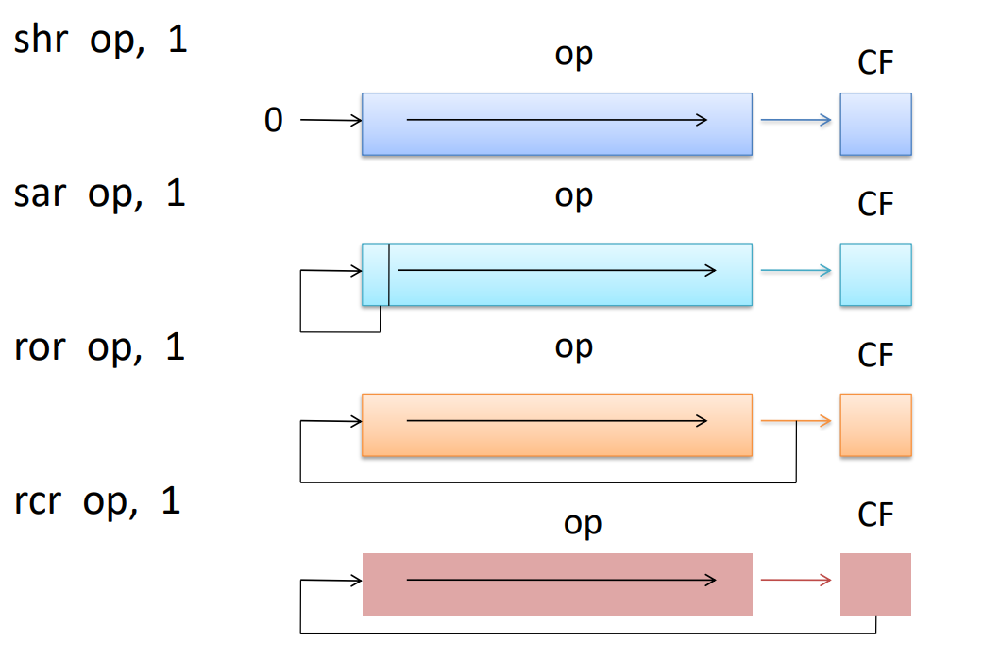

### **Логический сдвиг**


### **Арифметический сдвиг**
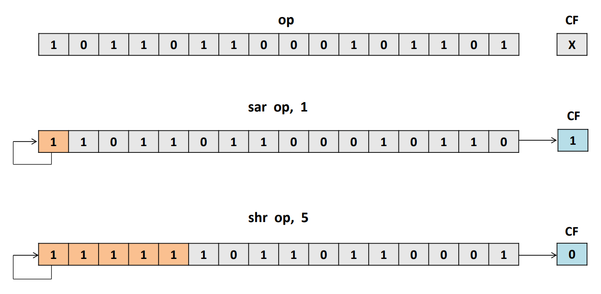

### **Циклический сдвиг(вращение)**
")

### **Циклический сдвиг через CF**
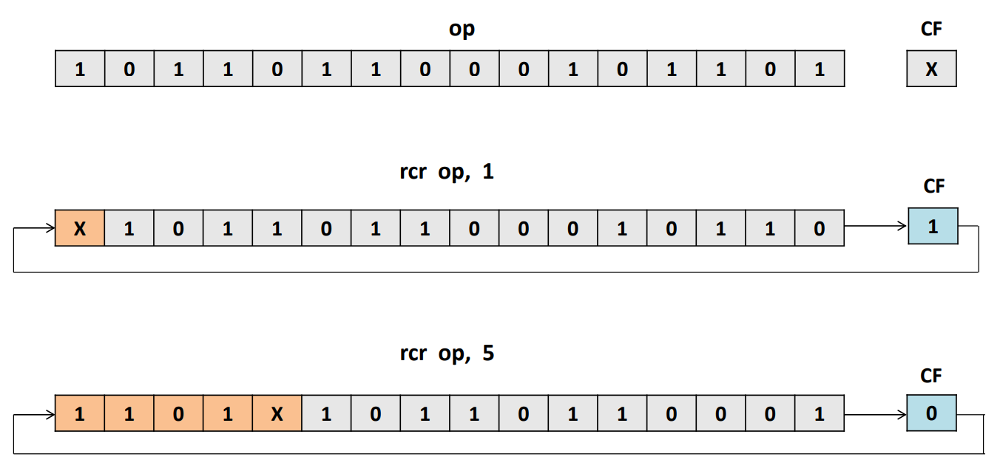

## **Быстрое умножение и деление на 2**
```asm
1 <= n <= 31
• op := op * 2n , op *= 2n
  shl op, n 

• op := op div 2n, op /= 2n
  – число без знака
  shr op, n

  – число со знаком
  sar op, n

• op := op mod 2n, op %= 2n, op >= 0
  and op, 2n- 1 ; 1...1b - битовая маска числа n
```
### Примеры:
```asm
• shl eax, 4    ; eax := eax * 16

• shr eax, 5    ; eax := eax / 32

• and eax, 7    ; eax := eax mod 8
```
Примеры(продолжение):
```asm
• Подсчет числа двоичных единиц в eax
xor ebx, ebx    ; ebx := 0
mov ecx, 32     ; счетчик цикла
cycle: 
  ror eax, 1    ; младший бит в CF
  adc ebx, 0    ; ebx := ebx + CF
  loop cycle

• x := x div 2, x – 64-разрядное число, x >= 0
shr dword[x + 4], 1  ; сдвиг старшей части x
rcr dword[x], 1      ; сдвиг младшей части x

• Пусть eax = x, получить eax = |x|. Команды сравнения и условные переходы не использовать
mov ecx, eax      ; x
sar ecx, 31       ; ecx = -1 (x < 0), ecx = 0 (x >= 0) 
xor eax, ecx      ; eax = ~x (x < 0), eax = x (x >= 0) 
sub eax, ecx      ; eax = ~x + 1 = доп(x) (x < 0), eax = x (x >= 0)

x = -5
eax = доп(-5) = 2^32 – 5 = 0xFFFFFFFB
mov ecx, eax    ; ecx = -5
sar ecx, 31     ; ecx = -1 
xor eax, ecx    ; eax = ~x = 0x00000004 = 4 
sub eax, ecx    ; eax = 4 – (-1) = 5
```

# <a name="lect8"></a>Обработка массивов - [↑](#contents)

## **Одномерные массивы.** Реализация
• Индексация элементов с 0 \
• Расположение в памяти: \
в едином непрерывном блоке памяти размером n * k (n * sizeof (<тип>)), \
k – размер элемента массива в байтах (k = sizeof (<тип>)

```
C:                   nasm:
                     section .bss
char a[12 ];             a resb 12
short b[6];              b resw 6
int c[3];         ->     c resd 3
enum {N = 100};          N equ 100 ; директива эквивалентности
int d[N];                d resd N
```

### **Доступ к элементам массива**
Адрес (a[i]) = a + i * k, a – адрес массива, k – размер элемента массива, k = {1, 2, 4, 8}

• Пусть eax = i (индекс элемента массива) \
Адрес (a[i]) : a + eax * k

• Пусть edx содержит начальный (базовый) адрес массива \
Адрес (a[i]) : edx + eax * k

### **Вычисление исполнительного адреса**
Общий вид исполнительного адреса: \
А = [база + индекс * масштаб + смещение]

• база – любой регистр общего назначения (eax, ebx, ecx, edx, edi, esi, ebp, esp) \
• индекс - любой регистр общего назначения, кроме esp \
• масштаб – размер элемента в памяти (1, 2, 4, 8)

```asm
a resd N, пусть ebx = i (i - индекс элемента массива)

mov eax, dword[a]                  ; eax := a[0]
mov eax, dword[a + ebx * 4]        ; eax := a[i]
mov edx, a                          ; edx := адрес массива
mov eax, dword[edx + ebx * 4]      ; eax := a[i]
mov eax, dword[edx + ebx * 4 - 4]  ; eax := a[i - 1]
```

### **Обработка массивов.** _Примеры_
#### Вычисление скалярного произведения векторов
```asm
section .bss
  N equ 100
  x resd N      ; числа со знаком
  y resd N      ; числа со знаком

xor eax, eax    ; s := 0
mov ebx, 0      ; i := 0, индекс элемента
mov ecx, N      ; счетчик цикла

cycle:
  mov edx, dword[x + ebx * 4]    ; edx := x[i]
  imul edx, dword[y + ebx * 4]   ; edx := x[i] * y[i]
  add eax, edx                    ; s := s + x[i] * y[i]
  inc ebx                         ; i := i + 1
  loop cycle

; В eax - скалярное произведение векторов
```

#### Подсчет количества нечетных чисел в массиве(слева-направо)
```asm
section .bss
  N equ 100
  x resd N      ; числа без знаком

xor eax, eax                  ; k := 0
mov ecx, N                    ; счетчик цикла
mov ebx, 0                    ; i := 0, индекс элемента
cycle:
  test dword[x + ebx * 4], 1 ; проверка младшего бита x[i]
  jz even                     ; четное число
  inc eax                     ; k := k + 1
even:
  inc ebx                     ; i := i + 1
  loop cycle
```

#### Подсчет количества нечетных чисел в массиве(справа-налево)
```asm
section .bss
  N equ 100
  x resd N      ; числа без знаком

xor eax, eax    ; k := 0
mov ecx, N      ; счетчик цикла
cycle:
  test dword[x + ecx * 4 - 4], 1 ; проверка младшего бита x[i]
  jz even                         ; четное число
  inc eax                         ; k := k + 1
even:
  loop cycle
```

# <a name="lect9_1"></a>Аппаратный стек. - [↑](#contents)
## **Поддержка аппаратного стека в IA-32**
- Область памяти, работа с которой ведется согласно дисциплине стека (LIFO)

- ESP (Stack Pointer) указатель стека - указывает на верхний элемент стека - верхушка стека (последнее занесенное в стек значение)

- Стек растет вниз (при записи значения)

- Контроль за размером стека осуществляет ОС

- Данные в формате двойного слова (dword) 

- Использование стека:
  - сохранение значений регистров
  - при вызовах функций (адрес возврата и т.д.)
  - в задачах, где требуется обработка данных согласно дисциплине стека


### Команды доступа к стеку: **запись в стек**
```asm
• Обеспечивается дисциплина работы со стеком (LIFO)
• push op ; запись в стек
  – r/m/i 16/32, для m и i обязательно указывать размер! 
  – будем рассматривать 32-х битный формат
  – esp := esp – 4, dword[esp] := op

• push eax
  push dword[x]
  push dword300
```

### Команды доступа к стеку: **чтение из стека**
```asm
• pop op ; чтение из стека
– r/m 16/32, для m обязательно указывать размер! 
– будем рассматривать 32-х битный формат
– op = dword[esp]; esp = esp + 4 
• pop eax
  pop dword[res]
```

### Примеры использования стека
#### Дана последовательность ненулевых чисел, оканчивающаяся 0. Вывести числа в обратном порядке
```asm
mov ebp, esp        ; запомнили положение вершины стека
Input:
  GET_DEC 4, eax    ; ввод очередного числа
  test eax, eax     ; проверка на 0
  jz Print          ; конец последовательности
  push eax          ; занесли число в стек
  jmp Input         ; ввод следующего числа
Print:
  cmp ebp, esp      ; проверка на пустоту стека(равенство указателей)
  je Fin            ; конец программы
  pop eax           ; извлекли число из стека
  PRINT_DEC 4, eax  ; вывод числа
  PRINT_CHAR ' '    ; вывод пробела
  jmp Print         ; вывод следующего числа
Fin:
  NEWLINE
  ret
```

# <a name="lect9_2"></a>Организация вызова функций - [↑](#contents)
### Вопросы:
- Передача управления функции и возврат обратно
- Размещение фактических параметров
- Передача возвращаемого значения
- Размещение локальных переменных
- Порядок использования регистров различными функциями
- Машинные команды для поддержки функций

### Ответы - Application Binary Interface (ABI) (бинарный интерфейс приложений)
- Соглашения между программами, библиотеками и ОС для обеспечения их взаимодействия на данной платформе
- Платформа – архитектура аппаратуры + ОС
- Соглашение о вызовах (Calling Convention)
- При соблюдении ABI можно разрабатывать модули программы на разных языках программирования


## Поддержка функций на уровне языка (nasm)
- Понятие функции (подпрограммы)
- Вызов функции и возврат из нее
- Адрес возврата (АВ)
- Фрейм функции
- Оформление функции – требуется только метка (имя функции)
- Не допускается вложенности функций (как в Си)
- В коде одномодульной программы располагаются после CMAIN

## Использование аппаратного стека для поддержки функций
- Необходимо выделять память под сохранение состояния каждого работающего вызова – фрейм функции:
    - Параметры
    - Локальные переменные
    -  Адрес возврата
- Почему стек?
  - Сохранять состояние вызова функции надо в ограниченный период времени: от момента ее вызова до момента выхода из функции
  - Вызываемая функция всегда завершается до вызывающей
- Стековый фрейм
  - Часть стека для хранения состояния отдельного вызова функции

## Машинные команды для поддержки функций
- Вызов функции
  - call <метра>
  - АВ – адрес команды, непосредственно следующей за call, заносится в стек, goto <метка>
  - esp = esp – 4; [esp] <- EIP; goto <метка>
- Возврат из функции
  - ret
  - Из стека извлекается АВ, выполняется переход по АВ
  - EIP <- [esp]; esp = esp + 4

Важно!!! К моменту выполнения ret в вершине стека должен находиться АВ

### Использование меток в функциях
- nasm позволяет использовать локальные метки
- Имя локальной метки начинается с точки
- Область локализации метки – фрагмент кода между обычными (нелокальными) метками
- Позволяет локализовать метки внутри функции => устраняется опасность коллизии меток
- Внутри функции следует использовать только локальные метки
  
### Пример: 
#### Вычисление n! (n > 0)
```asm
CMAIN:
  GET_UDEC 4, eax       ; ввод n
  push eax              ; параметр n в стек
  call fact             ; вызов функции fact
  add esp, 4            ; освободили стек от параметра n
  PRINT_UDEC 4, eax     ; результат fact
  NEWLINE               ; перевод строки
  xor eax, eax          ; возврат 0
  ret                   ; выход из программы
fact:
  push ebp                  ; сохранение ebp
  mov ebp, esp              ; ebp = esp
  mov ecx, dword[ebp + 8]  ; ecx = n
  mov eax, 1                ; return 1
.cycle:
  imul eax, ecx             ; eax = eax * ecx
  loop .cycle               ; ecx = ecx - 1; if (ecx != 0) goto .cycle
  pop ebp                   ; восстановление ebp
  ret                       ; выход из функции
```

# <a name="lect10_1"></a>Функции - [↑](#contents)
## Стек фреймов
- Во фрейме размещаются:
  - Данные, необходимые для возврата из функции (адрес возврата АВ)
  - Локальные переменные
  - Сохраненные регистры

- Управление фреймами:
  - Пространство выделяется во время входа в функцию
    - «пролог» функции
  - Освобождается на выходе из функции
    - «эпилог» функции

### Поддержка функций на уровне аппаратуры
- Аппаратный стек
- Вызов/возврат
  - Команды call и ret
- Состояние выполняющихся функций
  - Стековый фрейм
  - Фрейм хранит текущее состояние вызова функции
  - Границы фрейма
    - Верхняя граница – ebp
    - Нижняя граница – esp
  - Содержимое фрейма
    - Адрес возврата
    - Локальные переменные
    - Вспомогательные переменные
    - Параметры(аргументы) вызываемых функций

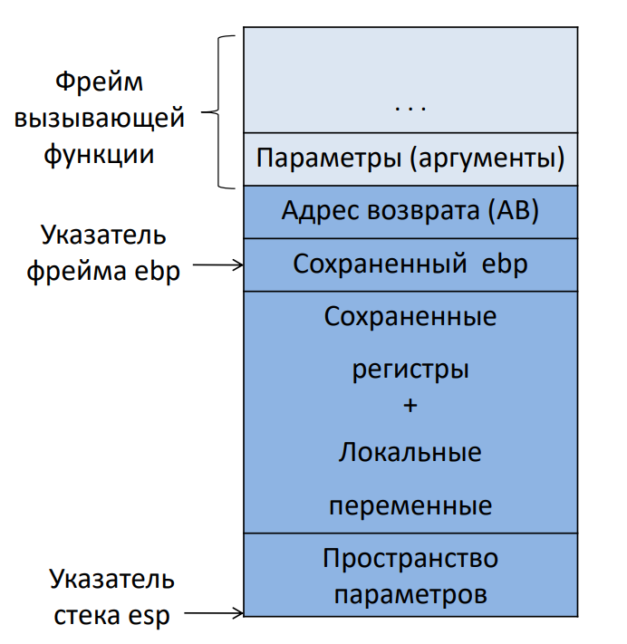

### Поддержка функций на уровне соглашений
- Для чего нужны соглашения о вызовах
  - взаимодействие с библиотеками стандартных функций
  - взаимодействие с кодом на языке высокого уровня
  - дисциплина программирования

- Соглашение о вызовах функций (Calling Convention) определяет:
  - способ и порядок передачи параметров (аргументов) функции
  - способ передачи возвращаемого значения
  - размещение локальных переменных
  - использование регистров и т.д.
- Основное соглашение на платформе IA-32/Linux - соглашение cdecl (используется по умолчанию)

# <a name="lect10_2"></a>Соглашение о вызовах cdecl - [↑](#contents)
- Размещение параметров
  - На стеке, с обязательным выравниванием по 4-х байтовой границе
  - Каждый параметр - двойное слово
- Порядок передачи параметров
  - «Обратный», от «верхушки» стека ко «дно»: сразу над адресом возврата размещается первый параметр, затем второй и т.д.
- Какие регистры могут быть использованы вызванной функцией без предварительного сохранения
  - EAX, EDX, ECX
- Какие регистры вызванная функция обязана сохранить
  - EBP, EBX, EDI, ESI
- Возвращаемое функцией значение
  - EAX
  - EDX:EAX
  - Через память
- Очистка стека от параметров после вызова
  - Очищает вызывающая функция

### Сохранение регистров в IA32/Linux+Windows
- eax, ecx, edx
  - Вызывающая функция сохраняет значения этих регистров перед call, если планирует использовать их позже
- eax
  - Используется для возврата значения
- ebx, edi, esi
  - Вызванная функция сохраняет значения этих регистров, если планирует их использовать
- esp, ebp
  - Сохраняются вызванной функцией
  - Восстанавливаются перед выходом из функции

### Оформление функции (cdecl):
```asm
• f (param1, …, paramN)
f:
  push ebp ; пролог
  mov ebp, esp ; функции
  ; ... 
  ; тело функции
  mov esp, ebp ; эпилог
  pop ebp ; функции
  ret
```

```asm
•Вызов функции f

push paramN
...
push param1
call f
add esp, 4 * n  ; очистка
                ; стека от параметров 
                ; вызова
```

### Пример
#### скалярное произведение(функция)
```asm
; int scal (int *a, int *b, int len), len > 0

scal:
  push ebp          ; пролог
  mov ebp, esp      ; функции

  push esi          ; сохранение
  push edi          ; регистров

  mov esi, dword[ebp + 8]  ; a
  mov edi, dword[ebp + 12] ; b
  xor eax, eax              ; s := 0
  mov ecx, dword[ebp + 16] ; len

.cycle:
  mov edx, dword[esi + ecx * 4 - 4]  ; a[i]
  imul edx, dword[edi + ecx * 4 - 4] ; a[i]*b[i]
  add eax, edx                        ; s := s + a[i]*b[i]
  loop .cycle                         ; ecx := ecx - 1; if (ecx != 0) goto .cycle
  pop edi                             ; восстановление
  pop esi                             ; регистров
  pop ebp                             ; функции
  ret
```
#### скалярное произведение(вызов)
```asm
section .bss
  N equ 100
  a resd N
  b resd N
; ...
push dwordN    ; len
mov eax, b
push eax        ; адрес массива b
mov eax, a
push eax        ; адрес массива a
call scal       ; вызов функции
add esp, 12     ; очистка стека от параметров вызова(3*4)
```

# <a name="lect11_1"></a>Рекурсивные функции - [↑](#contents)

### Вычисление n! (n >=0). Рекурсивная реализация
```asm
fact:
  push ebp                  ; пролог
  mov ebp, esp              ; функции

  sub esp, 4                ; для параметра fact
  mov edx, dword[ebp + 8]  ; edx = n 
  cmp edx, 1                ; проверка на крайнее значение
  ja .recur                 ; n > 1
  mov eax, 1                ; return 1
  jmp .end                  ; выход из функции
.recur:
  dec edx                   ; n – 1
  mov dword[esp], edx      ; параметр для 
  call fact                 ; eax = fact (n - 1)
  imul eax, dword[ebp + 8] ; fact (n-1)*n
.end:
  mov esp, ebp              ; эпилог 
  pop ebp                   ; функции
  ret                       ; return eax
```

### Рекурсия: выводы и итоговые замечания
- Для реализации рекурсии достаточно соблюдать соглашение о вызовах (cdecl)
- Реализация не использует дополнительные приемы
  - Создание фреймов гарантирует, что каждый вызов располагает персональным блоком памяти для хранения
    - адреса возврата
    - регистров и локальных переменных => локальные переменные незавершенных вызовов не перезаписываются
  - Общее соглашение о сохранении регистров препятствует порче регистров различными вызовами
  - Стековая организация поддерживается порядком вызовов и возвратов из функций
    - Если P вызывает Q, то Q завершается до того, как завершится P
    - LIFO - Last In First Out
- Справедливо для реализации неявной рекурсии
  - P вызывает Q; Q вызывает P

# <a name="lect11_2"></a>Оптимизация вызова функций - [↑](#contents)

## Как улучшить производительность кода
- Использование классических оптимизаций кода при компиляции
  - Отказ от использования указателя фрейма “omit frame pointer”
- Использование более эффективных соглашений о вызовах функций (при небольшом числе параметров)
  - Соглашение stdcall
  - Соглашение fastcall
- Использование конкретного соглашения о вызовах во многом определяется используемым компилятором

### Отказ от использования указателя фрейма
- Пролог и эпилог функции увеличивают накладные расходы на организацию вызова функции
  - особенно заметно на небольших функциях
- Для адресации по стеку используется только регистр esp
  - доступ ко всем данным во фрейме через смещение относительно esp
- Преимущества:
  - не надо сохранять и восстанавливать ebp в прологе и эпилоге функции
  - экономия обращений к памяти (нет push ebp, pop ebp)
  - появляется дополнительный регистр (ebp) для организации вычислений
- Опция '-fomit-frame-pointer' включена в общие списки оптимизации компилятора gcc(с 2011 года)
  - при включенном режиме оптимизации подключается по умолчанию

omit frame pointer - пример
```asm
fact:
  sub esp, 4                ; для параметра fact
  mov edx, dword[ebp + 8]  ; edx = n 
  cmp edx, 1                ; проверка на крайнее значение
  ja .recur                 ; n > 1
  mov eax, 1                ; return 1
  jmp .end                  ; выход из функции
.recur:
  dec edx                   ; n – 1
  mov dword[esp], edx      ; параметр для 
  call fact                 ; eax = fact (n - 1)
  imul eax, dword[ebp + 8] ; fact (n-1)*n
.end:
  add esp, 4                ; очистка от параметра
  ret                       ; return eax
```

# <a name="lect11_3"></a>Другие соглашения о вызовах: stdcall, fastcall - [↑](#contents)

## Соглашение stdcall
- Используется для функций с небольшим количеством параметров
- Очистку стека от параметров вызова выполняет сама вызванная функция !(отличие от cdecl)
- Возврат из функции
  - ret 4 * n, n – количество параметров функции
  - передает управление по адресу возврата
  - увеличивает esp на 4* n, очищая стек от параметров вызова
- Используется при вызове функций Win32 в ОС Windows
- Не подходит для реализации функций с переменным числом параметров, передаваемых через стек

### Пример соглашения stdcall. 
#### Вычисление суммы элементов массива
```asm
sum:
  push ebp                            ; пролог
  mov ebp, esp                        ; функции

  xor eax, eax                        ; s = 0
  mov ecx, dword[ebp + 8]            ; n
  test ecx, ecx                       ; n = 0 ?
  jz .end                             ; n = 0
  mov edx, dword[ebp + 12]           ; a

.cycle:
  add eax, dword[edx + 4 * ecx - 4]  ; s = s + a[i]
  loop .cycle
.end:
  pop ebp                             ; эпилог
  ret 8                               ; 4 * 2 – очищаем стек от параметров вызова
```

### Соглашение fastcall
- Используется для функций с небольшим количеством параметров
- Первый и второй параметры передаются через регистры ecx и edx соответственно !(отличие от cdecl)
  - Если размер параметров это позволяет
- Преимущество – экономия обращений к памяти
- Остальные параметры (если имеются) – через стек, от них стек очищает вызванная функция (как в stdcall)
- Такая форма соглашения принята в компиляторах gcc и Microsoft (MSVC)

### Пример соглашения fastcall.
#### Вычисление суммы элементов массива
```asm
section .bss
  n equ 100
  a resd n

sum:
  xor eax, eax                        ; s = 0
  test ecx, ecx                       ; n = 0 ?
  jz .end                             ; n = 0
.cycle:
  add eax, dword[edx + 4 * ecx - 4]  ; s = s + a[i]
  loop .cycle
.end:
  ret

; Вызов функции
mov ecx, n
mov edx, a
call sum
```

# <a name="lect12_1"></a>Использование библиотечных функций - [↑](#contents)

## Организация вызова функций стандартной библиотеки языка C из ассемблерного кода
- Соблюдение соглашения о вызовах позволяет использовать в программе библиотечные функции
- При этом необходимо:
  - Объявить внешнюю метку – имя функции, описанной в другом модуле
    - C и платформа Linux/IA-32 используют директиву extern <имя функции>
    - Windows, Linux, MacOS используют макрокоманду CEXTERN <имя функции> из файла io.inc
    - В io.inc уже объявлены функции: printf, scanf, ...
  - Выровнять фрейм функции по 16-байтной границе
    - Вызов библиотечных функций должен выполняться на выровненном стеке
    - После выравнивания границ стека необходимо следить за тем, чтобы оставшаяся часть фрейма занимала кратное 16 количество байтов (для корректного вызова библиотечных функций)
  - При сборке программы включить код библиотечной функции в исполняемый код
    - io.inc обеспечивает включение стандартной библиотеки языка Си

### Использование библиотечных функций в ассемблерном коде
```asm
%include 'io.inc'

CEXTERN fname1
...               ; объявление внешних имен (библиотечных функций)
CEXTERN fnameN

section .text 
  global CMAIN
CMAIN:
  push ebp        ; пролог
  mov ebp, esp
  and esp, -16    ; выравнивание стека по границе, кратной 16
  ...
  ; вызов библиотечных функций
  ...
  ret
```

### Выравнивание фреймов в стеке
- В стек помещаем данные только в формате dword(4 байта)
- Каждый вызов функции выполняется на выровненном стеке
- Необходимо формировать каждый фрейм таким образом, чтобы однажды выполненное выравнивание сохранялось
- Выравнивание стека по границе в 16 байтов IA-32/Linux gcc
  - выполняется в функции main
  - остальные функции поддерживают выравнивание, формируя фрейм определенного размера
  - для листовых функций необязательно

### Пример
#### использование библиотечных функций
```asm
section .rodata         ; read-only-data
  fin db "%d %d", 0     ; форматная строка для scanf
  fout db " %d", 10, 0  ; форматная строка для printf

aver:
  push ebp                  ; пролог
  mov ebp, esp              ; функции

  sub esp, 24               ; захватили место под фрейм
  mov dword[esp], fin      ; &fin
  lea eax, [ebp - 4]        ; &x
  mov dword[esp + 4], eax
  lea eax, [ebp - 8]        ; &y
  mov dword[esp + 8], eax

  call scanf                ; scanf("%d %d", &x, &y)
  mov eax, dword[ebp - 4]  ; eax = x
  add eax, dword[ebp - 8]  ; eax = x+y
  sar eax, 1                ; (x+y)/2
  mov dword[esp], fout     ; &fout
  mov dword[esp + 4], eax  ; передача параметра
  call printf               ; printf(" %d", (x+y)/2)

  mov esp, ebp              ; эпилог
  pop ebp                   ; функции
  ret
```

# <a name="lect13"></a>Обработка вещественных чисел - [↑](#contents)
- Представление числа в двоичной системе счисления

5 3/4 = $101.11_2$ = $1 * 2^2 + 0 * 2^1 + 1 * 2^0 + 1 * 2^{-1} + 1 * 2^{-2}$ \
2 7/8 = $10.111_2$ \
1 7/16 = $1.0111_2$ \
63/64 = $0.111111_2$

- Делеение\умножение на 2:
  - Деление на 2 выполняется сдвигом вправо
  - Умножение на 2 выполняется сдвигом влево

## Представление вещественных чисел (ограничение)
- Представление рациональных чисел (n / m, m != 0)
  - Рациональные числа вида $x/2^y$ можно представить точно
  - Остальные рациональные числа– в виде периодической дроби
    - 1/5 = $0.(0011)_2$
    - 1/3 = $0.(01)_2$
    - 1/10 = $0.0(0011)_2$
- Представление остальных чисел
  - Только в приближенном виде

## Переревод обыкновенной дроби в двоичную с/c (10 → 2)
- Алгоритм:
  - Умножаем дробь на основание новой с/c
  - Целая часть результата – очередная цифра
  - Завершение:
    - Дробная часть обратилась в 0
    - Возник период
    - Достигнута необходимая точность
- Примеры:
  - 5/8 * 2 = 10/8 = 1 2/8 = 1 1/4$
  - 1/4 * 2 = 2/4 = 0 1/2
  - 1/2 * 2 = 2/2 = 1
  - 5/8 = $0.101_2$


## Представление вещественных чисел. Стандарт IEEE-754
- Стандарт IEEE-754 определяет правила работы с числами с плавающей точкой
- Представление чисел с плавающей точкой:
  - $x = (-1)^s * M * 2^E$, $s = 1(x < 0), s = 0(x \geq 0)$
  - M – мантисса, E – порядок(экспонента)
  - $101.11_2$ = $1.111_2 * 2^1$ = $1.0111_2 * 2^2$ = $10111_2 * 2^{-2}$
- Представление в компьютере:
  - s - знаковый бит(1 для x<0, 0 для x>=0)
  - exp - смещенный порядок, exp = $E + 2^{k-1} - 1$
  - frac - код мантиссы
```
Вид:  | s | exp | frac |
Длина:    |  k  |  n   |
```

### Форматы чисел с плавающей точкой (IA-32)
|                      | Типа   | Размер(биты) | s   | frac(n) | exp(k) |
| -------------------- | ------ | ------------ | --- | ------- | ------ |
| Одинарная точность   | float  | 32           | 1   | 23      | 8      |
| Двойная точность     | double | 64           | 1   | 52      | 11     |
| Расширенная точность |        | 80           | 1   | 64      | 15     |
- Типы float и double определены в C
-  Расширенная точность реализована в аппаратуре архитектуры IA-32

### Виды чисел с плавающей точкой
- Конкретный вид определяется значением exp
- Нормализованные числа
  - порядок не принимает «крайние» значения (exp != 0…0 и exp != 1…1 )
- Ненормализованные числа
  - exp = 0…0
- Особые значения
  - exp = 1…1


### Пример гипотетического 8-битного формата (s = 1 бит, exp: k = 4 бита, frac: n = 3 бита)
| Описание                     | Битовое представление | Значение |
| ---------------------------- | --------------------- | -------- |
| Ноль                         | 0_0000_000            | 0        |
| Наименьшее положительное     | 0_0000_001            | 1/512    |
|                              | 0_0000_010            | 2/512    |
|                              | ...                   |          |
|                              | 0_0000_110            | 6/512    |
| Наибольшее ненормализованное | 0_0000_111            | 7/512    |
| Наименьшее нормализованное   | 0_0001_000            | 8/512    |
|                              | 0_0001_001            | 9/512    |
|                              | ...                   |          |
|                              | 0_0110_111            | 15/16    |
| Единица                      | 0_0111_000            | 1        |
|                              | 0_0111_001            | 9/8      |
|                              | ...                   |          |
|                              | 0_1110_110            | 254      |
| Наибольшее нормализованное   | 0_1110_111            | 240      |
| Плюс бесконечность           | 0_1111_000            | +inf     |
|                              | 0_1111_001            | NaN      |
|                              | ...                   |          |
|                              | 0_1111_111            | NaN      |

### Округление. Режимы округления стандарта IEEE-754
| Режим округления        | 1.40 | 1.60 | 1.50 | 2.50 | -1.50 |
| ----------------------- | ---- | ---- | ---- | ---- | ----- |
| К нулю                  | 1    | 1    | 1    | 2    | -1    |
| К наименьшиму(down)     | 1    | 1    | 1    | 2    | -2    |
| К наибольшему(up)       | 2    | 2    | 2    | 3    | -1    |
| К ближайшему($\sqrt{}$) | 1    | 2    | 2    | 2    | -2    |

- Округление к ближайшему (округление до четного значения)
  - Если число находится ровно посредине между возможными результатами, то оно округляется так, чтобы младшая цифра была четной
  - Режим по умолчанию


### Перевод чисел в модельную кодировку
#### Представить в модельной кодировке согласно стандарту IEEE-754 (k = 4, n = 5) число 105
- 105 = $69_{16}$ = $1101001_2$
- 105 = $(-1)^0 * 1.101001 * 2^6$ => s = $0$, M = $1.101001$, E = 6, exp = $6 + 2^{4-1} - 1 = 13 = 1101_2$
- frac = $10100_2$
- 105: 0_1101_10100

```
| s | exp  | frac  | 
| 0 | 1101 | 10100 |
```

## Операции с плавающей точкой:
### Умножение
- $(-1)^{s1} * M1 * 2^{E1} \times (-1)^{s2} * M2 * 2^{E2}$
- Точный результат:
  - Знаковый бит s: $s1$ ^ $s2$
  - Мантисса M: $M1$ * $M2$
  - Порядок E: $E1$ + $E2$
- Нормализация:
  - Если M >= 2, сдвигаем M вправо(делим на 2), увеличивая E
  - Если E выходит за пределы => переполнение
- Округление:
  - Округляем M до размера поля frac

### Сложение
- $(-1) * M1 * 2^{E1} + (-1)^{s2} * M2 * 2^{E2}$
- Точный результат:
  - Выравнивание порядков: E=max(E1, E2)
  - Знаковый бит s, мантиcа M: Результат выравнивания и сложения
- Нормализация:
  - Если M >= 2, сдвигаем M вправо(делим на 2), увеличивая E
  - Если M < 1, сдвигаем M влево на k позиций, уменьшая E на k
  - Если E выходит за пределы => переполнение
- Округление:
  - Округляем M до размера поля frac

# <a name="lect14"></a>Сопроцессор x87. Операции над числами с плавающей точкой - [↑](#contents)
## Числа с плавающей точкой в IA-32
### Обработка чисел с плавающей точкой в архитектуре IA-32:
- Команды сопроцессора x87
- Векторные команды расширений SSE (SSE, SSE2, … , SSE4)
  - Позволяют одновременно обрабатывать несколько чисел
  
- Сопроцессор x87 (FPU - Floating Point Unit)
  - Историческая справка
    - 8087 (1980 г.) – первое устройство FPU на отдельной плате, первая реализация будущего стандарта IEEE
    - Отдельная плата до i386 включительно
    - Начиная с i486 - на единой плате с основным процессором (ЦП)
    - Окончательно интегрирован с основным процессором на единой плате с Pentium
  - Рассматриваем подмножество команд, обеспечивающих работу с x87 как со стековым процессором

### Схема взаимодействия ЦП и сопроцессора
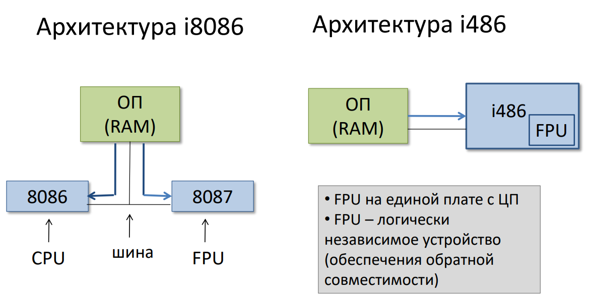

### nasm: представление вещественных чисел
- Обязательно наличие десятичной точки
- Одинарная точность (32 бита)
  - dd -12.5
  - dd 3.1415
  - dd 1.12E3
  - dd -1.12E-3
- Двойная точность (64 бита)
  - dq 3.1415
  - dq 1.12E3
- Расширенная точность (80 битов)
  - dt 3.1415

## Обмен данными с сопроцессором x87
- Обмен данными только с памятью
- При пересылке данных выполняется преобразование типов
- Загрузка данных (на вершину стека)
  - Вершина стека смещается вниз
  - fld op(m 32/64/80)
  - fld ST(i) ; загрузка данных из регистров ST0 … ST7
  - fld ST0; fld dword; [a] fld qword [x]
- Выгрузка данных (из вершины стека)
  - fst op(m 32/64) ; копирование вершины стека в op, состояние стека не меняется
  - fstp op(m 32/64/80) ; вершина стека смещается вверх
  - fst[p] ST(i) ; наличие p (pop) означает «выталкивание» из стека
  - fstp qword [y]; fst qword [a] 
  - fstp ST0; очистка вершины стека от числа

## Арифметические операции
- finit; инициализация сопроцессора
  - Устанавливаются начальные значения регистров CR, SR, TW
  - Режимы работы устанавливаются по умолчанию
  - TOP=0, все регистры свободны
  - Все операции выполняются над числами повышенной точности (режим по умолчанию)
  - Оба операнда извлекаются из стека, на вершину стека помещается результат
  - faddp ; ST1 + ST0
  - fsubp ; ST1 – ST0
  - fmulp ; ST1 * ST0
  - fdivp ; ST1 / ST0

### Пример
#### сложение двух чисел
```asm
include 'io.inc'
section .data
  a dd -15.123
  b dd 1.5678
section .bss
  c resd 1
section .text
  global CMAIN
CMAIN:
  finit
  fld dword[a]
  fld dword[b]
  faddp
  fstp dword[c]
  PRINT_HEX 4, [c]
  NEWLINE
  ret
; В конце выполнения программы все регистры х87 будут свободны
```
### Пример
#### вывод вещественного значения с помощью printf
```asm
include 'io.inc'
section .data
  a dd -15.123
  b dd 1.5678
section .rodata
  fout db "%.3f ", 10, 0 ; формат вывода вещественного числа
section .bss
  c resd 1
section .text
global CMAIN
CMAIN:
sub esp, 16             ; выравнивание стека

fld dword[a]            ; загрузка a
fld dword[b]            ; загрузка b
faddp                   ; c = a + b
fst dword[c]            ; c = a + b
fstp qword[esp + 4]     ; сохранение c в стеке
mov dword[esp], fout    ; формат вывода
call printf             ; вывод c
add esp, 16             ; восстановление стека
ret
```

### Некоторые полезные команды
- Загрузка констант
  - fld1  ; загрузка 1.0
  - fldz  ; загрузка +0.0
  - fldpi ; загрузка π
- fabs    ; ST0 := abs(ST0)
- fchs    ; (change sign) ST0 := - ST0
- fxch    ; меняет местами значения ST0 и ST1
- fsqrt   ; ST0 := sqrt(ST0)

### Сравнение чисел с плавающей точкой
- fucomi ST(i) ; ST0 \/ ST(i)
  - Появилась в Pentium Pro
  - Результат сравнения заносится непосредственно во флаги ZF и CF регистра EFLAGS
  - неудобство: нет возможности сразу очистить оба регистра
- После команды сравнения следует использовать команды перехода для беззнаковых чисел
- 
| Результат сравнения  | ZF  | CF  |
| -------------------- | --- | --- |
| ST0 > ST(i)          | 0   | 0   |
| ST0 < ST(i)          | 0   | 1   |
| ST0 = ST(i)          | 1   | 0   |
| Несравнимы(inf, NaN) | 1   | 1   |

# <a name="lect15"></a>Макросредства языка ассемблера - [↑](#contents)
## Основные понятия
- Макросредства:
  - Обеспечивают возможность преобразования текста программы до ее трансляции
  - Повышают уровень языка программирования (для ассемблера)
- Макроязык
  - Расширение языка программирования за счет макросредств
- Макропроцессор
  - Программное средство, преобразующее программу на макроязыке в программу на языке программирования
  - Препроцессор (для C)
- Макропроцессирование (макрогенерация)

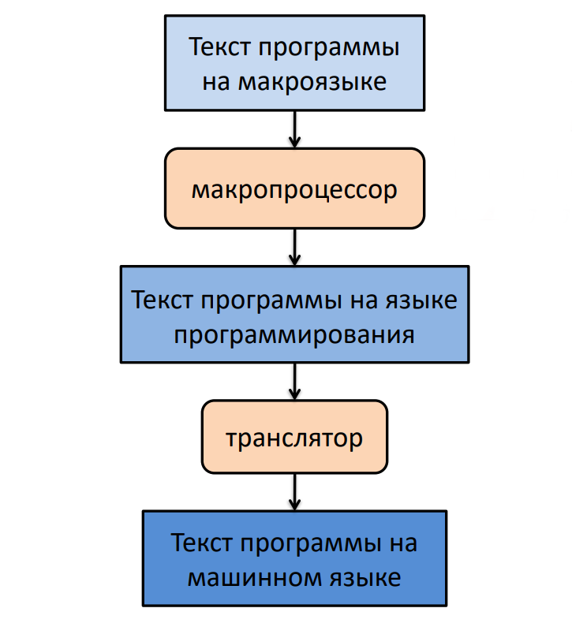

## Макросы:
- Макрос
  - Имя специальным образом описанного фрагмента кода
  - Задает правило преобразования этого фрагмента
- Макроопределение
  - Фрагмент кода, определяющий макрос
  - Это способ дать имя фрагменту кода
  - Содержит имя макроса, параметры и тело макроса
- Макрокоманда (макровызов)
  - Имя макроса и параметры вызова
- Макроподстановка
  - Процесс замены макрокоманды на тело макроса
- Макрорасширение
  - Результат макроподстановки
  - Код на «чистом» языке программирования (без макросредств)

## Макропроцессор (препроцессор):
- Основные возможности
  - Две формы макросов
    - Однострочные
    - Многострочные
  - Макроповторения
  - Условная макрогенерация (условная компиляция)
  - Возможность переопределения макросов
- Все директивы препроцессора начинаются со знака %

### Расположение в тексте программы
- В произвольном месте программы до его макровызова
- Хороший стиль программирования – макроопределения в самом начале программы
- В отдельном файле, например ('io.inc')
- Новое макроопределение переопределяет макроопределение, описанное ранее

## Однострочные макросы. Макропеременные
### Однострочные макросы - для генерации части строки
```asm
%define <имя_макроса> <текст>
Пример: обращение к параметрам функции
%define par1 dword [ebp + 8]
%define par2 dword [ebp + 12]
; ...

mov eax, par1 ; mov eax, dword [ebp + 8]
mov ebx, par2 ; mov ebx, dword [ebp + 12]
```

### Макропеременные - для задания числового значения
```asm
%assign <имя макропеременной> <выражение>
%assign var 15
; ...
%assign var var + 1 ; значение var увеличивается на 1
```

### Отмена определения макроса
```asm
%undef <имя макроса> ; отменяет однострочный макрос
```

## Макроповторения
- Возможность многократно (циклически) обрабатывать фрагмент кода
- Объявление блока повторения:
```asm
%rep <количество повторений>
<тело блока повторения>
%endrep
```
### Пример
#### объявление области памяти из 15 байтов с последовательными значениями 10, 11, ..., 24.
```asm
%assign n 10 
%rep 15            db 10
db n           =>  db 11
%assign n n+1       ...
%endrep            db 24
```

## Многострочные макросы
### Определение многострочного макроса:
```asm
%macro <имя макроса> <количество параметров>
  <тело макроса>
%endmacro
```
### Макровызов:
```asm
<имя макроса> <параметры через запятую>
```

### Ссылка на параметр в теле макроса:
```asm
%<номер параметра>
%1 - первый параметр
```

### Пример
#### вызов функции с одним параметром
```asm
%macro fcall1 2
  push %2 ; параметр ф-ции
  call %1 ; имя ф-ции
  add esp, 4
%endmacro
; макровызов
                      push eax
fcall1 func, eax  =>  call func
                      add esp, 4
```

## Локальные метки в макросах
### Обозначение локальной метки
```asm
%%<имя>
```
### Обработка локальной метки:
```asm
При каждом вызове макроса макропроцессор генерирует новую метку вида ..@<число>.<имя>

%%lab
..@1.lab ..@2.lab ..@3.lab ...
```

### Пример
#### поместить в регистр максимум двух знаковых чисел (dword)
```asm
;%1 – регистр, %2, %3 – имена переменных
%macro max 3
  mov %1, dword [%2]
  cmp %1, dword [%3]
  jge %%lab
  mov %1, dword [%3]
%%lab:
%endmacro

                        mov eax, dword [x]
; макровызов            cmp eax, dword [y]
max eax, var1, var2  => jge ..@1.lab
                        mov eax, dword [y]
                        ..@1.lab:
```

## Условная компиляция
- Позволяет компилировать фрагменты кода только при выполнении некоторого условия
- Директивы условной компиляции
```asm
%if <условие>
  <текст1>
%else
  <текст2>
%endif
```
- Проверка числовых выражений
  - %if <выражение> ; условие выполнено, если <выражение>  0
  - Допустимы операции: =, <>, <, >, <=, >=, ==, !=, &&, ||
  - ! Нельзя использовать значения переменных и регистров !ъ
- Проверка на идентичность текста
  - %ifidn <текст1>, <текст2> ; <текст1> = <текст2>
  - %ifidni <текст1>, <текст2> ; аналогично, регистр не важен
  - %ifnidn <текст1>, <текст2> ; <текст1> != <текст2>
  - %ifnidni <текст1>, <текст2> ; аналогично, регистр не важен


### Пример
#### определение знака числа
```asm
; В регистр al поместить знаковый бит числа (al = 0, если число >= 0, al = 1, если число < 0).
; Число в формате: byte, word, dword.

%macro sign 2
  ; %1 – имя переменной, %2 - размер переменной
  %if %2 = 1    ; byte
    mov al, byte [%1]
  %elif %2 = 2  ; word
    mov al, byte [%1+ 1]
  %else         ; dword
    mov al, byte [%1+ 3] 
  %endif
  shr al, 7
%endmacro
```
### Пример
#### обнуление элемента массива
```asm
; Описать макрос null x, n, t , где x – имя массива из n двойных слов.
; Если t = FIRST, обнулить первый элемент массива,
; если t = LAST – обнулить последний элемент массива.

%macro null 3
  %ifidn %3, FIRST
    mov dword [%1], 0
  %else
    mov dword [%1 + 4 * %2 - 4] , 0
  %endif
%endmacro
```

### Сравнение макровызовов и вызовов функций

| Вопрос                                                                        | Макровызов                | Вызов функции       |
| ----------------------------------------------------------------------------- | ------------------------- | ------------------- |
| Когда происходит вызов?                                                       | Во время ассемблирования  | Во время выполнения |
| Тело макроса/функции вставляется в объектную программу каждый раз при вызове? | Да                        | Нет                 |
| Команда вызова макроса/функции вставляется в объектную программу?             | Нет                       | Да                  |
| После вызова нужно использовать команду возврата?                             | Нет                       | Да                  |
| Сколько копий тела макроса/функции появляется в объектной программе?          | Одна на каждый макровызов | Одна                |

# <a name="lect16"></a>Система программирования языка Си. Многомодульные программы - [↑](#contents)
## Понятие о системе программирования
### Система программирования – комплекс средств для автоматизации процесса разработки и сопровождения программного обеспечения
- Языковые компоненты
  - Языки программирования
  - Языки спецификаций
  - ...
- Программные компоненты
  - Инструменты системы программирования
- Информационные компоненты
  - Библиотеки
  - Описания служебных программ
  - ...

### Этапы жизненного цикла программного обеспечения
- Проектирование
  - Сбор и анализ требований к программе
  - Разработка
- Реализация
  - Кодирование
  - Отладка
- Сопровождение

## Модульное программирование
- Способ разработки программ, основанный на разбиение программы на модули
- Технология модульного программирования

### Программный модуль
- Автономно разрабатываемая и компилируемая часть программы – единица компиляции
- Раздельная компилация

### Многоязыковая система программирования

## Модульность программы
### Преимущества
- Программа может быть организована как набор небольших файлов с исходным кодом (модулей)
- Независимая разработка и отладка
  - Локализация места ошибки
- Раздельная компиляция
  - Существенный выигрыш по времени при итоговой сборке программы
  - Повторная компиляция требуется только для модулей, куда были внесены изменения
- Наличие собственного пространства имен (имена локализованы в модуле)
- Возможность создания модулей на разных языках программирования
- Возможность организовывать библиотеки функций, использующихся в разных программах

### Недостатки
- Необходимость поддерживать связи (статические) между модулями
- Перед выполнением программы необходим этап ее сборки из составляющих программу модулей
- Компилятор не может контролировать правильность связей между модулями => позднее обнаружение ошибок связи может существенно замедлить процесс отладки

### Упрощенная схема компиляции и выполнения программы
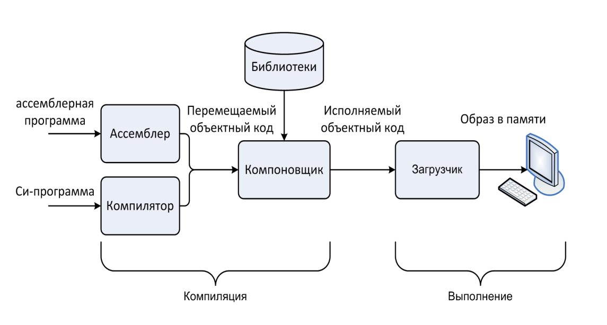 

### Сборка многомодульной программы в системе программирования языка C
Команды для сборки:
```bash
gcc -m32 -c –o hello.o hello.c
nasm –f elf32 –o rdtsc.o rdtsc.asm
gcc -m32 -o hello hello.o rdtsc.o
```

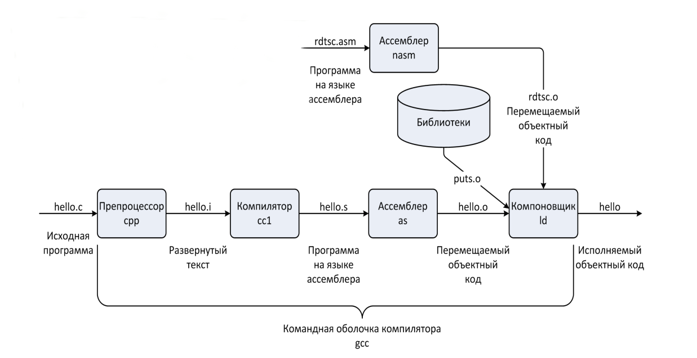

## Процесс сборки программы
### Препроцессирование
- Подстановка заголовочных файлов (#include)
- Условная компиляция
- Макроподстановки
### Компиляция
- Генерация объектного модуля для каждой единицы компиляции

### Компоновка
- Объединение объектных модулей вместе с библиотеками в исполняемый файл


## Связывание имён
### Связывание имён
- Каждому имени должно быть однозначно сопоставлено определение этого имени (адрес)
- Сопоставление имя -> определение имени – разрешение связей

### Виды связывания
- Внешнее связывание
  - имя доступно в нескольких единицах компиляции (модулях)
- Внутреннее связывание
  - имя доступно только в своей единице компиляции

### В ассемблере:
- локальные и нелокальные метки – внутреннее связывание
- глобальные метки – внешнее связывание
- в единице компиляции можно использовать внешние имена из единицы компиляции на C и наоборот


## Схема работы ассемблера
- Первый проход: частичная трансляция команд, составление таблицы имен (таблицы символов), таблицы  ссылок на имена, ...
  - Имя
    - Метка – адрес, с которым соотнесено имя
  - Таблица имён
    - Содержит описание имен
    - Размер
    - Видимость имени из других модулей (глобальное/локальное)
  - Определяются размеры секций
  - Таблица ссылок – использование имен в операндах команд
- Второй проход: построение объектного кода
  - Разрешение внутренних связей – заполнение ссылок на имена, определенные в этом модуле

### Какие проблемы остались после работы ассемблера?
- Разрешение внешних связей (внешнего связывания)
  - В объектных файлах содержатся определения внешних имен и ссылки на эти имена. Цель разрешения связей – точно связать каждую ссылку на имя с уникальным определением имени
  - Компоновщик
- Замена меток на конкретные адреса
  - Загрузчик

## Поддержка модулей в nasm
### Статические связи между модулями – значения связей (адреса) известны до начала выполнения программы
-  Глобальные имена global <имя>
   - Имя определяется в данном модуле
   - Имя разрешено к использованию в других модулях
 - Внешние имена extern <имя>
   - Имя определяется в другом модуле
   - Имя используется в данном модуле
 - Для наглядности директивы global и eхtern рекомендуется размещать в самом начале текста модуля
 - Остальные имена являются локальными и не видны из других модулей

## Замечание: специфика оформления внешних имен в ОС Windows
- Все внешние имена имеют вид _<имя>
- Компилятор языка C делает это автоматически (например main -> _main)
- В ассемблере это надо делать вручную
- Альтернатива – использовать макросы из библиотеки io.inc

# <a name="lect17"></a>Сборка многомодульной программы - [↑](#contents)
## Компоновщик: основная задача
- Разрешение внешних связей (внешнего связывания)
  - В объектных файлах содержатся определения внешних имен и ссылки на эти имена (таблица имен, таблица ссылок на имена)
  -  Цель разрешения связей – точно связать каждую ссылку на имя с уникальным определением имени 
- Компоновщик устанавливает связь каждой ссылки на имя с единственным определением этого имени

### Символы (имена) в процессе компоновки
- Типы символов (имен)
  - Глобальные
  - Внешние
  - Локальные
- Определение функий и переменных в C
  - По умолчанию – глобальные
  - С модификатором static – локальные
- Опеределеие функций и переменных в ассемблере
  - По умолчанию – локальные
  - С директивой global – глобальные

## Статическая компоновка
- Программа компилируется и компонуется драйвером (командной оболочкой) компилятора
- Команды для сборки программы
  - Компиляция Си-модуля (ключ -m32 для IA-32)
    - gcc -m32 –c –o <имя модуля>.o <имя модуля>.c
  - Компиляция ассемблерного модуля
    - Linux: nasm -f elf32 -o <имя модуля>.o <имя модуля>.as
    - Windows: nasm -f win32 -o <имя модуля>.o <имя модуля>.asm
  - Компоновка с использованием драйвера компилятора gcc (ключ -m32 для IA-32)
    - gcc -m32 -o <имя исполняемого файла> <имена объектных модулей>
  - Запуск на исполнение
    - Linux: ./<имя исполняемого файла>

## Объектные файлы (модули)
- Объектный код
  - Промежуточное представление откомпилированных модулей
- Объектный модуль
  - Заголовок модуля
    - Описание структуры объектного модуля
    - Точка входа программы (entrypoint)
  - Тело модуля
    - Секции .text, .rodata, .data, .bss
  - Информация, необходимая для сборки программы из модулей
    - Таблица имен (только внешние связи)
    - Размеры секций
    - ...

### Виды объектных файлов
- Перемещаемые объектные файлы (.o-файлы)
  - Содержит код и данные в форме, пригодной для компоновки с другими перемещаемым объектными файлами
  - Каждый .o-файл производится из **одного** файлы с исходным кодом
- Исполняемые объектные файлы
  - Содержит код и данные в форме, пригодной для непосредственного копирования в память и запуска программы на выполнение
- Разделяемые объектные файлы (.so-файлы)
  - Особый вид перемещаемого объектного файла, который может быть загружен в память и скомпонован с программой динамически (во время ее загрузки либо во время исполнения)
  - Windows - Dynamic Link Libraries (DLL)
- Стандартный бинарный формат объектных файлов
  - Executable and Linkable Format (ELF)
  - Единый формат для всех трех видов объектных файлов

## Формат ELF файла:
- ELF заголовок
  - тип файла (.o, исп., .so), …
- Секция .text
  - код
- Секция .rodata
  - данные, доступные только на чтение: таблица переходов, константы
- Секция .data
  - инициализированные глобальные 
переменные 
- Секция .bss
  - неинициализированные глобальные 
переменные 
- Секция .symtab
  - Таблица имен
  - Имена функций и статических переменных

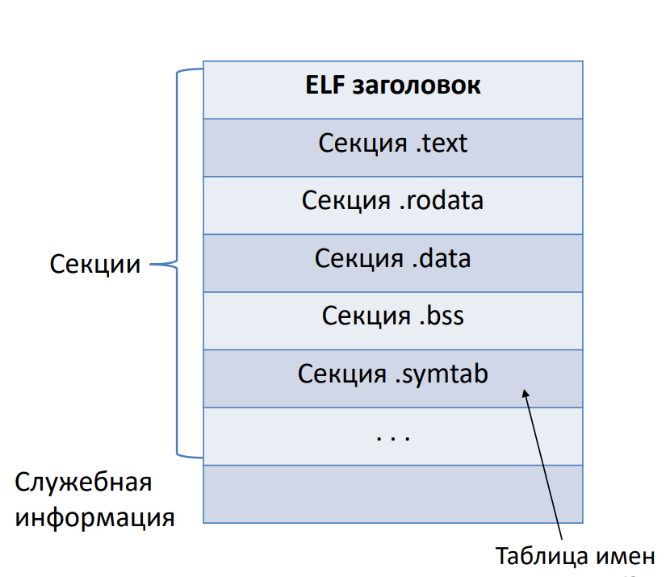

# <a name="lect18_1"></a>Статические библиотеки - [↑](#contents)

## Статические библиотеки (.a - файлы-архивы):
- Близкие по смыслу перемещаемые объектные файлы группируются в одном файле – архиве
- Обычно строится по принципу «одна функция – один модуль» (для системных библиотек)
- Содержит таблицы для ускорения поиска имен в этих файлах (как правило)
- В Unix-системах – архивные файлы (.a - файлы-архивы)
- Компоновщику указывают набор архивов для того, чтобы он попытался найти в них код (определение) для еще неопределенных имен (неразрешенных ссылок)
- Если содержащийся в архиве файл помогает разрешить ссылку (связать символ), то его автоматически включают в компоновку

## Концепция статической библиотеки
- Функции компилируются в отдельные объектные модули, затем собираются в единый библиотечный файл (архив)
- Прикладные программы могут использовать любую библиотечную функцию, указав в командной строке имя библиотечного файла (архива)
- Во время сборки программы компоновщик копирует из библиотеки только те модули, на которые имеются ссылки

### Создание статической библиотеки
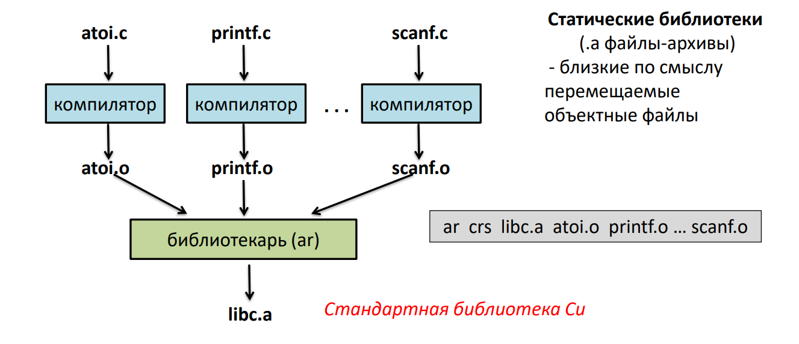

### Основные библиотеки языка Си
- libc.a (Стандартная библиотека Си)
  - подключается при компоновке автоматически
  - 8 МБ архив из 1392 объектных файлов
  - ввод/вывод , управление памятью, работа со строками, случайные числа, целочисленные математические функции, ...
- libm.a (Математическая библиотека Си)
  - для подключения необходимо указать опцию -l и имя библиотеки
  - префикс lib отбрасывается: gcc -lm –o program file1.o file2.o
  - 1 МБ архив из 401 объектных файлов
  - Математические функции над числами с плавающей точкой (sin, cos, tan, log, exp, sqrt, ...)


### Использование статических библиотек при сборке программы
- Алгоритм компоновщика для разрешения внешних ссылок
  - Просматривает .о файлы и .а файлы _в порядке их следования_ в командной строке (возвратов к уже просмотренным файлам нет)
  - В процессе просмотра строит исполняемый объектный файл из .о файлов и поддерживает список не разрешенных на данный момент символов (ссылок)
  - При появлении нового файла пытается разрешить каждую из еще неразрешенных ссылок среди имен, определенных в данном файле
  - Если по окончании процесса компоновки осталась хотя бы одна неразрешенная ссылка -> ошибка компоновки
- Замечания
  - Важен порядок следования объектных файлов в командной строке (объектный файл должен стоять _до_ соответствующей библиотеки)
  - Все библиотеки рекомендуется размещать в конце командной строки

### Компоновка со статическими библиотеками
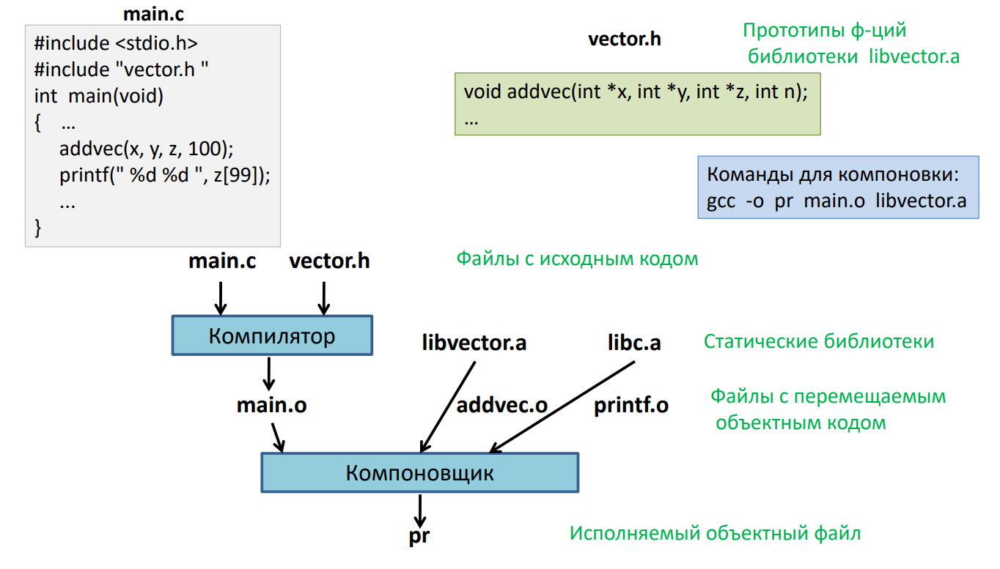

# <a name="lect18_2"></a>Загрузчик - [↑](#contents)


## Загрузчик
- Часть операционной системы (Linux)
- Задачи загрузчика:
  - Копирование программы в память
  - Запуск программы на исполнение (передача управления в точку входа)
- Виды загрузчиков:
  - Статические
  - Динамические

### Статический загрузчик
- До начала выполнения программы вся программа располагается в оперативной памяти, все связи между  модулями установлены
- Достоинства:
  - Более простая схема
  - После начала выполнения программы для ее работы не требуется вмешательство системных программ
- Недостатки:
  - Неэффективное использование памяти

### Динамический загрузчик
- До начала выполнения программы в оперативной памяти размещается только основная часть программы (головной модуль)
- Остальные модули загружаются в оперативную память по мере необходимости (если есть обращение к функциям данных модулей)
- Достоинства:
  - Эффективное использование оперативной памяти, загружаются только модули, к функциям которых реально есть обращения
- Недостатки:
  - Дополнительные накладные расходы на выполнение служебных процедур во время счета программы
  - Может существенно увеличиться время выполнения программы за счет подгруздки модулей из внешней памяти


# <a name="lect19"></a>Мультипрограммный (многозадачный) режим работы ЭВМ - [↑](#contents)
- Несколько программ могут выполняться в компьютере одновременно - периоды выполнения программ полностью или частично перекрываются
  - В оперативной памяти находится несколько готовых к выполнению программ
  - Из этих программ формируется очередь заданий
  - Процессор разделяет свое время между программами из очереди заданий
- Позволяет существенно повысить производительность компьютера за счет:
  - более эффективного использования времени ЦП
  - более полной загрузки внешних устройств компьютера (устройства ввода/вывода, внешние запоминающие устройства, ...)
- Может быть реализован и на компьютерах с одним процессором

## Одновременное выполнение задач на одном процессоре
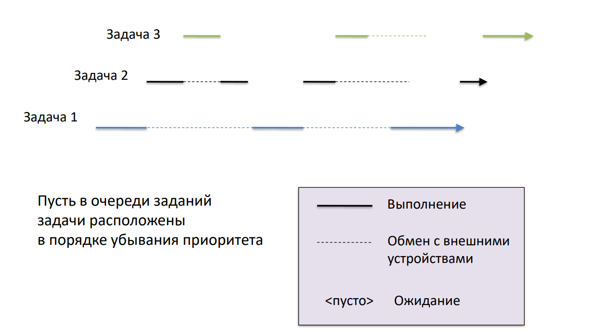

## Виды режимов мультипрограммирования
- Планирование времени ЦП
  - задача планировщика - компонента ОС
  - стратегии смены активных задач
- Режимы мультипрограммирования:
  - Пакетный режим
  - Режим разделения времени
  - Режим реального времени

### Пакетный режим
- Задачи в очереди заданий выстроены по приоритетам
- Смена активной задачи происходит только в случае ее окончания или запроса на операцию ввода/вывода
- Самый эффективный режим с точки зрения использования вычислительной мощности ЦП
- Используется в суперкомпьютерах и системах с большим объемом численных расчетов

### Режим разделения времени
- Задача планировщика - дать всем заданиям отработать некоторое время
- Каждой задаче отводится определенный квант времени ЦП
- Смена активной задачи происходит по окончании этого кванта или при запросе на операцию ввода/вывода
- Различные стратегии поддержки очереди заданий (приоритетная очередь, ...)
- ОС Unix две составляющие приоритета:
  - Статическая - по важности задания (назначается администратором)
  - Динамическая - по времени ожидания в очереди заданий (изменяется планировщиком)
    - Растет во время ожидания в очереди
    - Падает во время выполнения
  - Приоритет задания определяется по сумме составляющих

### Режим реального времени
- Выполняемые задачи имеют жесткие рамки по времени завершения
- Задача планировщика – обеспечить завершение каждой задачи за отведенное ей время или снять задачу, если это невозможно
- Используется в системах, где время выполнения программы критично:
  - управление полетом,
  - управление реактором,
  - управление производственным процессом

## Аппаратная поддержка многозадачности(требования)
- Привилегированный режим работы ЦП
  - Разделение машинных команд на две категории: команды пользователя и привилегированные команды (работа с внешними устройствами, ...)
  - Два режима работы ЦП:
    - привилегированный - ЦП может выполнять любые команды, работает ОС
    - режим пользователя - ЦП может выполнять только команды пользователя (непривилегированные), работает программа пользователя
  - Механизм защиты памяти
    - Изоляция кода/данных различных программ (и ОС) друг от друга
    - Пользовательская программа может преобразовывать данные только в отведенной ей памяти, все остальные действия – только через обращение к ОС
  - Аппарат прерываний
    - Обеспечивает возможность реакции на события и автоматического переключения с одной задачи на другую
  - Таймер
    - Периодически посылает ЦП сигналы прерывания
    - Принудительное вытеснение задачи с процессора

## Обработка прерываний
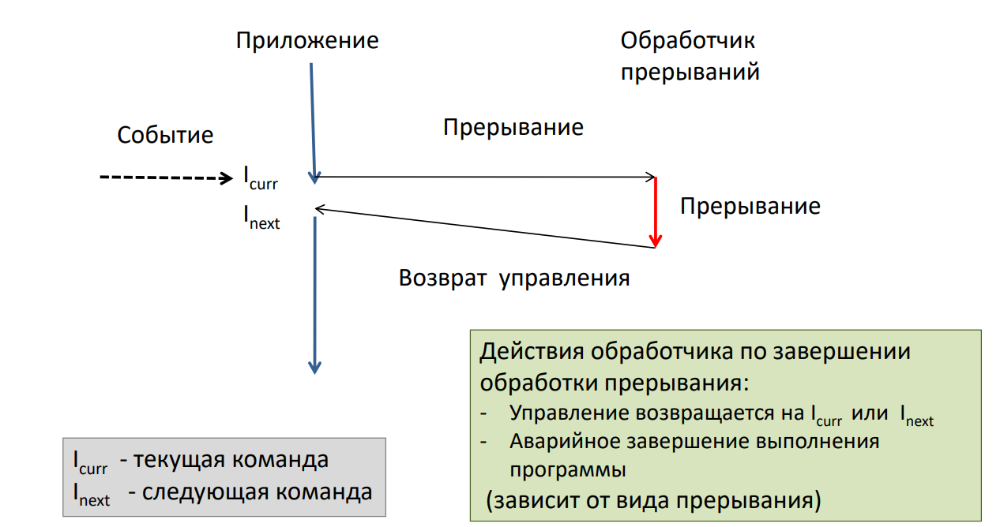

## Аппарат прерываний
### Каждому прерыванию соответствует уникальный номер прерывания. Номер назначается:
- разработчиками процессора
  - деление на 0, сбои при обращении к памяти, переполнения, ...
- разработчиками ядра ОС
  - системные вызовы, сигналы от внешних устройств ввода/вывода

## Прерывания и их классификация
- Асинхронные прерывания – события, происходящие в периферийных устройствах (Ввод/Вывод); не вызваны исполнением какой-либо команды
- Синхронные прерывания (исключения) – возникновение определенных ситуаций при выполнении команд процессором; синхронны по отношению к программе, вызываются ею непосредственно  могут быть воспроизведены при повторном запуске программы с теми же входными данными

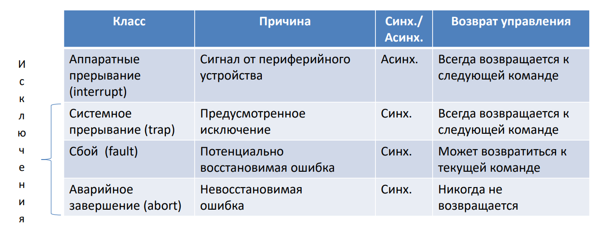

### Примеры прерываний (платформа Intel)
| Номер      | Описание                    | Класс                               |
| ---------- | --------------------------- | ----------------------------------- |
| 0          | Деление на 0                | Сбой                                |
| 13         | Общее нарушение защиты      | Сбой                                |
| 14         | Ошибка обращения к странице | Сбой                                |
| 16         | Ошибка в x87 FPU            | Сбой                                |
| 18         | Ошибка контроля аппаратуры  | Аварийное завершение                |
| 32-127     | Исключения, определенные ОС | Аппаратное или системное прерывание |
| 128 (0x80) | Системные вызовы            | Системное прерывание                |
| 129-255    | Исключения, определенные ОС | Аппаратное или системное прерывание |


## Обработка прерываний
- Аппаратная реакция на сигнал прерывания
  - Процессор завершает выполнение текущей команды (при этом другие прерывания блокируются)
  - Выполняется малое упрятывание:
    - Минимальная необходимая информация о прерываемой программе запоминается в стеке активной задачи
    - Счетчик команд и регистр флагов
  - Устанавливается привилегированный режим работы процессора
  - Управление передается обработчику прерывания (по номеру прерывания)
- Программная реакция на прерывание
  - Выполняется обработчиком прерывания

## Системные вызовы
- Пользовательской задаче доступна для преобразования только отведенная ей память
- Любые другие действия (обращение к аппаратуре, в защищенную память и др.) требуют обращения к ОС
- Системный вызов – обращение пользовательской задачи к ядру ОС за услугами
  - syscall/sysret
  - sysenter/sysexit
  - int/iret
- В архитектуре IA-32 системный вызов реализован как прерывание
  - int 0x80

### Системные вызовы в OC Linux
- int 0x80
- Передача параметров - через регистры
  - eax - номер системного вызова
  - ebx, ecx, edx, esi, edi - параметры (если есть)
- Результат выполнения вызова – через eax
  - Значение = [0xfffff000, 0xffffffff] => ошибка, это код ошибки
  
| eax | Название | ebx                                     | ecx          | edx                        |
| --- | -------- | --------------------------------------- | ------------ | -------------------------- |
| 1   | _exit    | Код возврата                            | -            | -                          |
| 3   | read     | Дескриптор потока 0 – ввод с клавиатуры | Адрес данных | Количество данных в байтах |
| 4   | write    | Дескриптор потока 1 – вывод на экран    | Адрес данных | Количество данных в байтах |

### Пример
#### печать строки (OC Linux)
```asm
section .data
  msg db "Hello, world!", 10
  msg_len equ 14
section .text
  global _start
_start:
  mov eax, 4          ; вызов write
  mov ebx, 1          ; дескриптор потока 1
  mov ecx, msg        ; адрес данных
  mov edx, msg_len    ; количество данных в байтах
  int 0x80            ; вызов ядра ОС
  mov eax, 1          ; вызов _exit
  mov ebx, 0          ; код "успеха"
  int 0x80            ; вызов ядра ОС
```

# <a name="lect20"></a>Повышение производительности работы с ОП - [↑](#contents)
- ЦП
  - время выполнения команды ~ 1 наносекунда
- ОП
  - время чтения/записи(побайтово) ~ 5 наносекунд
- add eax, dworx[x]
  - чтение команды из ОП (6 байтов): 6 * 5 = 30 нс
  - чтение операнда из ОП (4 байта): 4 * 5 = 20 нс
  - выполнение команды в ЦП 1 нс
  - общее время выполнения команды: 30 + 20 + 1 = 51 нc
- ожидание ЦП ~ 98% времени

## Расслоение памяти
- ОП делится на блоки (банки памяти)
- Банки памяти могут работать параллельно
- Байты с последовательными адресами размещаются в разных банках
- За одно обращение к ОП считывается несколько байтов (по количеству банков) с последовательными адресами (по одному байту из каждого банка)

### Пример на 8 банков
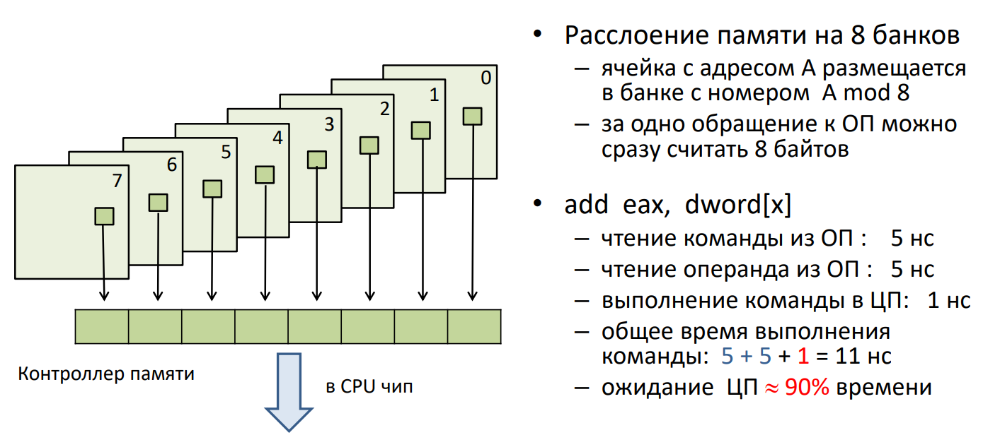


## Оперативная память ОП (RAM – Random Access Memory)
- Основные свойства
  - RAM - запоминающие устройства с произвольной выборкой
  - RAM традиционно оформляется в виде отдельного чипа
  - ОП состоит из нескольких чипов RAM
  - Энергозависимая - информация теряется при отключении электропитания
- Статическая память (SRAM – Static RAM)
  - Быстрее и дороже чем DRAM
- Динамическая память (DRAM – Dynamic RAM)
  - Медленнее и дешевле чем SRAM
- Объем памяти в обычном компьютере:
  - SRAM - не более нескольких мегабайт
  - DRAM – сотни или тысячи мегабайт

## Принцип локальности
- Программа стремится использовать данные и команды с адресами, близкими (либо точно такими же) к тем, которые использовались ранее
- Временная локальность
  - Повторные обращения к одной и той же ячейке
- Пространственная локальность
  - В некоторый малый промежуток времени используются ячейки памяти с близкими адресами
- Программы с высокой степенью локальности выполняются быстрее

### Пример функции с высокой локальностью
```c
int sumvec (int v [N]) {
  int i, sum = 0;
  for (i = 0; i < N; i++)
    sum += v[i];
  return sum;
}
```
- Выборка данных
  - Последовательные обращения к элементам массива - Пространственная локальность
  - Переменная sum используется на каждой итерации - Временная локальность
- Выборка команд
  - Последовательная выборка команд - Пространственная локальность
  - Повторное выполнение команд в цикле - Временная локальность

### Пример функции с высокой пространственной локальностью
```c
int sum_array_rows (int a[M] [N]) {
  int i, j, sum = 0;
  for (i = 0; i < M; i++ )
    for (j = 0; j < N; j++)
    sum += a[i] [j];
  return sum;
}
```
- Обращение к элементам массива в порядке их размещения в памяти (по строкам)
- Обращение по индексу с шагом 1
- С увеличением шага по индексу пространственная локальность уменьшается

### Пример функции с низкой пространственной локальностью
```c
int sum_array_cols (int a[M] [N]) {
  int i, j, sum = 0;
  for (j = 0; j < N; j++ )
    for (i = 0; i < M; i++)
    sum += a[i] [j];
  return sum;
}
```
- Обращение к элементам массива не в порядке их размещения в памяти - по столбцам
- Обращение по индексу с шагом != 1
- С увеличением шага по индексу пространственная локальность уменьшается


## Иерархия памяти
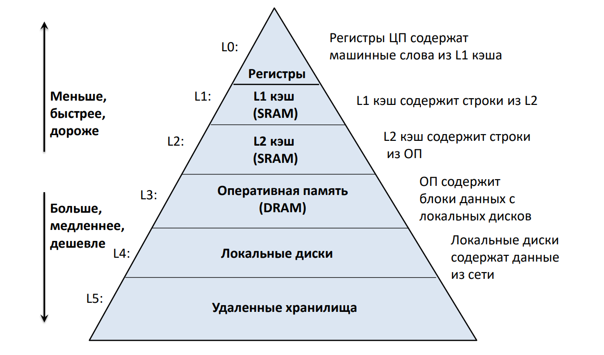

### Кэширование в иерархии памяти
- Кэш:
  - меньшее по объему, но более быстрое устройство хранения выступает в роли промежуточного хранилища для большего по объему, но более медленного устройства
- Основная идея иерархии памяти:
  - более быстрое и меньшее по объему устройство на уровне k служит кэшем для более медленного, но большего по объему устройства на уровне k + 1
- За счет чего достигается эффективность?
  - Из-за локальности программа обращается к данным на уровне k гораздо чаше, чем к данным на уровне k+1
  - Устройство уровня k+1 может быть более медленным -> большего размера, более дешевым

# <a name="lect21"></a>Кэш память - [↑](#contents)
- Кэш оперативной памяти – небольшая, быстрая память (SRAM). Управление кэшем аппаратное.
  - Хранит в себе часто используемые блоки оперативной памяти
- ЦП сначала ищет требуемые данные в кэше (L1, L2) и только потом в ОП
- L1 – кэш первого уровня между регистрами ЦП и кэшем L2, расположен в ЦП
- L2 – кэш второго уровня между кэшем L1 и основной памятью
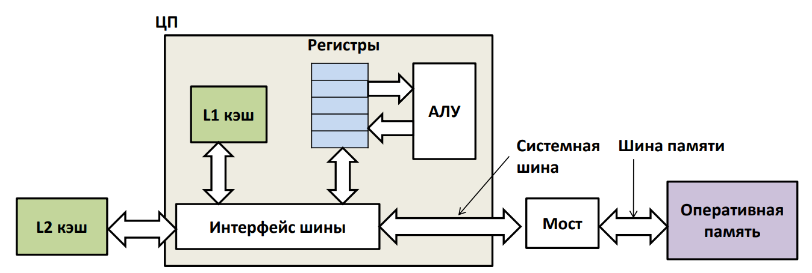

## Основаная идея кэширования
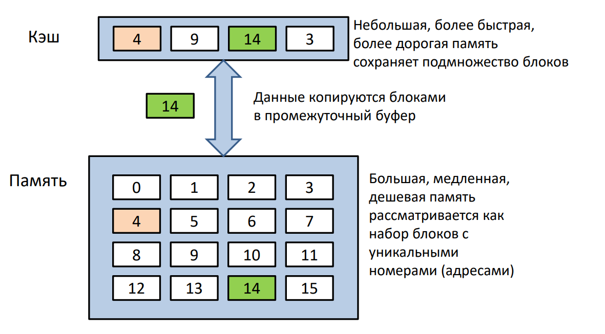

### Общая организация кэш-памяти
#### Кэш - массив строк фиксированного размера

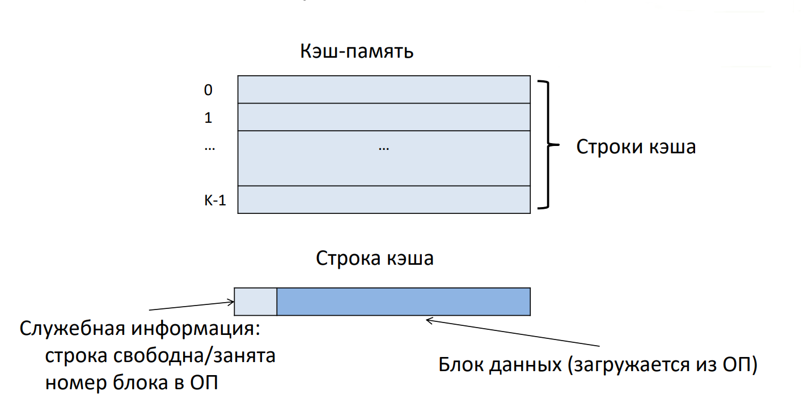
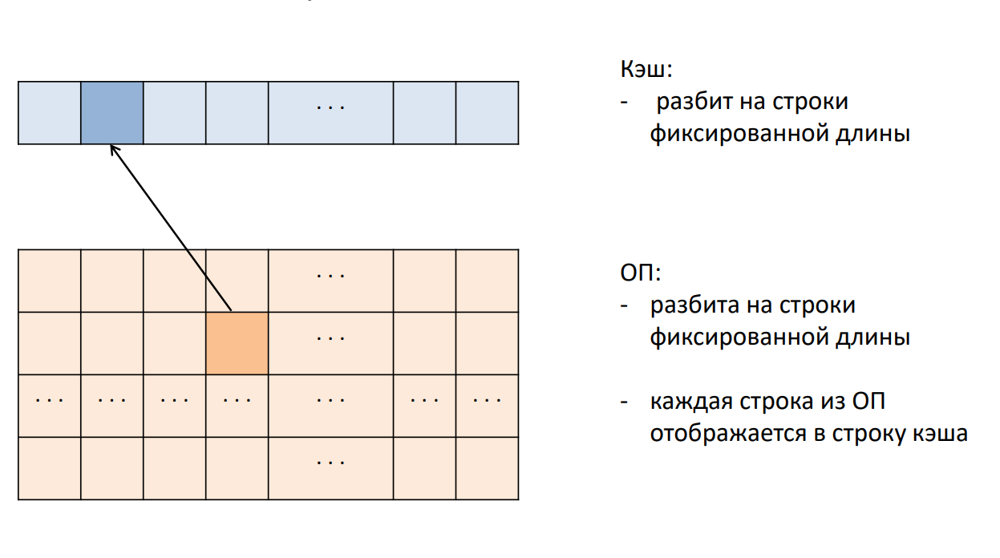

## Виды кэш-памяти(Определяются способом отображения строки ОП в строку кэша)
### Кэш прямого отображения
- Строка из ОП отображается в определенную строку кэша
- Строка с номером n из ОП отображается в строку с тем же номером в кэше

### N-канальный множественно-ассоциативный кэш(частично- ассоциативный кэш)
- Строки кэша разбиваются на группы (наборы) по N строк
- Строка с номером n из ОП отображается в какую-либо строку из определенной группы

### Полностью ассоциативный кэш
- Строка из ОП отображается в произвольную строку кэша

## Кэш прямого отображения (модель)
- ОП
  - Объем $2^{20}$ байтов
  - Адреса 00000 – FFFFF
  - Разбита на страницы по $2^{12}$ байтов (256 страниц)
  - Страница: 256 строк по 16 байтов
  - Адрес ABCDE:
    - AB - номер страницы в ОП
    - CD - номер строки
    - E - номер байта в строке
- Кэш
  - Объем $2^{12}$ байтов(= 1 страница)
  - Страница: 256 строк по 16 байтов

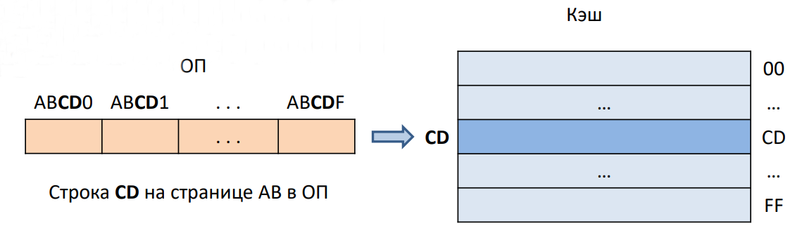

### Пример
```
Дано:
  время чтения 1 байта из кэша – 1 единица времени
  время чтения 1 строки из ОП в кэш – 8 единиц

Определить время чтения из ОП в регистры ЦП байтов с адресами: 
70631, 9488F, 7063A, 66884, 70630, 66883, 94887
```
```
Решение:
70631:  ОП→кэш 70630 / 7063F строка 63 (8 ед)
        кэш→ЦП 70631 (1 ед)

9488F:  ОП→кэш 94880 / 9488F строка 8F (8 ед)
        кэш→ЦП 9488F (1 ед)

7063A:  кэш→ЦП 7063A (1 ед) - результативное обращение

66884:  ОП→кэш 66880 / 6688F строка 88 (8 ед)
        кэш→ЦП 66884 (1 ед)

70630:  кэш→ЦП 70630 (1 ед) - результативное обращение

66883:  кэш→ЦП 66883 (1 ед) - результативное обращение

94887:  ОП→кэш 94880 / 9488F строка 8F (8 ед)
        кэш→ЦП 94887 (1 ед)

Итого:  9 + 9 + 1 + 9 + 1 + 1 + 9 = 39 ед
```

## Метрики производительности кэша
### Коэффициент промахов
- Отношение количества промахов к общему числу обращений (промахи / обращения) = 1 – коэффициент попаданий
- Характерные показатели (в процентах):
- 3 - 10% для L1
- Может быть достаточно малым (< 1%) для L2 (зависит от размера, ...)

### Время попадания
- Время извлечения данных из кэша
- Характерные показатели (в тактах):
  - 1 – 2 тактов для L1
  - 5 – 20 тактов для L2

### Накладные расходы при промахе
- Дополнительное время из-за промаха
  - Обычно 50 – 200 тактов для обращения к памяти

## Дружественный к кэш-памяти код
- Хорошие программисты пишут код, удачно взаимодействующий с кэш-памятью, т.е. обладающий хорошей локальностью
- Рекомендации:
  - В первую очередь улучшать часто работающий код
    - Тела вложенных циклов
    - Часто вызываемые функции
  - Минимизировать промахи при обращении к кэшу в теле вложенного цикла
    - Повторяющеюся обращения к одним и тем же переменным (временная локальность)
    - Проход по массиву с шагом 1 (пространственная локальность)


# <a name="lect22"></a>Общие принципы конвейерной обработки - [↑](#contents)
## Конвейер – совмещение разных действий в один момент времени
- Задача делится на серию дискретных этапов
- Этапы выполняются параллельно -> повышается производительность системы
  - Длительность обслуживания одного клиента неизменна или несколько увеличивается
  - Увеличение пропускной способности системы (количество клиентов, обслуживаемых за единицу времени)

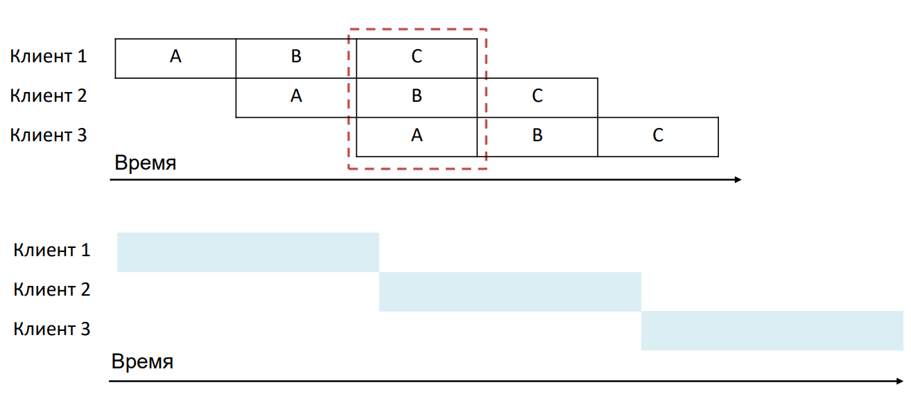

## Конвейер вычислений
- Выполнение команды делится на этапы (ступени)
- Каждая ступень выполняется на отдельном аппаратном устройстве
- Все эти устройства могут работать параллельно
- Преимущество:
  - в ЦП одновременно выполняется несколько команд
  - повышение пропускной способности системы

### Пятиступенчатый конвейер
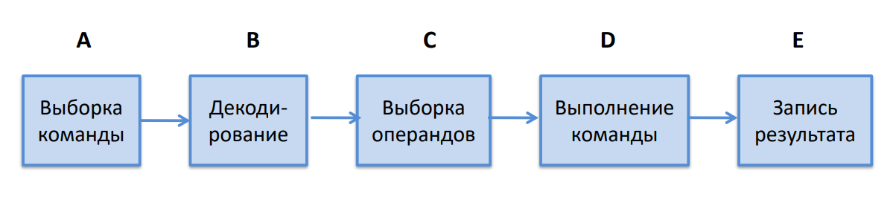
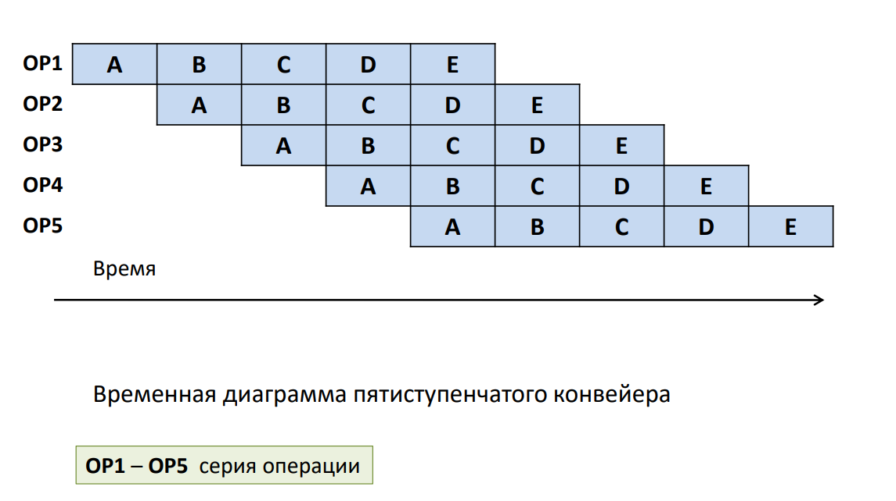

## Выполнение команд в конвейере
```asm
add eax, dword[x]
sub dword[y], eax
inc ebx
dec esi
```
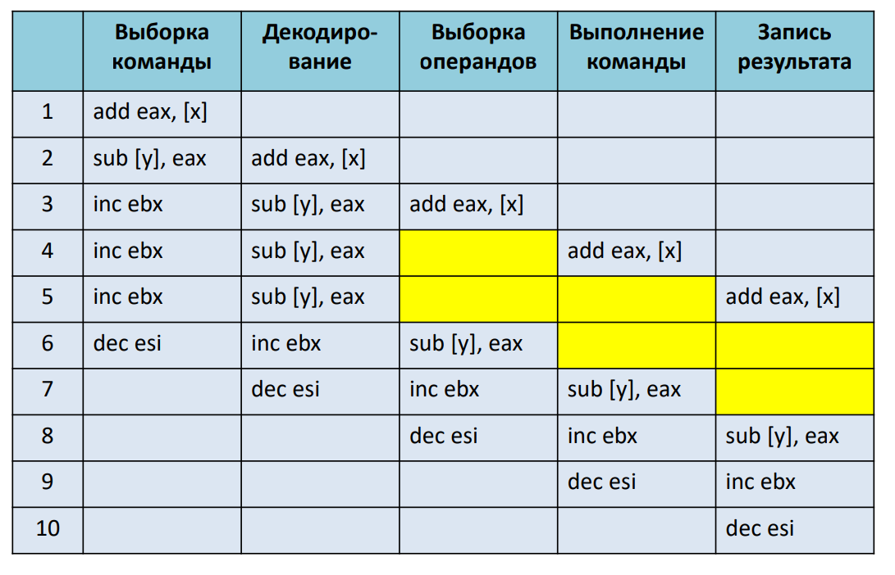

## Проблемы конвейерной архитектуры
### Простои устройств ЦП из-за:
- Зависимости команд по данным:
  - Результат выполнения одной команды является операндом другой команды
- Выполнения команд условного перехода:
  - Следующая команда станет известной только после окончания выполнения команды условного перехода

## Выполнение команд в конвейере (оптимизация)
```asm
add eax, dword[x]
sub dword[y], eax
inc ebx
dec esi
```
")