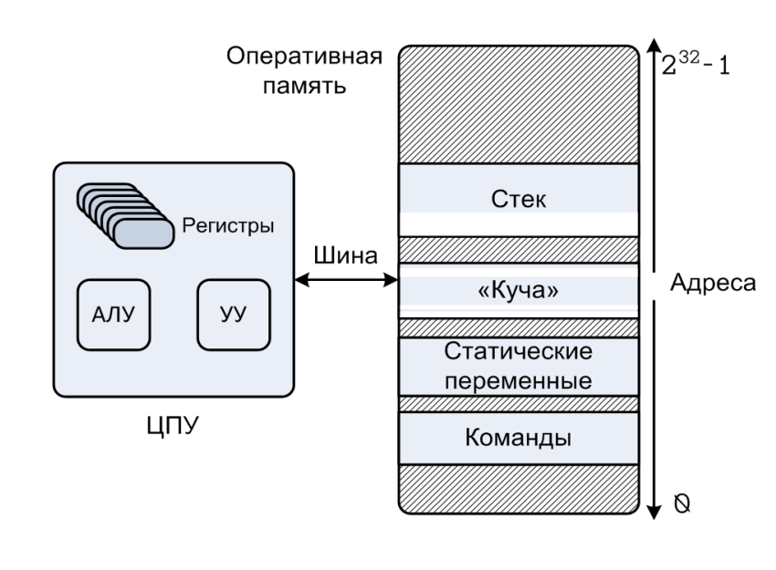

# Теория по алгоритмам и алгоритмическим языкам(Pascal)
## Лектор - ; 2 семестр ФИИТ МГУ

---

_**Содержание оформил**_ [_**@wlix13**_](https://github.com/wlix13) \

---

## <a name="contents"></a>Оглавление:
1) [Знакомство](#lect1_1)
2) [Цикл выполнения команд](#lect1_2)
3) [Понятие семейства ЭВМ](#lect2_1)

---

## <a name="lect1_1"></a>Знакомство - [↑](#contents)
_Цели и задачи курса_:
- Формирование связного представления об организации современных вычислительных систем
  - Изучение базовых принципов устройства современных компьютеров
  - Изучение особенностей процессорной архитектуры IA-32
  - Изучение языка ассемблера (NASM) архитектуры IA-32 
- Изучение особенностей реализации конструкций языка высокого уровня на языке низкого уровня и причин, влияющие на выбор механизма реализации (на примере архитектуры IA-32, языка Си и ассемблера NASM)
- Назначение языка ассемблера
  - средство изучения архитектуры реального компьютера
  - повышение производительности программы 
  - полный доступ к аппаратному обеспечению компьютера
- Знакомство с основными элементами системы программирования, ее связь с архитектурой ЭВМ
- Знакомство с основными архитектурными решениями в современных ЭВМ

_Применение компьютеров_:
- Применение первых компьютеров
  - задачи математической физики
  - шифрование/дешифрование сообщений
  - управление (военной) техникой
- Современное применение компьютеров
  - хранение информации и предоставление удобного доступа к ее обработке
  - игры
  - передача информации
  - управление технологическими процессами
  - работа со всем, что нас окружает...

### **Архитектура машины фон Неймана:**


### **Регистры ЦП:**


### **Архитектурные принципы фон Неймана**:
* Линейность и однородность памяти
* Произвольный доступ к памяти (адресуемость памяти)
* Программное управление
* Последовательное выполнение команд
* Принцип хранимой программы
* Неразличимость команд и данных
* Двоичное кодирование информации

## <a name="lect1_2"></a>Цикл выполнения команд (такт работы ЦП) - [↑](#contents)
**Выборка → Декодирование → Исполнение**

1. **Извлечение команды из памяти** \
Используя текущее значение счетчика команд, ЦП извлекает из памяти код очередной команды и помещает его в регистр команд

1. **Декодирование команды** \
ЦП по содержимому регистра команд определяет код операции и ее операнды. Значение счетчика команд увеличивается на длину извлеченного кода

1. **Загрузка операндов команды** \
Извлекаются значения операндов. Если операнд размещается в ОП, вычисляется исполнительный адрес

1. **Выполнение операции над данными**

2. **Запись результата** \
Результат может быть записан в том числе и в счетчик команд для изменения естественного порядка выполнения команд (команды перехода)

### **Выполнение команды:**


### **Компиляция и выполнение прикладной программы:**


### **Ключевые термины и понятия**:
* Регистр, имя регистра, значение регистра, машинное слово
  - Счетчик команд, регистр команд
* Память, ячейка памяти, адрес ячейки памяти, время 
доступа к памяти
* Цикл выполнения команд (такт работы), тактовая частота
* Машинная команда, код операции, операнд, адресность 
команды
  - исполнительный адрес (effective/ executive address)
* Команда перехода (передачи управления

## <a name="lect2_1"></a>Понятие семейства ЭВМ - [↑](#contents)

* Одновременный выпуск и использование нескольких моделей семейства (с различной производительностью и ценой)
* Программная совместимость всех моделей семейства – обратная совместимость
* Унификация устройств компьютера (аппаратная совместимость между моделями)
* Принцип модульности в архитектуре моделей семейства
* Стандартизированное системное программное обеспечение

### **Семейство процессоров Intel (x86)**
| Микросхема   | Дата выпуска | Частота(МГц) | Кол-во транзисторов | Объём памяти | Примечание                    |
| ------------ | ------------ | ------------ | ------------------- | ------------ | ----------------------------- |
| 8086         | 1978         | 5-10         | 29 000              | 1 Мб         | Первый 16-разрядный процессор |
| 80286        | 1982         | 8-12         | 134 000             | 16 Мб        | Появилась защита памяти       |
| 80386        | 1985         | 16-33        | 275 000             | 4 Гб         | Первый 32-разрядный процессор |
| 80486        | 1989         | 25-100       | 1 200 000           | 4 Гб         | Кэш-память на 8 Кб            |
| Pentium      | 1993         | 60-223       | 3 100 000           | 4 Гб         |                               |
| Pentium  Pro | 1995         | 150-200      | 5 500 000           | 4 Гб         |                               |
| Pentium II   | 1997         | 233-400      | 7 500 000           | 4 Гб         |                               |
| Pentium III  | 1999         | 650-1400     | 9 500 000           | 4 Гб         |                               |
| Pentium 4    | 2000         | 1300-3800    | 42 000 000          | 4 Гб         |                               |
| Core Due     | 2006         | 1600-3200    | 152 000 000         | 2 Гб         |                               |
| Core         | 2006         | 1200-3200    | 410 000 000         | 64 Гб        | 64-разрядная архитектура      |
| Core i7      | 2011         | 1100-3300    | 1 160 000 000       | 24 Гб        |                               |

### **Виртуальная память**
* _Виртуальная память_ – абстракция ОП
  * каждый процесс единолично использует ОП
  * каждый процесс имеет одно и то же представление о памяти – _однородное виртуальное адресное пространство_
* Виртуальное адресное пространство:
  * Адреса ячеек памяти [0, 2n - 1]
  * IA-32 : [0, 232 - 1], [00000000, ffffffff]
* Виртуальный адрес
* Физический адреc


Виртуальная память:
* Эффективно использует оперативную память
* Упрощает управление памятью, обеспечивая каждый процесс однородным адресным пространством
* Защищает адресное пространство каждого процесса от вмешательства других процессов


### **Архитектура виртуальной машины IA-32 (Intel Architecture):**



### **Основные регистры IA-32:**


## <a name="lect2_2"></a>Особенности хранения чисел в памяти и на регистрах - [↑](#contents)

### Порядок размещения байтов в памяти

**Два наиболее распространенных подхода:**
1. прямой порядок следования байтов (big-endian) как правило используется в процессорах для обработки сетевых данных
2. обратный порядок следования байтов (little-endian) используется в IA-32

В регистрах используется прямой порядок следования байтов

Пусть $X = 12345678_\text{16}$

```
            Память                    Регистр
     ┌───┬───┬───┬───┬───┬───┐  ┌───┬───┬───┬───┐
     │...│78 │56 │34 │12 │...│  │12 │34 │56 │78 │
     └───┴───┴───┴───┴───┴───┘  └───┴───┴───┴───┘
        └────────────────┘
                X
```

### **Представление целых чисел**
* Числа без знака (беззнаковые)
  * _прямой код_ неотрицательного числа
  * диапазон [0, $2^k - 1$], k – количество разрядов в ячейке
    * byte (k = 8) ➔ [0, $2^8 – 1$] = [0, 255]
    * word (k = 16) ➔ [0, $2^\text{16} – 1$] = [0, 65535]
    * dword (k = 32) ➔ [0, $2^\text{32} – 1$] = [0, 4 294 967 295]
  * примеры (k = 8)
    * 90 = $5A_\text{16}$ = $01011010_2$
    * 128 = $80_\text{16}$ = $10000000_2$

* Числа со знаком (знаковые)
  * _дополнительный код_: доп(x) = $x \ mod \ 2^k$
    * Если x >= 0, доп(x) = $x$
    * Если x < 0, доп(x) = $2^k - |x|$, k – количество разрядов в ячейке

  * диапазон [$-2^\text{k-1}, 2^\text{k -1} - 1$], k – количество разрядов в ячейке
    * byte (k = 8) ➔ [$-2^7, 2^7 – 1$] = [-128, 127]
    * word (k = 16) ➔ [$-2^\text{15}, 2^\text{15} – 1$] = [-32768, 32767]
    * dword (k = 32) ➔ [$-2^\text{31}, 2^\text{31} – 1$] = [-2 147 483 648, 2 147 483 647]

  * Примеры (k = 8)
    * доп(+90) = $5A_\text{16}$ = $01011010_2$
    * доп(-1) = $FF_\text{16}$ = $11111111_2$

### **Построение дополнительного кода**
Способы построения дополнительного кода (x < 0):

1. По формуле определения \
Пример (k = 8, x = -13) \
доп (-13) = $2^8$ – 13 = 256 – 13 = 243 = $F3_\text{16}$ = $11110011_2$

2. Через _обратный код_:
      * Построить прямой код |x|
      * Построить _обратный код_ (1 → 0, 0 → 1)
      * Прибавить 1 \

Пример (k = 8, x = -13) \
$|x| = 13$

Прямой код: $00001101_2$ \
Обратный код: $11110010_2$ \
+1 \
Дополнительный код $11110011_2$

### **Преимущества использования дополнительного кода**
* Единый алгоритм сложения и вычитания для чисел со знаком и без знака
* В процессоре достаточно иметь одну электронную схему для сложения и одну - для вычитания (для множения и деления это не так)
* Единое представление +0 и -0

### **Ключевые термины и понятия**:
* Семейство ЭВМ
* Программная совместимость
* Виртуальная память
  * Физический адрес
  * Виртуальный адрес, виртуальное адресное пространство
* Флаг, регистр флагов
* Представление целых чисел
  * Прямой код
  * Обратный код
  * Дополнительный код