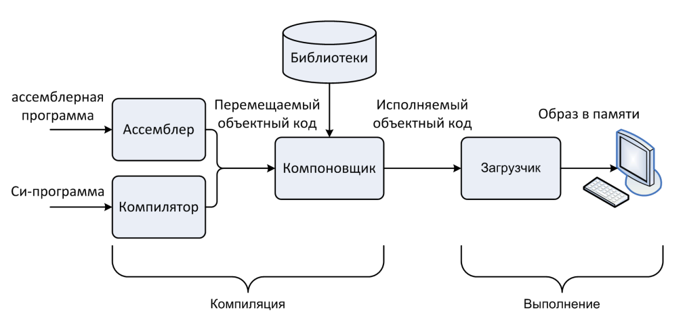

# Теория по алгоритмам и алгоритмическим языкам(Pascal)
## Лектор - ; 2 семестр ФИИТ МГУ

---

_**Содержание оформил**_ [_**@wlix13**_](https://github.com/wlix13) \

---

# <a name="contents"></a>Оглавление:
  1. [Знакомство](#lect1_1)
  2. [Цикл выполнения команд](#lect1_2)
  3. [Понятие семейства ЭВМ](#lect2_1)
  4. [Особенности хранения чисел в памяти и на регистрах](#lect2_2)
  5. [Ассемблер NASM(Netwide Assembly)](#lect3_1)
  6. [Директивы определения данных](#lect3_2)
  7. [Команды пересылки данных](#lect3_3)
  8. [Расширение размера данных при пересылке](#lect3_4)
  9. [Арифметические операции и регистр флагов](#lect4_1)
  10. [Команды и флаги](#lect4_2)
  11. [Макросы ввода/вывода (файл io.inc)](#lect4_3)
  12. [Команды переходов](#lect5_1)
  13. [Реализация ветвлений](#lect5_2)

---

# <a name="lect1_1"></a>Знакомство - [↑](#contents)
_Цели и задачи курса_:
- Формирование связного представления об организации современных вычислительных систем
  - Изучение базовых принципов устройства современных компьютеров
  - Изучение особенностей процессорной архитектуры IA-32
  - Изучение языка ассемблера (NASM) архитектуры IA-32 
- Изучение особенностей реализации конструкций языка высокого уровня на языке низкого уровня и причин, влияющие на выбор механизма реализации (на примере архитектуры IA-32, языка Си и ассемблера NASM)
- Назначение языка ассемблера
  - средство изучения архитектуры реального компьютера
  - повышение производительности программы 
  - полный доступ к аппаратному обеспечению компьютера
- Знакомство с основными элементами системы программирования, ее связь с архитектурой ЭВМ
- Знакомство с основными архитектурными решениями в современных ЭВМ

_Применение компьютеров_:
- Применение первых компьютеров
  - задачи математической физики
  - шифрование/дешифрование сообщений
  - управление (военной) техникой
- Современное применение компьютеров
  - хранение информации и предоставление удобного доступа к ее обработке
  - игры
  - передача информации
  - управление технологическими процессами
  - работа со всем, что нас окружает...

### **Архитектура машины фон Неймана:**


### **Регистры ЦП:**


### **Архитектурные принципы фон Неймана**:
* Линейность и однородность памяти
* Произвольный доступ к памяти (адресуемость памяти)
* Программное управление
* Последовательное выполнение команд
* Принцип хранимой программы
* Неразличимость команд и данных
* Двоичное кодирование информации

# <a name="lect1_2"></a>Цикл выполнения команд (такт работы ЦП) - [↑](#contents)
**Выборка → Декодирование → Исполнение**

1. **Извлечение команды из памяти** \
Используя текущее значение счетчика команд, ЦП извлекает из памяти код очередной команды и помещает его в регистр команд

1. **Декодирование команды** \
ЦП по содержимому регистра команд определяет код операции и ее операнды. Значение счетчика команд увеличивается на длину извлеченного кода

1. **Загрузка операндов команды** \
Извлекаются значения операндов. Если операнд размещается в ОП, вычисляется исполнительный адрес

1. **Выполнение операции над данными**

2. **Запись результата** \
Результат может быть записан в том числе и в счетчик команд для изменения естественного порядка выполнения команд (команды перехода)

### **Выполнение команды:**


### **Компиляция и выполнение прикладной программы:**


### **Ключевые термины и понятия**:
* Регистр, имя регистра, значение регистра, машинное слово
  - Счетчик команд, регистр команд
* Память, ячейка памяти, адрес ячейки памяти, время 
доступа к памяти
* Цикл выполнения команд (такт работы), тактовая частота
* Машинная команда, код операции, операнд, адресность 
команды
  - исполнительный адрес (effective/ executive address)
* Команда перехода (передачи управления

# <a name="lect2_1"></a>Понятие семейства ЭВМ - [↑](#contents)

* Одновременный выпуск и использование нескольких моделей семейства (с различной производительностью и ценой)
* Программная совместимость всех моделей семейства  * обратная совместимость
* Унификация устройств компьютера (аппаратная совместимость между моделями)
* Принцип модульности в архитектуре моделей семейства
* Стандартизированное системное программное обеспечение

### **Семейство процессоров Intel (x86)**
| Микросхема   | Дата выпуска | Частота(МГц) | Кол-во транзисторов | Объём памяти | Примечание                    |
| ------------ | ------------ | ------------ | ------------------- | ------------ | ----------------------------- |
| 8086         | 1978         | 5-10         | 29 000              | 1 Мб         | Первый 16-разрядный процессор |
| 80286        | 1982         | 8-12         | 134 000             | 16 Мб        | Появилась защита памяти       |
| 80386        | 1985         | 16-33        | 275 000             | 4 Гб         | Первый 32-разрядный процессор |
| 80486        | 1989         | 25-100       | 1 200 000           | 4 Гб         | Кэш-память на 8 Кб            |
| Pentium      | 1993         | 60-223       | 3 100 000           | 4 Гб         |                               |
| Pentium  Pro | 1995         | 150-200      | 5 500 000           | 4 Гб         |                               |
| Pentium II   | 1997         | 233-400      | 7 500 000           | 4 Гб         |                               |
| Pentium III  | 1999         | 650-1400     | 9 500 000           | 4 Гб         |                               |
| Pentium 4    | 2000         | 1300-3800    | 42 000 000          | 4 Гб         |                               |
| Core Due     | 2006         | 1600-3200    | 152 000 000         | 2 Гб         |                               |
| Core         | 2006         | 1200-3200    | 410 000 000         | 64 Гб        | 64-разрядная архитектура      |
| Core i7      | 2011         | 1100-3300    | 1 160 000 000       | 24 Гб        |                               |

### **Виртуальная память**
* _Виртуальная память_  * абстракция ОП
  * каждый процесс единолично использует ОП
  * каждый процесс имеет одно и то же представление о памяти  * _однородное виртуальное адресное пространство_
* Виртуальное адресное пространство:
  * Адреса ячеек памяти [0, 2n - 1]
  * IA-32 : [0, 232 - 1], [00000000, ffffffff]
* Виртуальный адрес
* Физический адреc


Виртуальная память:
* Эффективно использует оперативную память
* Упрощает управление памятью, обеспечивая каждый процесс однородным адресным пространством
* Защищает адресное пространство каждого процесса от вмешательства других процессов


### **Архитектура виртуальной машины IA-32 (Intel Architecture):**


### **Основные регистры IA-32:**


# <a name="lect2_2"></a>Особенности хранения чисел в памяти и на регистрах - [↑](#contents)

### Порядок размещения байтов в памяти

**Два наиболее распространенных подхода:**
1. прямой порядок следования байтов (big-endian) как правило используется в процессорах для обработки сетевых данных
2. обратный порядок следования байтов (little-endian) используется в IA-32

В регистрах используется прямой порядок следования байтов

Пусть $X = 12345678_\text{16}$

```
            Память                    Регистр
     ┌───┬───┬───┬───┬───┬───┐  ┌───┬───┬───┬───┐
     │...│78 │56 │34 │12 │...│  │12 │34 │56 │78 │
     └───┴───┴───┴───┴───┴───┘  └───┴───┴───┴───┘
        └────────────────┘
                X
```

### **Представление целых чисел**
* Числа без знака (беззнаковые)
  * _прямой код_ неотрицательного числа
  * диапазон [0, $2^k - 1$], k  * количество разрядов в ячейке
    * byte (k = 8) ➔ [0, $2^8  * 1$] = [0, 255]
    * word (k = 16) ➔ [0, $2^\text{16}   * 1$] = [0, 65535]
    * dword (k = 32) ➔ [0, $2^\text{32}  * 1$] = [0, 4 294 967 295]
  * примеры (k = 8)
    * 90 = $5A_\text{16}$ = $01011010_2$
    * 128 = $80_\text{16}$ = $10000000_2$

* Числа со знаком (знаковые)
  * _дополнительный код_: доп(x) = $x \ mod \ 2^k$
    * Если x >= 0, доп(x) = $x$
    * Если x < 0, доп(x) = $2^k - |x|$, k   * количество разрядов в ячейке

  * диапазон [$-2^\text{k-1}, 2^\text{k -1} - 1$], k  * количество разрядов в ячейке
    * byte (k = 8) ➔ [$-2^7, 2^7   * 1$] = [-128, 127]
    * word (k = 16) ➔ [$-2^\text{15}, 2^\text{15}  * 1$] = [-32768, 32767]
    * dword (k = 32) ➔ [$-2^\text{31}, 2^\text{31}   * 1$] = [-2 147 483 648, 2 147 483 647]

  * Примеры (k = 8)
    * доп(+90) = $5A_\text{16}$ = $01011010_2$
    * доп(-1) = $FF_\text{16}$ = $11111111_2$

### **Построение дополнительного кода**
Способы построения дополнительного кода (x < 0):

1. По формуле определения \
Пример (k = 8, x = -13) \
доп (-13) = $2^8$   * 13 = 256  * 13 = 243 = $F3_\text{16}$ = $11110011_2$

2. Через _обратный код_:
      * Построить прямой код |x|
      * Построить _обратный код_ (1 → 0, 0 → 1)
      * Прибавить 1 \

**_Пример_** (k = 8, x = -13) \
$|x| = 13$

Прямой код: $00001101_2$ \
Обратный код: $11110010_2$ \
+1 \
Дополнительный код $11110011_2$

### **Преимущества использования дополнительного кода**
* Единый алгоритм сложения и вычитания для чисел со знаком и без знака
* В процессоре достаточно иметь одну электронную схему для сложения и одну - для вычитания (для множения и деления это не так)
* Единое представление +0 и -0

### **Ключевые термины и понятия**:
* Семейство ЭВМ
* Программная совместимость
* Виртуальная память
  * Физический адрес
  * Виртуальный адрес, виртуальное адресное пространство
* Флаг, регистр флагов
* Представление целых чисел
  * Прямой код
  * Обратный код
  * Дополнительный код


# <a name="lect3_1"></a>Ассемблер NASM(Netwide Assembly) - [↑](#contents)

### **Организация ассемблерной программы**

* Программма на языке ассемблера
  * текстовый файл с расширением .asm
* Ассемблерный файл
  * набор секций, в размещается код программы и её данные
  * _директивы ассемблера_ - управляют процессом ассемблирования
* Основные секции ассемблерного файла
  * Секция кода **_.text_**
  * Секция инициализации данных **_.data_** - начальное значение определено
  * Секция неинициализации данных **_.bss_** - начальное значение не определено, все значения обнуляются перед запуском

### Примеры ассемблерных комманд
```asm
NASM:
%include 'io.inc' ; директива для подключения
                  ; команд ввода/вывода
section .text     ; директива объявляет секцию кода
global CMAIN      ; директива объявляет точку входа 
                  ; в программу
CMAIN:            ; метка, на которую будет передано
                  ; управление при запуске программы
  PRINT_STRING ˮHello, world!” ; вывод строки
  NEWLINE                      ; перевод строки
  xor eax, eax                 ; eax := 0
  ret             ; завершает выполнение программы

C:
#include <stdio.h>
int main (void) { 
printf (Hello, world!\n”);
return 0;
}
```

```nasm
%include 'io.inc'
section .bss           ; секция неинициализированных данных
  a resd 1
  b resd 1
section .data          ; секция инициализированных данных
  c dd 10
section .text          ; секция кода
global CMAIN

CMAIN:
  GET_DEC 4, [ a ]     ; ввод a
  GET_DEC 4, [ b ]     ; ввод b
  mov eax, dword [ a ] ; eax := a 
  add eax, dword [ b ] ; eax := a + b
  add eax, dword [ c ] ; eax := a + b + c
  PRINT_DEC 4, eax ; вывод eax
  NEWLINE
  xor eax, eax
  ret
```

* Регистры: eax, ebx, ecx, edx, edi, esi, ebp, esp

* CMAIN == int main(void)

* Возвращаемое значение функции   * в регистре eax

* Средства ввода: GET_DEC, …

* Средства вывода: PRINT_DEC, NEWLINE, …

* Размеры обращений к памяти: byte, word, dword

* Резервирование памяти: resb, resw, resd

* Объявление переменных с инициализацией: db, dw, dd

### **_Виды предложений языка ассемблера_**
* Ассемблерная команда
* Директива
* Комментарий
* Макрокоманда
```
Стурктура ассемблерной команды

метка: код_операции операнды  ; комментариий
```
* Метка:
  * Имя - помечает данное место (команду) в программе - Ему соответствует адрес этой команды в памяти

# <a name="lect3_2"></a>Директивы определения данных - [↑](#contents)
* Общий вид директивы
имя_переменной [ : ] директива ; комментарий
* Определение данных с начальной инициализацией
* Секция _.data_
  * db (byte) 1 байт 
  * dw (word) 2 байта
  * dd (dword) 4 байта
  * dq (qword) 8 байтов
* Определение данных без инициализации (резервирование памяти)
* Секция _.bss_
* все значения обнуляются ОС перед запуском программы
  * resb (byte) 1 байт 
  * resw (word) 2 байта 
  * resd (dword) 4 байта 
  * resq (qword) 8 байтов

### Директивы определения данных с начальной инициализацией
```nasm
x dd -1       ; определение переменной x в формате двойного слова
              ; со значением -1 (0xFFFFFFFF)

db 5          ; определение байтовой переменной со значением 5

z dw 1, 2, 3  ; определение трех переменных в формате слова 
              ; со значениями 1, 2, 3

y db 127      ; определение байтовой переменной y со значением 127 (0x7F)
```

### Директивы определения данных без инициализации (резервирование памяти)
#### Следует располагать в секции .bss, тогда все данные получают начальное значение 0
```nasm
a resd 1      ; резервирование памяти для 1 переменной (двойное слово)
b resb 20     ; резервирование памяти для 20 байтов 
c resw 100    ; резервирование памяти для 100 слов 
```
Имена a, b, и c - адреса, начиная с которых размещены обнуленные данные

### Запись констант
* Десятичное число 200, -5, 0
* Шестнадцатеричное число
  * Префикс _0x_: 0xC8 0x12345678
  * Суффикс _h_: 0C8h 12345678h
* Двоичное число
  * Суффикс _b_: 11001000b
* Символ: 'a', '*', '5'


# <a name="lect3_3"></a>Команды пересылки данных - [↑](#contents)
Типы операндов:
* Регистр - r
* Память - m
* Константа - i

```nasm
mov op1, op2 ; op1 := op2, op1 и op2 одинакового размера
```
Допустимые форматы операндов
* _регистр – непосредственный операнд (константа)_ (r, i)
* _регистр – регистр_ (r, r)
* _регистр – память_ (r, m)
* _память – регистр_ (m, r)
* _память - непосредственный операнд (константа)_ (m, i)
  * r/m 8/16/32 r/m/i 8/16/32
* !!! Формат _память – память_ недопустим !!!

```nasm
xchg op1, op2 ; op1 <-> op2 
```
* _регистр – регистр_ (r, r)
* _регистр – память_ (r, m)
* _память – регистр_ (m, r)
  * r/m 8/16/32 r/m 8/16/32

### Примеры команд пересылки данных
```nasm
mov eax, 0      ; eax := 0
mov ecx, edx    ; ecx := edx
xchg eax, ebx   ; eax <-> ebx
```

Обращение к памяти:
* операнд типа «память»
  * _спецификатор размера_ [ имя переменной ]
  * Спецификатор размера:
    * byte
    * word
    * dword

```nasm
mov eax, dword [a]  ; в eax помещается значение переменной a
                    ; (little-endian → big-endian)
mov eax, a          ; в eax помещается адрес переменной a
                    ; обращения к памяти нет
```

# <a name="lect3_4"></a>Расширение размера данных при пересылке - [↑](#contents)
* Используется для приведения типов
* *movzx* - беззнаковое расширение данных
  * число дополняется слева нулями до нужного размера
  * операнды: r 16/32 r/m 8/16
* *movsx* - знаковое расширение данных
  * число дополняется слева значением знака исходного числа
  * операнды: r 16/32 r/m 8/16

# <a name="lect4_1"></a>Арифметические операции и регистр флагов - [↑](#contents)

### Команды сложения и вычитания, регистр флагов
```nasm
add op1, op2                 ; op1 := op1 + op2
  r/m 8/16/32 r/m/i 8/16/32 
sub op1, op2                 ; op1 := op1 - op2
  r/m 8/16/32 r/m/i 8/16/32
inc op                       ; op := op + 1
  r/m 8/16/32 
dec op                       ; op := op – 1
  r/m 8/16/32
neg op                       ; op := 0 - op
  r/m 8/16/32
```
* Флаги:
  * CF - флаг переноса
  * OF - флаг переполнения
  * SF – флаг знака
  * ZF - флаг нуля

### Особенности сложения и вычитания целых чисел. Формирование флагов
* CF = 1 – произошло беззнаковое переполнение
$$Сумма(x, y) = (x + y) \; mod \; 2^k=\begin{cases}
  x+y, \; x+y < 2^k, \; CF=0  \\
  x+y-2^k, \; x+y \geq  2^k, \; CF=1
\end{cases}
$$

* OF = 1 – произошло знаковое переполнение
  * Результат вышел за диапазон представления знакового числа
* SF = 1 – результат операции отрицателен
  * SF = старший бит результата
* ZF = 1 – результат операции равен 0
**_Примеры_**:
```nasm
mov al, 255; -1 = FF
add al, 3

  FF 
+  3

102_16 = 00000010_2

CF = 1, SF = 0, ZF = 0 
-1 + 3 = 2 in [-128, 127] => OF = 0

al = 2
```
```nasm
mov al, 127; 7F
add al, 2

  7F 
+  2

81_16 = 10000001_2 =129

CF = 0, SF = 1, ZF = 0
127 + 2 =129 not in [-128, 127] => OF = 1

al_бз = 129
al_зн = -127
```
### Команды умножения
```nasm
mul op  ; умножение чисел без знака
  r/m 8/16/32

imul op ; умножение знаковых чисел
  op:
    byte => ax := al * op
    word => (dx, ax) := ax * op
    dword => (edx, eax) := eax * op

!!! op не может быть константой!!!
```
```nasm
imul op1, op2                 ; op1 := op1 * op2
  r 16/32, r/m 16/32
imul op1, op2, op3            ; op1 := op2 *op3
  r 16/32, r/m 16/32, i 16/32
```
| Размер операндов | множетель 1 | множетель 2 | результат  |
| ---------------- | ----------- | ----------- | ---------- |
| byte             | Al          | r/m 8       | AX         |
| word             | AX          | r/m 16      | (DX, AX)   |
| dword            | EAX         | r/m 32      | (EDX, EAX) |

### Команды деления
```nasm
div op    ; деление чисел без знака
  r/m 8/16/32

idiv op   ; деление знаковых чисел 
  op:
    byte => al := ax div op, ah := ax mod op
    word =>  ax := (dx, ax) div op,
             dx := (dx, ax) mod op
    dword => eax := (edx, eax) div op,
             edx := (edx, eax) mod op

!!! op не может быть константой!!!
```

| Размер операндов | делимое    | делитель | частное | остаток |
| ---------------- | ---------- | -------- | ------- | ------- |
| word/byte        | AX         | r/m 8    | AL      | AH      |
| dword/word       | (DX, AX)   | r/m 16   | AX      |         |
| qword/dword      | (EDX ,EAX) | r/m 32   | EAX     | EAX     |

### Команды расширения размера данных (конвертирование)
```nasm
movzx, movsx - пересылка с расширением
```
Расширение знаковых чисел:

<p style="text-align:center"><b>cbw (al → ax )</b></p>

$$ah:=\begin{cases}
0, \; al \geq 0 \\
FF, \; al < 0
\end{cases}$$

<p style="text-align:center"><b>cwd (ax → (dx, ax))</b></p>

$$dx:=\begin{cases}
0, \; ax \geq 0 \\
FFFF, \; ax < 0
\end{cases}$$

<p style="text-align:center"><b>cdq (eax → (edx, eax))</b></p>

$$edx:=\begin{cases}
0, \; eax \geq 0 \\
FFFFFFFF, \; eax < 0
\end{cases}$$

| Расширение    | Число без знака                 | Число со знаком          |
| ------------- | ------------------------------- | ------------------------ |
| byte → word   | mov al, byte [x].. mov ah, 0    | mov al, byte [x].. cbw   |
| byte → word   | movzx ax, byte [x]              | movsx ax, byte [x]       |
| word → dword  | mov ax, word [x].. mov dx, 0    | mov ax, word [x].. cwd   |
| dword → qword | mov eax, dword [x].. mov edx, 0 | mov eax, dword [x].. cdq |


### Вычисление арифметических выражений
**Типы** _**Си → nasm:**_
* int → dword
* short → word
* char → byte


```nasm
; Вычислить c := a + b - 250, a и b – знаковые переменные в формате слова и двойного слова соответственно
section .data
  a dw -10 
  b dd 1500
section .bss
  c resd 1
section .text
  movsx eax, word [a]  ; знаковое расширение 
  add eax, dword [b]   ; eax := a + b
  sub eax, 250         ; eax := a + b - 250
  mov dword [c], eax   ; c := a + b - 250
```

```nasm
; Вычислить b := (a - 500000) div 15, a – беззнаковая переменная в формате байта
section .data
  a db 150 
section .bss
  b resd 1 
section .text
  movzx eax, byte [a] ; беззнаковое расширение 
  sub eax, 500000     ; eax := a – 500000
  cdq                 ; (edx, eax) := (a – 500000)_qword
  mov ecx, 15
  idiv ecx
  mov dword [b], eax  ; b := (a - 500000) div 15
```

### Арифметика над 64-разрядными числами
```nasm
adc op1, op2 ; op1 := op1 + op2 + CF
sbb op1, op2 ; op1 := op1 – op2 – CF
```
Пример:
```nasm
section .bss
  x resq 1
  y resq 1
  z resq 1
; z := x + y
section .text
  mov eax, dword [x]
  add eax, dword [y]
  mov dword [z], eax      ; сложили младшие части
  mov eax, dword [x + 4]
  adс eax, dword [y + 4]
  mov dword [z + 4], eax  ; сложили старшие части
```

# <a name="lect4_2"></a>Команды и флаги - [↑](#contents)
* «M» - команда меняет флаг
* «-» - влияние команды на флаг не определено
* « » - команда не влияет на флаг

| Команды                 | OF  | SF  | ZF  | CF  |
| ----------------------- | --- | --- | --- | --- |
| add, sub, neg           | M   | M   | M   | M   |
| inc, dec                | M   | M   | M   |     |
| adc, sbb                | M   | M   | M   | M   |
| imul, mul               | M   | -   | -   | M   |
| idiv, div               | -   | -   | -   | -   |
| cbw, cwd, cdq           |     |     |     |     |
| mov, xchg, movsx, movzx |     |     |     |     |

# <a name="lect4_3"></a>Макросы ввода/вывода (файл io.inc) - [↑](#contents)

| Имя макрокоманды      | Описание                                                                                   |
| --------------------- | ------------------------------------------------------------------------------------------ |
| PRINT_UDEC size, data | Вывод беззнакового числа. Параметр data - выводимое значение, size – размер числа в байтах |
| PRINT_DEC size, data  | Вывод знакового числа в 10-ичном представлении                                             |
| PRINT_HEX size, data  | Вывод числа в 16-ричном представлении                                                      |
| PRINT_CHAR ch         | Печать символа, заданного параметром ch. Печатается содержимое 8 младших разрядов          |
| PRINT_STRING data     | Печать строки, оканчивающейся символом с кодом 0                                           |
| NEWLINE               | Перевод строки                                                                             |
| GET_UDEC size, data   | Ввод беззнакового числа размера size                                                       |
| GET_DEC size, data    | Ввод знакового числа размера size                                                          |
| GET_CHAR data         | Ввод символа                                                                               |

```nasm
%include 'io.inc'
section .text         ; c := 10 * (a + b) – d mod 27
global CMAIN          ; a, b, d - числа со знаком в формате двойного слова
CMAIN:
  GET_DEC 4, ecx      ; ввод a
  GET_DEC 4, ebx      ; ввод b
  GET_DEC 4, eax      ; ввод d
  add ecx, ebx        ; ecx := a + b
  imul ecx, ecx, 10   ; ecx := 10 * (a + b)
  cdq                 ; (edx, eax) := dqword
  mov ebx, 27
  idiv ebx            ; edx := d mod 27
  sub ecx, edx        ; ecx := 10 * (a + b) – d mod 27
  PRINT_DEC 4, ecx    ; вывод ecx
  NEWLINE
  xor eax, eax
  ret
```

# <a name="lect5_1"></a>Команды переходов - [↑](#contents)

* Нарушают естественный (линейный) порядок выполнения 
команд программы
* В счетчик команд (регистр EIP) записывается адрес команды, на которую следует передать управление(выполнить переход)
* Не меняют флаги
* Разновидности переходов:
  * _безусловные_ – выполняются вне зависимости от каких-либо условий
  * _условные_ – выполняются только, если выполнено некоторое условие

### Команда безусловного перехода
```nasm
jmp op ; goto op
  r/m/i 32
  позволяют передавать управление в любую точку программы
```
```nasm
# Прямой переход – адрес перехода указан явно
# jmp <метка> (i 32)

jmp L ; переход на команду с меткой L
      ; код
L :
      ; код
```

```nasm
Косвенный переход – адрес перехода указан в регистре или ячейке памяти;
  * используется, если адрес перехода становится известным только во время выполнения программы

jmp eax ; адрес перехода в регистре eax
jmp [x] ; адрес перехода в ячейке памяти по адресу x
```
### Команды сравнения и условных переходов
* **Команда _сравнения_**
```nasm
cmp op1, op2
  ; op1 - op2, op1 не меняется,
  ; флаги формируются как в команде sub,
  ; r/m/i 8/16/32 r/m/i 8/16/32
```
* **Команда _условного перехода_**
```nasm
Jcc <метка> 
  ; cc – код условия перехода,
  - условие перехода определяется состоянием флагов регистра EFLAGS;
  - позволяют передавать управление в любую точку программы (длинный переход)
```


### Команды условного перехода по результатам сравнения (cmp op1, op2)
| Команда | Jump if          | Логика перехода | Условие перехода |
| ------- | ---------------- | --------------- | ---------------- |
| je      | equal            | op1=op2         | ZF=1             |
| jne     | not equal        | op1!=op2        | ZF=0             |
|         |                  | числа со знаком |                  |
| jl      | less             | op1<op2         | SF!=OF           |
| jle     | less or equal    | op1<=op2        | SF!=OF или ZF=1  |
| jg      | greater          | op1>op2         | SF!=OF           |
| jge     | greater or equal | op1>=op2        | SF!=OF и ZF=0    |
|         |                  | числа без знака |                  |
| jb      | below            | op1<op2         | CF=1             |
| jbe     | below or equal   | op1<=op2        | CF=1 или ZF=1    |
| ja      | above            | op1>op2         | CF=0 и ZF=0      |
| jae     | above or equal   | op1>=op2        | CF=0             |

### Другие команды условного перехода
* **Переходы по значению флагов**
| Команда | Условие перехода | Команда | Условие перехода |
| ------- | ---------------- | ------- | ---------------- |
| jz      | ZF=1             | jnz     | ZF=0             |
| js      | SF=1             | jns     | SF=0             |
| jc      | CF=1             | jnc     | CF=0             |
| jo      | OF=1             | jno     | OF=0             |

* **Переход по значению регистра ecx**
```nasm
jecxz <метка>
  ; if ecx = 0 then goto <метка>
  ;Реализует короткий переход (в пределах [-128, 127] байтов)
```
# <a name="lect5_2"></a>Реализация ветвлений - [↑](#contents)
| С                             | Pascal                          | NASM                      |
| ----------------------------- | ------------------------------- | ------------------------- |
| goto <метка>                  | goto <метка>                    | jmp <метка>               |
| if (op1 \/ op2){goto <метка>} | if op1 \/ op2 then goto <метка> | cmp op1, op2  jmp <метка> |

**_Пример_**: вычисление модуля числа
```nasm
%include 'io.inc'
section .text
global CMAIN
CMAIN:
  GET_DEC 4, eax     ; ввод числа x
  cmp eax, 0
  jge ge             ; если x >= 0
  neg eax            ; меняем знак числа x
ge:
  PRINT_UDEC 4, eax  ; вывод |x|
  NEWLINE
  xor eax, eax
  ret
```

# <a name="lect6_1"></a>Реализация циклов - [↑](#contents)

### Цикл while
```nasm
cycle:
  cmp dword [x], 0
  jle cycle_end   ; x <= 0
                  ; реализация S
  ...
  jmp cycle
cycle_end:

```
### Цикл repeat
```nasm
cycle:
                   ; реализация S
  ...
  cmp dword [x], 0
  jle cycle        ; x <= 0
```
**_Пример_**: вычисление суммы цифр числа
```nasm
%include 'io.inc'
section .text
global CMAIN
CMAIN:
; n >= 0 
GET_UDEC 4, eax; ввод n
mov ecx, 0; s := 0
mov ebx, 10
cycle:
cmp eax, 0
je cycle_end; n = 0
mov edx, 0; расширили n для деления
div ebx ; eax = n / 10, edx = n % 10
add ecx, edx; s := s + цифра
jmp cycle
cycle_end:
```

### Циклы с заранее известным числом повторений. Команда loop
```nasm
loop <метка>
  ; ecx := ecx – 1
  ; if ecx <> 0 then goto <метка>
  - Флаги не меняет
  - Реализует короткий переход
```
**_Пример_**: вычисление факториала
```nasm
%include 'io.inc'
section .text
global CMAIN
CMAIN:
                    ; n! = n * (n - 1) * … * 2 * 1, n >= 0
  GET_UDEC 4, ecx   ; ввод n
  mov eax, 1        ; n!
  jecxz fin         ; если n = 0
cycle:
  imul eax, ecx
  loop cycle
fin:
  PRINT_UDEC 4, eax ; вывод n!
  NEWLINE
  mov eax, 0
  ret
```

### Реализация вложенных циклов с помощью команды loop
```Pascal
{n > 0, m >0}
for i := n downto 1 do
  for j := m downto 1 do S
```

```nasm
  mov ecx, n
extr_cycle:
  mov edx, ecx    ; запомнить ecx для внешнего цикла
  mov ecx, m
int_cycle:
  ...             ; реализация S
  loop int_cycle
  mov ecx, edx    ; восстановить ecx для внешнего цикла
  loop extr_cycle
```
**_Пример_**: Подсчет количества двузначных чисел, не содержащих одинаковых цифр (деление не использовать)
```nasm
  mov ebx, 0    ; n := 0
  mov ecx, 9
extr_cycle:
  mov edx, ecx  ; edx – старшая цифра
  mov ecx, 10
int_cycle:
  mov eax, ecx
  dec eax       ; eax – младшая цифра
  cmp edx, eax
  je eq         ; цифры равны
  inc ebx       ; n := n + 1
eq:
  loop int_cycle
  mov ecx, edx
  loop extr_cycle
```

# <a name="lect6_2"></a>Операторы для циклов - [↑](#contents)

### Использование оператора break
* реализует досрочный выход из цикла
* _Пример_: найти первый отрицательный элемент в последовательности из n элементов (в eax)
```C
for (int i =1; i <= n; i++ ) {
scanf(“%d”, &x);
if (x < 0) break;
}
```

```nasm
  mov ecx, n
beg:
  GET_DEC 4, eax ; x
  cmp eax, 0
  jl exit        ; x < 0
  loop beg
exit:
```

### Использование оператора continue
* реализует досрочный переход к следующей итерации цикла
* _Пример_: обработка только положительных чисел в последовательности из n элементов (остальные пропускаются)

```C
for (int i =1; i <= n; i++ ) {
scanf(“%d”, &x);
if (x <= 0) 
  continue; /* пропускаем числа <= 0 */
... /* обработка положительных чисел */
}
```

```nasm
mov ecx, n
beg:
  GET_DEC 4, eax ; x
  cmp eax, 0
  jle next       ; x <= 0
  . . .          ; обработка чисел > 0
next:
  loop beg
```